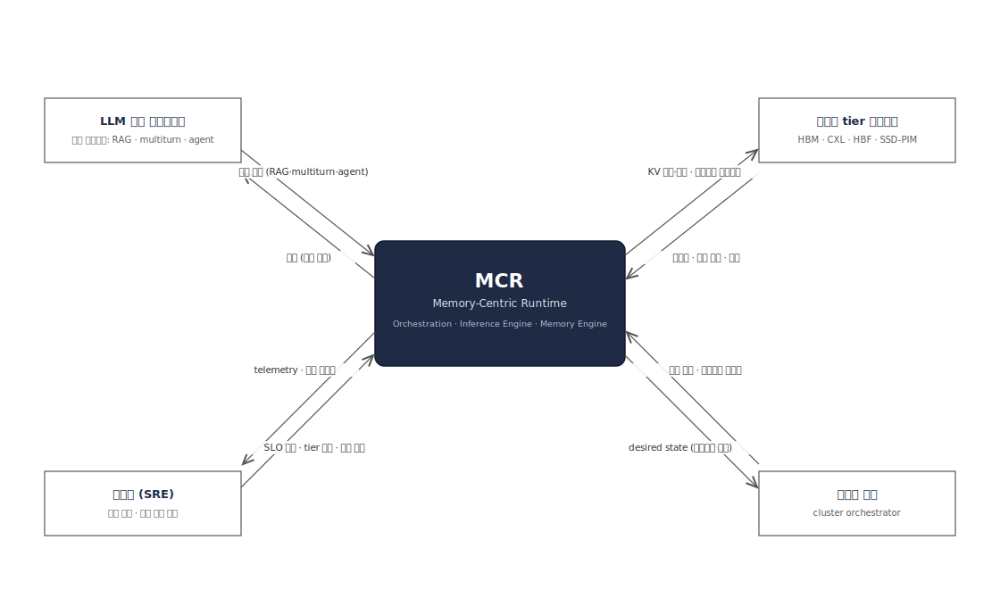
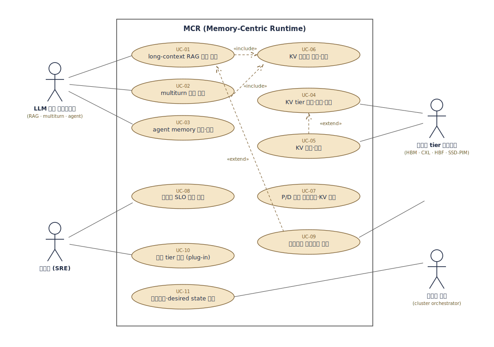

# MCR 요구사항 분석 (v0.9)

입력: [mcr_background_scope.md](mcr_background_scope.md) (배경·필요성·범위 v2).
산출: FR·제약사항 → 시스템 경계·Use Case → 품질 속성 선정(Utility Tree) →
Architecture Driver. 하류 문서: [00_qa_definitions.md](00_qa_definitions.md)
(선정 QA의 정의·정량 bin **단일 출처**),
[02](02_design_points_dp1_dp2.md)–[05](05_design_points_dp7_dp8.md) DP 문서.

**정제 요약**: 수집 23건(결번 1 포함, 유효 22건) → 기능 요구사항 **9건** ·
품질 요구(QA 후보) **10건** · 제약사항 **2건** · 범위 판정 **1건**
(원시 요구사항 전량: [부록 A](#부록-a-수집-원시-요구사항voc)).

**과제 성격**: 실서비스 구축·운영이 아닌 **연구 과제** — 자사가 타겟하는
memory-centric 제품군의 **효용성**(GPU HBM 단일 tier 대비 증분)을 E2E로
입증하는 것이 목적이다(범위 3.1). 따라서 서비스 운영 조직(AI 서빙 플랫폼 등)은
stakeholder에 두지 않으며, 서빙 SLO·워크로드 관점의 요구는 업계 벤치마크·문헌
조사와 자체 실측으로 대체 수집한다(§1.2). 상용화 단계 진입 시 "운영 주체"를
stakeholder로 추가하고 본 분석을 재수행한다.

**개정 이력**
- v0.9: QA 정의 문서 v0.9의 **QA1 2지표화** 반영 — Utility Tree QA-01
  Refinement·시나리오를 **TTFT 단축 배율(prefill 축) · throughput 배율
  (decode 축) 각 ≥ 2×**로 갱신. TTFT는 KV 재사용·retrieval 가속(prefill),
  throughput은 tier 확장·압축(decode)에 대응
- v0.8: QA 정의 문서 v0.8의 **QA1 지표 개정** 반영 — goodput@SLO(절대 SLO)
  → baseline 대비 **throughput 배율**(지연 가드 TPOT p99 ≤ baseline 1.5× ·
  곡선 병행 보고 · ★★★ ≥ 2×). QA-01 시나리오에 **retrieval(SSD-PIM 근접
  가속) 포함 E2E** 명시, VOC 매핑에 R-09 추가 (retrieval 가속 = PIM 활용의
  당위이자 일반 런타임과의 차별 축)
- v0.7: **C-02 "Transformer 모델 한정" 신설** (리뷰 반영) — 핵심 기법(KV
  압축·재사용·tier 배치)이 KV cache의 존재를 전제하므로 최적화 대상 모델을
  KV cache를 갖는 Transformer 기반으로 한정, 탈Transformer 구조는 범위 외로
  판정. (v0.3까지 있던 구 C-02 "기존 압축 기법 채용"과 무관한 신설 — 번호만
  재사용.) §5 driver 표에 C-02 행 추가 (Drivers 16종 → 17종)
- v0.6: QA 정의 문서 v0.7의 **QA2↔QA3 번호 교환** 반영 (§4.3 매핑·§5 driver
  표 — 이제 QA1~QA4는 번호 = 우선순위)
- v0.5: ① UC-07 연결 보강(운영자 연관 + UC-11 «include» — v0.4의 UC-09
  보강은 유지) ② QA-04 모델 변화 예에서 SSM 제외, linear attention 계열
  포함 ③ QA 정의 문서 v0.6(절 순서 우선순위 정렬, ΔF1 1%p 근거 보강)과 정합
- v0.4: 리뷰 반영 — ① 응용/모델 서비스팀 → **User**(응용·모델은 public 제공물
  사용), MCAS 팀 역할을 시뮬레이션·예측으로 정정, MCR(실측)과의 상호 보완 관계
  명시 ② FR-03에 토큰 eviction 포함, FR-04 재사용 표현 단순화 ③ C-02 삭제
  (자체 KV 압축·재사용 알고리즘 개발이 과제 범위), R-14 결번 ④ UC-09 연결
  보강 ⑤ Utility Tree 전면 개정 — P/D 분리 전제 제거, [측정]을 평가 방법+
  baseline+선정 이유로 재기술, Accuracy를 전제(gate)로 상향(우선순위 2),
  Accuracy 지표를 F1-score로 전환, QA4 정량화, Affordability→**Maintainability**,
  **Adaptability**(framework 교체) 후보 추가·선정(6건 선정) ⑥ "1급 자원" 등
  표현 정제 ⑦ VOC R-01·07·08·09·16·17 수정, R-23 추가
- v0.3: 고정 N 전제 확정 — 연구 범위에서 클러스터 규모(N) 조정을 범위 외로
  판정. 인프라 계층 액터 제거(Context·Use-case diagram 포함), FR-09를
  "모니터링·고정 N 내 P/D 자동 조정"으로 재기술, UC-11·driver 매핑 갱신.
  N 조정(desired state) 인터페이스는 상용화 단계 진화 경로로만 유지
- v0.2: ① 과제 성격(연구 과제) 명시 — AI 서빙 플랫폼팀을 stakeholder에서
  제외하고 해당 VOC(R-01·02·16·17·18·19) 출처 재귀속 ② Memory-centric AI
  System 팀 추가 ③ §3.1에 Context Diagram 삽입
- v0.1: 최초 작성 (architect-requirements 스킬 절차 적용). 기존
  `00_qa_definitions.md` v0.4의 QA1–QA5·우선순위와 정합하도록 Utility Tree 구성.

## 1. 요구사항 수집

### 1.1 주요 Stakeholder 및 역할

| Stakeholder | 역할 | 주요 관심사 |
|---|---|---|
| 메모리 사업부 (제품기획·디바이스 설계팀) | 과제 발주. memory-centric 제품군(PIM/PNM · CXL · Custom HBM/HBF · SSD-PIM) 로드맵 보유, MCR을 레퍼런스 SW 스택으로 요구 | **E2E 관점의 제품 가치 입증**(고객 신뢰의 근거), 고객 제공 가능한 레퍼런스 스택 확보, 근접연산의 실증 |
| **Memory-centric AI System (MCAS) 팀** | 자사 타겟 메모리로 시스템을 구성했을 때의 성능을 **시뮬레이션·예측**하는 부서 | 시뮬레이션 예측치가 실제 SW 스택 실측에서 재현되는지, tier 조합별 효용의 정량화 |
| **User** | public으로 제공되는 LLM 응용·모델의 사용자 — 대표 워크로드(long-context RAG · multiturn · agent)의 요구 특성을 제공 (응용·모델 자체는 개발하지 않고 public 제공물을 사용) | 장문 컨텍스트 비용, 세션·장기 기억, 응답 품질 유지 |
| 개발 임원 (랩장) | 과제 승인·자원 배정, 타 과제/사업부 협력 조율 | 연구 가치 — 타겟 메모리의 **효용성을 E2E 정량으로 입증**(baseline 대비), 일정, 지속 유지 가능성 |
| MCR 개발팀 | 런타임 개발·유지보수, 자체 벤치 실측·검증 수행 | 개발 비용, upstream framework(vLLM 등 — 고정 아님) 추종·교체 부담, 코어/모듈 경계 |
| 고객사 (잠재 — 자사 메모리 채택 CSP·서버 제조사) | 레퍼런스 스택을 받아 시스템을 구축할 외부 수요처 (현 단계 직접 요구 없음 — 도입 전제 조건만 수집) | 도입 용이성(기존 생태계 호환), 실측 성능 증거, 확장성 |
| (간접) 오픈소스 커뮤니티 (vLLM · SGLang 등) | upstream 프레임워크·KV 계층(LMCache 등)의 진화 주체 | — 요구를 내지는 않으나 릴리스 주기·인터페이스 변화·세력 교체가 제약으로 작용 |

주(MCAS ↔ MCR 역할 분담): MCAS 팀은 타겟 메모리 시스템의 성능을 **시뮬레이션
으로 예측**하고, MCR은 **실제 SW 스택을 올린 환경에서 테스트·검증(실측)** 한다.
MCAS가 구축하려는 시스템 환경은 실장(實裝) 전이라 MCR의 실제 시스템 환경과
동일하지 않다 — 두 축은 예측 ↔ 실측으로 상호 보완하며, 예측-실측 편차 자체가
양쪽 모두의 검증 데이터가 된다.

### 1.2 요구사항 수집 방법

| 방법 | 대상/출처 | 산출 |
|---|---|---|
| Stakeholder 인터뷰·VOC 접수 | 메모리 사업부 · MCAS 팀 · User · 임원 · 개발팀 · 고객사(잠재) | 원시 요구사항 R-01~R-23 (부록 A) |
| QAW (Quality Attribute Workshop) | 이해관계자 합동 — 품질 요구를 시나리오 형태로 구체화 | §4.2 Utility Tree의 시나리오 행 |
| 자체 벤치마크 실측 | P/D 분리 벤치 — decode 대기 70–85% (근거 A) | R-01의 정량 근거, QA1 baseline 정의 |
| 문헌·업계 벤치마크 조사 | MLPerf · DistServe · KIVI · KVQuant · vLLM(SOSP'23) · FlexGen (근거 B) | QA 정의 문서의 SLO 앵커 표 |
| upstream 로드맵·릴리스 분석 | vLLM 정규 릴리스 2주 케이던스 (근거 B) | R-13, QA4·QA5 bin 근거 |
| 유사 시스템 분석 | LMCache 등 KV offloading 계층 (근거 B) | 범위 문서 배경 ④, DP1 후보 발굴 |

주: 연구 과제 성격상 서비스 운영 조직이 stakeholder에 없으므로, 서빙 SLO·
워크로드 관점 요구는 **문헌·업계 벤치마크(MLPerf·DistServe)와 자체 실측**으로
대체 수집한다 — 가공의 운영 stakeholder를 세우지 않는다.

## 2. 요구사항 도출 (정제 → FR · 제약사항)

정제 규칙: ① 중복 병합 ② 검증 가능한 문장으로 재기술 ③ 기능(FR)/품질(QA
후보 — §4)/제약(C) 3분류 ④ 범위 밖 항목 기각(사유 기록). 품질 분류분 10건은
§4.2 Utility Tree로 보낸다.

### 2.1 기능 요구사항 (FR)

| 번호 | 태그 | 설명 | 출처 |
|---|---|---|---|
| FR-01 | 워크로드 서빙 | 대표 워크로드(**long-context RAG · multiturn · agent memory**)의 추론 요청을 admission → retrieval/context → 배칭 → 실행 → 응답으로 E2E 처리할 수 있어야 한다. | R-03·R-04·R-08·R-11 |
| FR-02 | 이종 tier KV 배치 | KV cache를 GPU HBM 밖 **이종 메모리 tier**(CXL·DRAM·HBF·SSD 등)에 두고, 디바이스 특성(대역폭·지연·용량)을 인지해 **배치·이동(승격/강등)** 할 수 있어야 한다. | R-02 |
| FR-03 | KV 압축 | **양자화·토큰 eviction 등 압축 기법**을 KV cache에 적용·해제할 수 있어야 한다 (자체 압축 알고리즘 개발 포함). | R-02 |
| FR-04 | KV 영속·재사용 | KV를 **세션·사용자 단위로 영속화**하고 **재사용**할 수 있어야 한다. | R-03·R-04·R-05 |
| FR-05 | P/D 분리 실행 | **prefill/decode 분리** 구성에서 인스턴스 간 KV 전송을 포함해 추론을 실행할 수 있어야 한다. | R-11·R-17 |
| FR-06 | 요청별 SLO 정책 | **요청별 SLO·품질 예산**을 기준으로 배치×압축×재사용 수준을 차등 조율할 수 있어야 한다. | R-16 |
| FR-07 | 근접연산 오프로드 | **PIM/PNM 디바이스로 연산을 오프로드**(예: 압축 연산, RAG 검색)해 실행할 수 있어야 한다. | R-09 |
| FR-08 | 디바이스 plug-in | 신규 메모리 디바이스를 **Tier Topology Model 파라미터로 등록**해 지원할 수 있어야 한다. | R-17 |
| FR-09 | 모니터링·P/D 조정 | HW·SLO telemetry를 수집하고, **고정된 노드 N개 안에서** prefill/decode 인스턴스 비율(a:b)을 부하에 따라 **자동 조정**할 수 있어야 한다. (클러스터 규모 N 자체의 조정은 범위 외 — §3.1) | R-17 |

### 2.2 제약사항 (C)

| 번호 | 제약사항 | 설명 | 출처 |
|---|---|---|---|
| C-01 | 디바이스 불변 | 메모리 디바이스 **HW 설계는 과제에서 변경 불가** — Tier Topology Model의 파라미터(대역폭·용량·지연)로만 취급한다 (범위 3.3). | R-10 |
| C-02 | Transformer 모델 한정 | 최적화 대상 모델은 **KV cache를 갖는 Transformer 기반으로 한정**한다 — 핵심 기법(KV 압축·재사용·tier 배치)이 KV cache의 존재를 전제하므로, **탈Transformer 모델**(순수 SSM·순수 linear attention 등 KV cache 부재 구조)은 전제 자체가 성립하지 않아 범위 외. hybrid 모델은 KV 보유 계층에 한해 적용하며, KV 구조 **변화**(GQA/MQA·MLA·linear attention 계열 hybrid)의 수용은 QA4가 다룬다. | 과제 정의 — KV 압축·재사용이 과제 본질 (리뷰 반영 신설, v0.7) |

(v0.3까지 있던 구 C-02 "기존 압축 기법 채용"은 삭제 — **자체 KV 압축·재사용
알고리즘 개발이 과제 범위에 포함**되므로 제약이 아니다. R-14 결번.
현 C-02는 그와 무관한 신설(v0.7)로 번호만 재사용.
모델(가중치) **학습** 알고리즘은 여전히 범위 외 — §3.1 경계 참조.)

## 3. 시스템 경계 및 Use Case

### 3.1 시스템 경계

시스템 = **MCR** (Inference Orchestration / Inference Engine / Memory Engine
3-패키지, [01_architecture_overview.md](01_architecture_overview.md)).
범위 문서 3.3 Out of Scope와 정합.

draw.io 소스: [`diagrams/req_context_mcr.drawio`](../diagrams/req_context_mcr.drawio)
(외부 엔티티 = §3.2 액터와 1:1 대응, 화살표 = 경계를 넘는 정보 흐름)

| 경계 내 (MCR 책임) | 경계 외 (책임 주체) |
|---|---|
| KV 배치·이동·압축·재사용의 **정책 + 메커니즘** — 자체 KV 압축·재사용 알고리즘 개발 포함 (FR-02·03·04·06) | 메모리 디바이스 HW 설계 — 메모리 사업부 (C-01) |
| 요청 파이프라인·스케줄링/라우팅·P/D 운용 (FR-01·05) | LLM 응용·모델 자체의 개발 — public 제공물 사용 (User) |
| 근접연산 오프로드의 대상 선정·실행 구조 (FR-07) | 클러스터 규모(N) 조정·provisioning — **범위 외**. 연구 범위는 고정 N 테스트베드 전제이며, N을 바꾸는 desired state 인터페이스는 상용화 단계의 진화 경로로만 남긴다 ([01 문서](01_architecture_overview.md) Autoscaler outer 루프 참조) |
| 디바이스 plug-in 경계 = 공개 인터페이스(KV Locator·CompressionOp)와 Tier Topology Model (FR-08) | 모델 **학습** 지원 — 범위 외 (R-22 판정) |
| telemetry 수집 · 고정 N 내 **P/D 역할 자동 조정** (FR-09) | 신규 모델 일반 enablement(가중치·토크나이저 등) — upstream 책임 (DP1 후보1 전제, QA 정의 문서 QA4 각주) |

### 3.2 액터

| 액터 | 구분 | 정의 |
|---|---|---|
| LLM 응용 클라이언트 | 1차 | RAG·multiturn·agent 서비스 — 추론 요청을 발행하고 응답을 소비 |
| 운영자 (SRE) | 1차 | SLO 정책 설정, 신규 tier 등록, 운용·관제 수행 |
| 메모리 tier 디바이스 | 2차 | HBM·CXL·HBF·SSD-PIM 등 — 시스템이 KV 저장·근접연산에 활용 |

(v0.2까지 있던 "인프라 계층" 액터는 제거 — 고정 N 전제에서 desired state를
집행할 상대가 없다. 상용화 단계에 N 조정이 범위에 들어오면 복원한다.)

### 3.3 Use Case

draw.io 소스: [`diagrams/req_usecase_mcr.drawio`](../diagrams/req_usecase_mcr.drawio)

| 번호 | Use Case | 근거 FR |
|---|---|---|
| UC-01 | long-context RAG 요청 서빙 (retrieval 결과를 컨텍스트로 추론) | FR-01 |
| UC-02 | multiturn 세션 서빙 (턴 간 컨텍스트 유지) | FR-01·FR-04 |
| UC-03 | agent memory 영속·복원 (세션을 넘는 장기 기억) | FR-04 |
| UC-04 | KV tier 배치·승격·강등 (topology-aware placement) | FR-02 |
| UC-05 | KV 압축·복원 | FR-03 |
| UC-06 | KV 재사용 판정·복원 (KV Index 조회) | FR-04 |
| UC-07 | P/D 분리 스케줄링·인스턴스 간 KV 전송 — UC-11(P/D 자동 조정)의 role 전환 시 «include», 운영자가 P/D 실험 구성을 운용 | FR-05 |
| UC-08 | 요청별 SLO 정책 적용 (배치×압축×재사용 차등) | FR-06 |
| UC-09 | 근접연산 오프로드 실행 — UC-01(RAG 검색)·UC-05(압축 연산)를 «extend», 메모리 tier 디바이스(PIM/PNM)와 연동 | FR-07 |
| UC-10 | 신규 tier 등록 (Tier Topology 파라미터 plug-in) | FR-08 |
| UC-11 | 모니터링·P/D 자동 조정 (고정 N 내 prefill:decode 비율 조정) | FR-09 |

FR 커버리지: FR-01(UC-01·02) · FR-02(UC-04) · FR-03(UC-05) ·
FR-04(UC-02·03·06) · FR-05(UC-07) · FR-06(UC-08) · FR-07(UC-09) ·
FR-08(UC-10) · FR-09(UC-11) — **전 FR이 ≥1개 UC에 매핑** ✓.

## 4. 품질 속성 선정

### 4.1 QA 후보 도출

수집 요구사항의 품질 분류분 10건을 시나리오 + `[측정]` 형태로 정제 — 아래
Utility Tree에 전량 수록. 출처 VOC 매핑: QA-01 ← R-01·R-07·R-09·R-11 /
QA-02 ← R-06 / QA-03 ← R-01·R-02·R-07 / QA-04 ← R-13·R-17·R-21 /
QA-05 ← R-23 / QA-06 ← R-08·R-12·R-13 / QA-07 ← R-18 / QA-08 ← R-19 /
QA-09 ← R-15 / QA-10 ← R-20. `[측정]`은 **평가 방법**(지표 + baseline +
baseline 선정 이유)을 기술하며, 별점 판정용 정량 bin은
[00_qa_definitions.md](00_qa_definitions.md)가 단일 출처다.

### 4.2 Utility Tree 및 선정

우선순위 규칙(QA 정의 문서와 동일): ① **중요도** 우선 ② 동률이면 성능 사슬
내 **역할** — 최종 목표 > 그 유효성의 전제(gate) > 수단 ③ 그 외 동률은
**난이도** ④ 남는 동률은 과제 본질 축 우선(구조 논증). **상위 6건 선정**
(기본 5건에서 확장 — framework 유동성 리스크(R-23)를 QA로 승격하면서
Maintainability를 탈락시키는 대신 선정 폭을 늘렸다. 5건 유지가 필요하면
Adaptability/Maintainability 중 택일).

| 번호 | QA | Refinement | Scenario [측정] | 중요도 | 난이도 | 우선순위 | 선정 |
|---|---|---|---|---|---|---|---|
| QA-01 | Performance | prefill·decode 2단 성능 — baseline 대비 **TTFT 단축 배율 · throughput 배율** | 대표 워크로드(long-context RAG·multiturn·agent)를 동일 HW·동일 실행 구성에서 서빙하며 **retrieval(SSD-PIM 근접 가속, ADR-001) 포함 E2E 경로**에서 두 지표를 잰다: ① **TTFT 단축 배율**(prefill 축 — KV 재사용·retrieval 가속 반영, 평균 판정·p99 병행) ② **throughput 배율**(decode 축 — tier 확장·압축의 batch 확대 반영, iso-latency: TPOT p99 ≤ baseline 운영점·곡선 병행). [측정: **TTFT·throughput 모두 ≥ 2×** → ★★★. baseline = 동일 HW에서 **GPU HBM 단일 tier만 사용**하는 구성 — 순증분 분리 측정. P/D 분리는 전제하지 않는 실험 변수(양쪽 동일 적용)] | H | H | 1 | **O** |
| QA-02 | Accuracy | 압축·재사용 품질 저하 bound — QA-01·03 수치의 유효 전제(gate) | 압축(양자화·토큰 eviction)·재사용을 실서빙 설정으로 활성화하고 long-context 벤치마크(LongBench 등)를 수행한다. [측정: **baseline 대비 F1-score 차이(ΔF1, %p)**. baseline = 동일 모델·동일 벤치의 **비압축(FP16 KV)·비재사용** 구성 — 품질의 이론적 상한이므로 저하량이 곧 압축·재사용의 비용. 보조 지표: ΔPPL(Wikitext-2, 선행 신호). bound 집행 단위(요청별/전역)도 판정] | H | M | 2 | **O** |
| QA-03 | Resource Efficiency | 유효 KV 용량 (원본 환산 동시 수용량) | QA-02 품질 bound를 지키는 조건에서 시스템이 동시 수용하는 KV 총량을 원본 환산으로 잰다. [측정: **유효 KV 용량 ÷ 물리 HBM 용량 배율** — Σ_tier(용량 × 평균 압축률 × KV 가용 비율)로 산출. baseline = **HBM 단일 tier·비압축**(정의상 1.0×) — HBM이 희소 자원이라 "HBM 한 장당 수용 컨텍스트"가 비용 구조를 결정하기 때문] | H | H | 3 | **O** |
| QA-04 | Modifiability | 신규 디바이스·KV 구조 변화 수용성 | 신규 tier(HBM4/CMM-DC/HBF) 1종 추가와 KV 구조 영향 모델 변화(GQA/MQA · MLA · linear attention 계열)를 수용하는 실험을 수행한다. [측정: (i) 신규/변경 **모듈 수** (ii) **코어 변경 LOC 비율(%)** — 코어 = 골격 + 공개 인터페이스(KV Locator·CompressionOp) (iii) 인터페이스 **시그니처 변경 건수** (iv) 모델 변화 수용 **리드타임**(upstream 공개일 기준). baseline = 현행 코드베이스] | M | H | 4 | **O** |
| QA-05 | Adaptability | 서빙 framework 교체 적응성 (vLLM → SGLang 등) | upstream framework를 교체할 때 Memory Engine·정책 계층이 보존되고 framework 결합부만 교체된다. [측정: 교체 시 **변경 코드 비율(%)과 전환 공수(인월)** — framework 결합 코드가 어댑터 계층에 격리되어 있는지 판정. baseline = 현 framework(vLLM) 결합 구조 — 현시점 기본 선택이지만 고정이 아니므로 교체 비용이 곧 종속 위험의 크기] | M | H | 5 | **O** |
| QA-06 | Maintainability | 개발·운영 비용 (지속 유지 가능성) | 초기 구축부터 지속 유지까지의 비용을 산정한다. [측정: **초기 구축 공수(인월**, 대표 워크로드 E2E 벤치 완주 기준**)과 연간 유지보수 FTE**(upstream 추종·회귀 검증 포함). baseline = DP1 후보별 비용 모델(02 문서 실측 표현: plugin형 수 인월 vs 독립형 수십 인월+) — 구조 선택이 비용을 한 자릿수 이상 가르기 때문] | M | M | 6 | **O** |
| QA-07 | Availability | 영속 KV 자산의 유실 복구 | 노드 장애로 영속 KV(agent memory 등) 일부가 유실될 때 재계산(re-prefill)으로 세션을 복구한다. [측정: KV 유실 시 세션 손실 건수와 복구 비용(재계산으로 인한 goodput 저하) — baseline = 무장애 운전] | M | M | 7 | |
| QA-08 | Security | 사용자 간 KV 재사용 격리 | 타 사용자 요청이 내 KV 블록의 재사용을 시도할 때 차단된다. [측정: cross-user KV 재사용 발생 건수(목표 0) — 재사용 범위 = 사용자/세션 내] | M | M | 8 | |
| QA-09 | Interoperability | 기존 서빙 생태계 호환 | vLLM 기반 스택을 쓰는 조직이 MCR 도입 시 응용 수정 없이 전환한다. [측정: 서빙 API 호환 여부, 응용 코드 수정 건수] | M | M | 9 | |
| QA-10 | Scalability | 클러스터 수평 확장 | 노드 추가 시 goodput이 선형에 가깝게 확장된다. [측정: N노드 goodput ÷ (N × 단일 노드 goodput) — baseline = 단일 노드] | L | H | 10 | |

**우선순위 판정 메모**: 중요도 H 3건은 역할 규칙으로 갈린다 — Performance는
최종 목표, **Accuracy는 그 수치의 유효 전제(gate)** — 아무리 빨라도 품질이
baseline과 크게 다르면 그 성능은 무효 — Resource Efficiency는 목표 달성의
수단. 따라서 목표(1) > gate(2) > 수단(3). 중요도 M 4건은 난이도로
Modifiability·Adaptability(M/H)가 Maintainability(M/M)에 앞서고, M/H 동률은
과제 본질 축(타겟 메모리·모델 수용)이 리스크 헤지 축(framework 교체)에
우선한다(C).

**미선정 사유** (전건 기록):

- **QA-07 Availability** — KV는 원본 컨텍스트에서 재계산 가능한 파생
  데이터라 유실이 정확성이 아닌 **성능 문제로 환원**되어 QA-01 측정에
  흡수(C). 영속 KV의 실패모델은 DP3(재사용 복원 전략)·DP5(KV Transport
  실패모델)의 구조 결정으로 다룬다. 상용화 단계 재평가.
- **QA-08 Security** — 실증 단계에서는 재사용 범위를 **사용자/세션 내로
  한정**하는 정책 제약으로 완화(DP3 커플링, 위 [측정]이 그 제약).
  멀티테넌트 상용화 시 독립 QA로 재평가.
- **QA-09 Interoperability** — 독립 QA가 아니라 **DP1(framework 실행
  구조)의 결정 변수로 흡수**. upstream 추종성은 QA4(Modifiability)·QA5
  (Maintainability)의 bin이 대리 측정. framework **교체** 축은 QA-05
  Adaptability로 분리 승격됨.
- **QA-10 Scalability** — 연구 범위가 **고정 N 테스트베드 전제**(§3.1)라
  클러스터 규모(N) 조정·provisioning 자체가 범위 외이고, 고정 N 내 P/D
  조정은 FR-09로 기능 요건화되어, 이번 과제 판정에 주는 타격이 낮아
  중요도 L 판정. 상용화 단계(N 조정 진화 경로 활성화 시) 재평가.
- M/M 동률(QA-07·08·09)의 순번은 리스크 노출 시점 순(실증 단계에서도
  노출되는 가용성 → 멀티테넌트 전제인 보안 → DP1로 흡수되는 호환성)의
  구조 논증(C) — 선정 결과에는 영향 없음.

### 4.3 선정 QA 정제 (번호 매핑)

선정 6건의 정의·측정 방법·정량 bin·bin 근거는
[00_qa_definitions.md](00_qa_definitions.md) (v0.5)가 **단일 출처**다 —
본 문서에는 Utility Tree 요약 행만 둔다. v0.6(QA 정의 v0.7)에서 QA2·QA3
번호를 우선순위에 맞춰 교환해 **QA1~QA4는 번호 = 우선순위**다 (QA5·QA6은
신설 순서 때문에 우선순위와 어긋남 — QA 정의 문서 규칙 참조).

| Utility Tree (우선순위) | QA 정의 문서 | 비고 |
|---|---|---|
| QA-01 Performance (1) | QA1. 추론 성능 (goodput@SLO) | H/H |
| QA-02 Accuracy (2) | QA2. 응답 품질 (품질 저하 bound) | H/M — gate 역할로 상향 (v0.4) |
| QA-03 Resource Efficiency (3) | QA3. 메모리 효율 (유효 KV 용량) | H/H — 수단 지표 |
| QA-04 Modifiability (4) | QA4. 확장성·진화성 | M/H |
| QA-05 Adaptability (5) | QA6. framework 적응성 (v0.5 신설) | M/H |
| QA-06 Maintainability (6) | QA5. 유지보수성 (개발·운영 비용) | M/M — 구 Affordability |

## 5. Architecture Driver 선정

**[기능 9, QA 6, Constraint 2 — Drivers 총 17종 선정]**

| Driver | 아키텍처에 주는 함의 | 관련 DP/컴포넌트 |
|---|---|---|
| FR-01 워크로드 서빙 | 요청 파이프라인(admission → retrieval → 세션 배칭)의 control plane 분리 | Request Manager (Request Lifecycle Manager · Retrieval Engine · Multiturn Batcher) |
| FR-02 이종 tier KV 배치 | Memory Engine을 연산 엔진과 대등한 독립 패키지로 분리, placement 정책의 위치 결정 | [DP2](02_design_points_dp1_dp2.md)·[DP4](03_design_points_dp3_dp5.md) / Cache Manager · Tier & Lifecycle |
| FR-03 KV 압축 | 압축 policy/mechanism 분리, 커널 의존 역전 | [DP2](02_design_points_dp1_dp2.md) / Memory Compressor · CompressionOp Kernel |
| FR-04 KV 영속·재사용 | 재사용 범위·복원 전략과 조회 자료구조 | [DP3](03_design_points_dp3_dp5.md) / KV Index |
| FR-05 P/D 분리 실행 | 인스턴스 간 KV 이동 경로·실패모델의 분리 | [DP5](03_design_points_dp3_dp5.md) / KV Transport · Autoscaler(inner) |
| FR-06 요청별 SLO 정책 | 정책의 중앙(스케줄러) vs 자율(엔진) 위치 결정 | [DP2](02_design_points_dp1_dp2.md) / Scheduling (KV-aware Router · SLO/QoS Monitor) |
| FR-07 근접연산 오프로드 | 오프로드 대상·실행 구조, SSD-PIM 검색의 계약·소유 | [DP6](04_design_points_dp6.md)·[DP7·DP8](05_design_points_dp7_dp8.md) / [ADR-001](adr/ADR-001-ssd-pim-rag-retrieval.md) |
| FR-08 디바이스 plug-in | HW 추상화 수준(파라미터 vs 전용 어댑터) 결정 | [DP4](03_design_points_dp3_dp5.md) / Tier Topology Model |
| FR-09 모니터링·P/D 조정 | SLO/HW 모니터링과 고정 N 내 P/D role 조정 (inner 루프; N 조정 outer 루프는 진화 경로) | Resource Manager (Hardware Monitor · Autoscaler inner: P/D Role Controller) |
| QA1 추론 성능 | 전 DP 평가의 1순위 축 (baseline = 동일 HW·GPU HBM 단일 tier) | DP1–DP8 QA 평가표 |
| QA2 응답 품질 (gate) | 요청별 품질 bound의 집행 구조 (전역 아닌 요청 단위) — 성능·용량 수치의 유효 전제 | DP2·DP3 |
| QA3 메모리 효율 | tier 오프로딩 × 압축의 결합 구조 요구 (압축 단독 초과) | DP2·DP4 |
| QA4 확장성·진화성 | 코어/모듈 경계와 공개 인터페이스의 안정성 설계 | DP1·DP4 / KV Locator · CompressionOp |
| QA6 framework 적응성 | framework 결합부의 어댑터 격리 — 교체 가능한 경계 설계 | [DP1](02_design_points_dp1_dp2.md) / framework adapter 계층 |
| QA5 유지보수성 | framework 실행 구조(plugin vs 독립)의 핵심 판단 기준 | [DP1](02_design_points_dp1_dp2.md) |
| C-01 디바이스 불변 | 디바이스를 파라미터로 추상화하도록 강제 (전용 코드 최소화) | DP4 / Tier Topology Model |
| C-02 Transformer 모델 한정 | 압축·재사용·배치 설계 공간을 KV cache 전제로 고정 — 탈Transformer 일반화는 요구하지 않음 (KV 구조 **변화** 수용은 QA4 축) | DP2·DP3 전제 / QA4 각주 |

전 driver가 DP 또는 확정 컴포넌트에 매핑 ✓ (FR-01·FR-09는 확정안 v2에서
구조 확정 — DP 불필요).

산출물: **"MCR (Memory-Centric Runtime)"**

---

## 부록 A. 수집 원시 요구사항(VOC)

| 번호 | 출처 | 내용 | 정제 결과 |
|---|---|---|---|
| R-01 | MCR 개발팀 | "컨텍스트 길이가 폭증하면서(과제 배경 ①) **KV cache 크기가 HBM 용량을 넘어선다** — 타겟 메모리로 이 병목이 풀리는지가 효용성 입증의 핵심이다." | QA-01, QA-03 |
| R-02 | MCAS 팀 | "우리가 시뮬레이션으로 예측한 이종 메모리 시스템의 효과가 실제 SW 스택 실측에서도 재현되는지 — 같은 HBM으로 동시 컨텍스트를 얼마나 더 수용하는지 정량으로 보고 싶다." | QA-03, FR-02, FR-03 |
| R-03 | User | "RAG 프롬프트가 수십 k 토큰인데 매 요청 전체를 re-prefill한다 — 같은 문서 chunk의 KV를 재사용하고 싶다." | FR-01, FR-04 |
| R-04 | User | "multiturn 대화에서 세션이 이어질 때마다 이전 턴 컨텍스트 복원 비용이 크다." | FR-01, FR-04 |
| R-05 | User | "agent가 세션을 넘는 장기 기억을 요구한다 — KV가 일회성 버퍼가 아니라 세션·사용자 단위로 영속하는 자산이 되어야 한다." | FR-04 |
| R-06 | User | "압축·재사용 때문에 답변 품질이 떨어지면 쓸 수 없다 — 품질 저하의 상한을 보장해달라." | QA-02 |
| R-07 | 메모리 사업부 | "**E2E 관점에서 당사 제품의 가치를 확인**할 수 있어야 한다 — 그래야 고객도 신뢰한다." | QA-01, QA-03 |
| R-08 | 메모리 사업부 | "우리가 **자체 레퍼런스 스택**을 가지고 있으면 고객에 제공할 수 있다." | FR-01, QA-06 |
| R-09 | 메모리 사업부 | "PIM/PNM 연산의 **효용성을 E2E에서 테스트**하고 싶다." | FR-07, QA-01 |
| R-10 | 메모리 사업부 | "디바이스 HW 스펙은 이 과제에서 바꿀 수 없다 — 주어진 스펙(대역폭·용량·지연)을 전제로 설계하라." | C-01 |
| R-11 | 개발 임원 | "GPU HBM 단일 tier baseline 대비 개선을 E2E 정량으로 입증해야 사업 설득이 된다. 대표 워크로드 벤치가 완주해야 한다." | QA-01(baseline), FR-01, FR-05 |
| R-12 | 개발 임원 | "과제 종료 후에도 소수 인력으로 지속 유지 가능해야 한다 — 상시 전담팀은 불가." | QA-06 |
| R-13 | MCR 개발팀 | "vLLM은 2주마다 릴리스된다(B) — 구조에 따라 추종 비용이 수십 인월로 갈린다." | QA-06, QA-04 |
| R-14 | — | (결번 — v0.4에서 삭제. "기존 압축 기법 채용" 제약은 자체 KV 압축·재사용 알고리즘 개발이 과제 범위이므로 성립하지 않음) | — |
| R-15 | 고객사 | "기존 서빙 API·생태계(vLLM 호환)와의 호환성이 도입의 전제 조건이다." | QA-09 |
| R-16 | MCR 개발팀 | "기존 KV 계층(LMCache 등)에는 요청별 SLO·품질 예산 기반 정책이 없다(B) — 이 조율 능력이 우리 스택의 차별점이 되어야 한다. 요청마다(interactive vs batch) 배치·압축·재사용 수준을 다르게 가져가야 한다." | FR-06 |
| R-17 | MCR 개발팀 | "tier 조합·P/D 구성을 바꿔가며 실험한다 — 신규 tier의 등록이 쉬워야 하고, 고정된 노드들 안에서 prefill/decode role 전환·재배분이 자동이어야 구성 변경 실험을 반복할 수 있다." | FR-05, FR-08, FR-09, QA-04 |
| R-18 | MCAS 팀 | "tier 디바이스 장애로 영속 KV가 유실되면 어떻게 되나 — 세션이 깨지지 않고 복구되어야 한다." | QA-07 |
| R-19 | 고객사 (잠재) | "멀티테넌트 환경에서 사용자 간 KV 재사용이 프롬프트 유출 통로가 되지 않아야 도입할 수 있다 — 격리를 보장하라." | QA-08 |
| R-20 | 고객사 | "클러스터 규모를 늘릴 때 노드 추가만으로 선형에 가깝게 확장되어야 한다." | QA-10 |
| R-21 | User | "MLA·hybrid attention 등 KV 구조가 바뀌는 신모델이 나오면 곧바로 서빙하고 싶다." | QA-04 |
| R-22 | 개발 임원 | "모델 학습 지원은 이번 과제 범위가 아니다 — 추론 서빙에 집중하라." | 범위 판정 (§3.1 경계 외 반영, 기각 아님) |
| R-23 | MCR 개발팀 | "vLLM이 유일한 선택지가 아니다 — SGLang 등 대안이 부상하고 있어, framework를 갈아탈 때의 비용이 통제되도록 종속을 관리해야 한다." | QA-05 |
