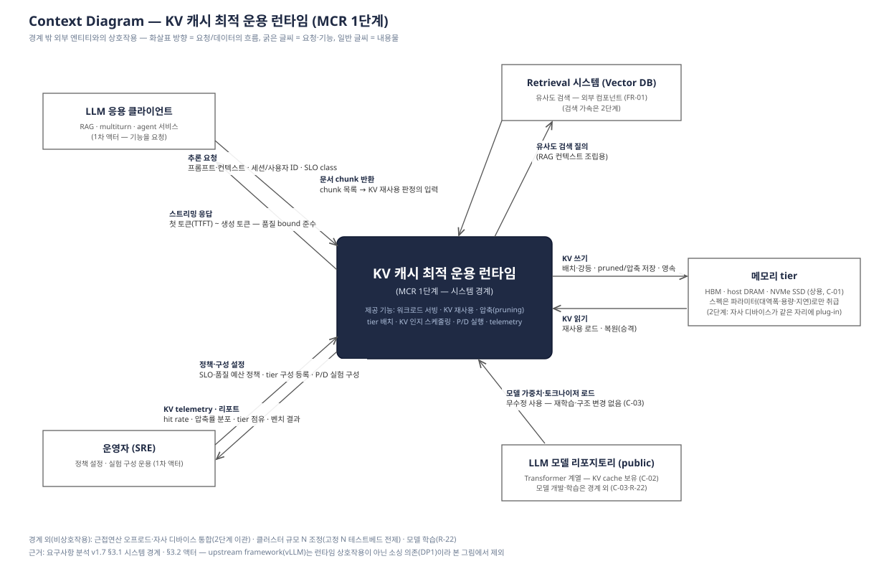
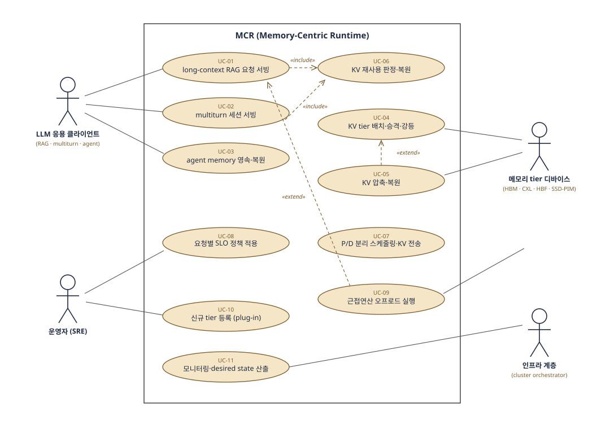

# MCR 1단계 (KV 캐시 최적 운용 AI 런타임) 요구사항 분석 (v1.6)

입력: [mcr_background_scope.md](mcr_background_scope.md) (배경·필요성·범위 **v5**
— 과제 목표 재정의·단계화).
산출: FR·제약사항 → 시스템 경계·Use Case → 품질 속성 선정(Utility Tree) →
Architecture Driver. 하류 문서: [00_qa_definitions.md](00_qa_definitions.md)
(선정 QA의 정의·정량 bin **단일 출처**),
[02](02_design_points_dp1_dp2.md)–[05](05_design_points_dp7_dp8.md) DP 문서.

**정제 요약**: 수집 24건(결번 1 포함, 유효 23건) → 기능 요구사항 **7건** ·
품질 요구(QA 후보) **10건** · 제약사항 **3건** · 범위 판정 **1건** ·
**2단계 배정 2건**(R-07·R-09)
(원시 요구사항 전량: [부록 A](#부록-a-수집-원시-요구사항voc)).

**과제 성격**: 실서비스 구축·운영이 아닌 **연구 과제** — KV 캐시 최적
운용(재사용·압축·KV 인지 스케줄링)의 **효용성**(GPU HBM 단일 tier baseline
대비 증분)을 E2E로 입증하는 것이 목적이다(범위 3.1, 목표 3축). 본 과제는
**MCR 로드맵의 1단계**다 — 자사 memory-centric 디바이스 1급 통합·근접연산
오프로드는 2단계(MCR 완성)로 이관하되, tier 추상화 인터페이스로 접속점을
보존한다(배경 문서 ⑥). 서비스 운영 조직(AI 서빙 플랫폼 등)은 stakeholder에
두지 않으며, 서빙 SLO·워크로드 관점의 요구는 업계 벤치마크·문헌 조사와 자체
실측으로 대체 수집한다(§1.2). 상용화 단계 진입 시 "운영 주체"를 stakeholder로
추가하고 본 분석을 재수행한다.

**개정 이력**
- v1.6: **우선순위 근거를 요구사항 기점으로 재정렬 (주객전도 교정 검수
  반영).** "QA 우선순위의 근거가 과제 목표 1·2·3"이면 방향이 뒤집힌다 —
  목표는 QA로 세우는 것이고, QA와 그 우선순위는 요구사항에서 나와야 한다.
  ① §4.1 **대표 워크로드 시나리오별 QA 도출** 신설 — 시나리오의 정량
  관찰(A/B/C 근거) → 필요 기능(FR) → 귀결 QA 체인을 명시(구 요구사항 덱
  p.8 양식 승계·1단계 갱신) ② 중요도 rubric **I1을 "목표 직결성" →
  "핵심 시나리오 직결성"으로 재정의** — 채점 입력을 VOC·워크로드
  시나리오로 한정(목표 문장 참조 금지). 전 QA 재채점 결과 점수·우선순위
  **불변**(근거 교체) ③ §4.5 **QA → 과제 목표(Exit Criteria) 역정의**
  신설 — 목표 3축의 정량 목표는 선정 QA의 ★★★ bin에서 정의됨을 명시
  ④ Utility Tree 행·판정 메모의 "목표 n" 앵커를 시나리오·VOC 앵커로 교체.
  QA 정의 v1.6과 정합
- v1.5: **QA-06(Maintainability) 미선정 전환** — 초기 구축 인월·유지
  FTE는 critical 요구가 아님(검수). 선정 5건(QA-01~05)으로 과제 표준
  복귀, Drivers 16→15종(FR 7 + QA 5 + C 3). 구 bin은 DP1 비용 모델 판단
  기준으로 보존, R-08·R-12는 미선정 사유·상용화 재평가로 처리
- v1.4: **우선순위 규칙 개정(① 중요도 → ② 난이도 → ③ 잔여 동률 역할)
  + 재번호(QA 정의 v1.4 정합).** Utility Tree 재정렬: **QA-01
  Throughput**(중요도 rubric 최고 6점 — 두 목표 공동 판정) → **QA-02
  Accuracy**(5점 동률군 내 난이도 최고 6점) → **QA-03 TTFT**(QA-04와
  완전 동률 5·3 — 잔여 동률만 역할[목표>수단]로 선순위) → QA-04~06 불변.
  §4.1 VOC 매핑·§4.3 번호 매핑·§5 driver 표·부록 A 참조 일괄 재번호.
  정의·측정·bin·선정 전 항목 불변
- v1.3: **등급 변별 rubric 반영(QA 정의 v1.3)** — "전 QA H/H" 변별력 부재
  검수 반영. Utility Tree QA-01·QA-04 난이도 H→M(각각 "경로 2/3 문헌
  재현" / "pruning 확정으로 도달선 문헌화"), QA-04 중요도는 **목표 2 공동
  판정 지표(기전 입증)** 근거로 H 유지, 목표 간 난이도 서열 비적용 규칙
  신설. H/H는 QA-02·QA-03 2건으로 정돈 — 우선순위 1–6·bin 불변
- v1.2: **압축 기법 방향 확정(중요도 기반 토큰 pruning 중심) + QA4 근거
  재기술.** ① FR-03을 **중요도 기반 토큰 eviction(pruning)을 주 기법**,
  양자화를 조합 옵션으로 재기술 — pruning은 토큰 수 자체를 줄여 용량과
  대역폭(매 토큰 읽기량)에 동시 작용 ② **신규 설계 쟁점 등재: pruning ×
  재사용 충돌** — 토큰 중요도는 쿼리 의존적(SnapKV)인데 재사용(FR-02)은
  다음 쿼리를 위한 영속화이므로 두 목표가 같은 KV를 반대로 당김 → §5
  쟁점 표 신설, DP2·DP3 결합 쟁점으로 차기 DP 문서 개정 시 전개 ③ QA4
  (Resource Efficiency) 중요도 근거를 3근거(수용 가능성 · 재사용
  보관량→hit rate→QA1 경로 · HBM당 비용/MCAS 검증[R-02])로 재기술 —
  "QA2의 수단"만이 아니라 **QA1·QA2의 공유 상류**임을 명시 (QA 정의
  v1.2와 정합)
- v1.1: **QA 체계 검수 반영 (4건).** ① UC-08을 "메모리 압박 대응"에서
  **"KV 공간 확보"**로 재기술 — 트리거(KV 풀 포화)·수단(추가 압축/강등/축출
  선택)·결과(preemption 없이 서빙 지속)를 명시 ② **Performance를 2개 QA로
  분할** — QA-01 TTFT(prefill, 목표 1) · QA-02 Throughput(decode, 목표 2·3).
  단일 QA 내 2지표 AND는 축별 판정을 흐린다는 검수 의견 반영 ③ QA
  중요도·난이도 재검수 — **Accuracy 난이도 M→H 상향**(비접두 재사용·차등
  압축·축출의 3중 품질 노출 + C-03 training-free로 회복 수단 제한): 이로써
  Accuracy·Resource Efficiency 모두 H/H 동률이 되어 우선순위는 역할
  규칙(목표>gate>수단)만으로 결정 — "H/H가 H/M보다 낮다"는 역전 해소
  ④ **Modifiability·Adaptability 중 Modifiability만 선정** — 유사 축 통합
  재평가: Adaptability는 중요도 M→L 재판정(1단계는 단일 framework 실증이
  목적, 교체 리스크 노출은 2단계/상용화)+ 측정축이 Modifiability의 코어/모듈
  경계 지표와 중복 → 미선정 전환(QA5가 대리 측정, DP1로 흡수). **QA 번호
  전면 재정렬: 번호 = 우선순위** (QA1 TTFT · QA2 Throughput · QA3 Accuracy ·
  QA4 Resource Efficiency · QA5 확장성·진화성 · QA6 Maintainability)
- v1.0: **과제 목표 재정의(배경 v5) 반영 — MCR 1단계로 범위 특정.**
  ① 목표 3축(재사용→TTFT / 정확도 유지 압축→메모리 병목 / KV 인지
  스케줄링→처리량) 반영해 FR 전면 재편(9건→7건): 근접연산 오프로드(구
  FR-07)·디바이스 plug-in(구 FR-08)을 2단계로 이관, KV 재사용(구 FR-04)을
  비접두·복원vs재계산 판단까지 확장해 FR-02로 승격, 요청별 SLO 정책(구
  FR-06)을 **KV 인지 스케줄링**(FR-05)으로 확장, telemetry(구 FR-09)를 KV
  관측 중심으로 재정의 ② C-03(모델 무변경 training-free) 신설 — 목표 2의
  "정확도 유지" 명문화 ③ VOC R-07·R-09를 **2단계 배정**으로 재귀속(기각
  아님), R-24(목표 재정의 지시) 추가 ④ QA-01 시나리오에서 retrieval(SSD-PIM)
  축 제거, 축별 ablation(재사용/압축/스케줄링 순기여 분리) 조항 추가 ⑤ UC
  재편(11건→10건) 및 use-case·context diagram 갱신 ⑥ Driver 17종→16종(FR 7
  + QA 6 + C 3)
- v0.9: QA 정의 문서 v0.9의 **QA1 2지표화** 반영 — Utility Tree QA-01
  Refinement·시나리오를 **TTFT 단축 배율(prefill 축) · throughput 배율
  (decode 축) 각 ≥ 2×**로 갱신. TTFT는 KV 재사용·retrieval 가속(prefill),
  throughput은 tier 확장·압축(decode)에 대응
- v0.8: QA 정의 문서 v0.8의 **QA1 지표 개정** 반영 — goodput@SLO(절대 SLO)
  → baseline 대비 **throughput 배율**(지연 가드 TPOT p99 ≤ baseline 1.5× ·
  곡선 병행 보고 · ★★★ ≥ 2×). QA-01 시나리오에 **retrieval(SSD-PIM 근접
  가속) 포함 E2E** 명시, VOC 매핑에 R-09 추가 (retrieval 가속 = PIM 활용의
  당위이자 일반 런타임과의 차별 축)
- v0.7: **C-02 "Transformer 모델 한정" 신설** (리뷰 반영) — 핵심 기법(KV
  압축·재사용·tier 배치)이 KV cache의 존재를 전제하므로 최적화 대상 모델을
  KV cache를 갖는 Transformer 기반으로 한정, 탈Transformer 구조는 범위 외로
  판정. (v0.3까지 있던 구 C-02 "기존 압축 기법 채용"과 무관한 신설 — 번호만
  재사용.) §5 driver 표에 C-02 행 추가 (Drivers 16종 → 17종)
- v0.6: QA 정의 문서 v0.7의 **QA2↔QA3 번호 교환** 반영 (§4.3 매핑·§5 driver
  표 — 이제 QA1~QA4는 번호 = 우선순위)
- v0.5: ① UC-07 연결 보강(운영자 연관 + UC-11 «include» — v0.4의 UC-09
  보강은 유지) ② QA-04 모델 변화 예에서 SSM 제외, linear attention 계열
  포함 ③ QA 정의 문서 v0.6(절 순서 우선순위 정렬, ΔF1 1%p 근거 보강)과 정합
- v0.4: 리뷰 반영 — ① 응용/모델 서비스팀 → **User**(응용·모델은 public 제공물
  사용), MCAS 팀 역할을 시뮬레이션·예측으로 정정, MCR(실측)과의 상호 보완 관계
  명시 ② FR-03에 토큰 eviction 포함, FR-04 재사용 표현 단순화 ③ C-02 삭제
  (자체 KV 압축·재사용 알고리즘 개발이 과제 범위), R-14 결번 ④ UC-09 연결
  보강 ⑤ Utility Tree 전면 개정 — P/D 분리 전제 제거, [측정]을 평가 방법+
  baseline+선정 이유로 재기술, Accuracy를 전제(gate)로 상향(우선순위 2),
  Accuracy 지표를 F1-score로 전환, QA4 정량화, Affordability→**Maintainability**,
  **Adaptability**(framework 교체) 후보 추가·선정(6건 선정) ⑥ "1급 자원" 등
  표현 정제 ⑦ VOC R-01·07·08·09·16·17 수정, R-23 추가
- v0.3: 고정 N 전제 확정 — 연구 범위에서 클러스터 규모(N) 조정을 범위 외로
  판정. 인프라 계층 액터 제거(Context·Use-case diagram 포함), FR-09를
  "모니터링·고정 N 내 P/D 자동 조정"으로 재기술, UC-11·driver 매핑 갱신.
  N 조정(desired state) 인터페이스는 상용화 단계 진화 경로로만 유지
- v0.2: ① 과제 성격(연구 과제) 명시 — AI 서빙 플랫폼팀을 stakeholder에서
  제외하고 해당 VOC(R-01·02·16·17·18·19) 출처 재귀속 ② Memory-centric AI
  System 팀 추가 ③ §3.1에 Context Diagram 삽입
- v0.1: 최초 작성 (architect-requirements 스킬 절차 적용). 기존
  `00_qa_definitions.md` v0.4의 QA1–QA5·우선순위와 정합하도록 Utility Tree 구성.

## 1. 요구사항 수집

### 1.1 주요 Stakeholder 및 역할

| Stakeholder | 역할 | 주요 관심사 |
|---|---|---|
| 메모리 사업부 (제품기획·디바이스 설계팀) | 과제 발주 주체의 일원. memory-centric 제품군(PIM/PNM · CXL · Custom HBM/HBF · SSD-PIM) 로드맵 보유, MCR을 레퍼런스 SW 스택으로 요구 | **E2E 관점의 제품 가치 입증**·근접연산의 실증 — **2단계(MCR 완성) 배정**(R-07·R-09). 1단계에는 "디바이스가 성능이 되기 위한 전제인 KV 운용 정책 계층의 성립"으로 간접 연결, tier 추상화 인터페이스 보존을 요구 |
| **Memory-centric AI System (MCAS) 팀** | 자사 타겟 메모리로 시스템을 구성했을 때의 성능을 **시뮬레이션·예측**하는 부서 | 시뮬레이션 예측치가 실제 SW 스택 실측에서 재현되는지, tier 조합별 효용의 정량화 |
| **User** | public으로 제공되는 LLM 응용·모델의 사용자 — 대표 워크로드(long-context RAG · multiturn · agent)의 요구 특성을 제공 (응용·모델 자체는 개발하지 않고 public 제공물을 사용) | 장문 컨텍스트 비용, 세션·장기 기억, 응답 품질 유지 |
| 개발 임원 (랩장) | 과제 발주·승인·자원 배정, 타 과제/사업부 협력 조율. **목표 재정의(R-24)의 주체** | 연구 가치 — KV 캐시 최적 운용의 **효용성을 E2E 정량으로 입증**(baseline 대비, 목표 3축), 일정, 지속 유지 가능성 |
| MCR 개발팀 | 런타임 개발·유지보수, 자체 벤치 실측·검증 수행 | 개발 비용, upstream framework(vLLM 등 — 고정 아님) 추종·교체 부담, 코어/모듈 경계 |
| 고객사 (잠재 — 자사 메모리 채택 CSP·서버 제조사) | 레퍼런스 스택을 받아 시스템을 구축할 외부 수요처 (현 단계 직접 요구 없음 — 도입 전제 조건만 수집) | 도입 용이성(기존 생태계 호환), 실측 성능 증거, 확장성 |
| (간접) 오픈소스 커뮤니티 (vLLM · SGLang 등) | upstream 프레임워크·KV 계층(LMCache 등)의 진화 주체 | — 요구를 내지는 않으나 릴리스 주기·인터페이스 변화·세력 교체가 제약으로 작용 |

주(MCAS ↔ MCR 역할 분담): MCAS 팀은 타겟 메모리 시스템의 성능을 **시뮬레이션
으로 예측**하고, MCR은 **실제 SW 스택을 올린 환경에서 테스트·검증(실측)** 한다.
MCAS가 구축하려는 시스템 환경은 실장(實裝) 전이라 MCR의 실제 시스템 환경과
동일하지 않다 — 두 축은 예측 ↔ 실측으로 상호 보완하며, 예측-실측 편차 자체가
양쪽 모두의 검증 데이터가 된다.

### 1.2 요구사항 수집 방법

| 방법 | 대상/출처 | 산출 |
|---|---|---|
| Stakeholder 인터뷰·VOC 접수 | 메모리 사업부 · MCAS 팀 · User · 임원 · 개발팀 · 고객사(잠재) | 원시 요구사항 R-01~R-24 (부록 A) |
| QAW (Quality Attribute Workshop) | 이해관계자 합동 — 품질 요구를 시나리오 형태로 구체화 | §4.1 시나리오 표·§4.3 Utility Tree의 시나리오 행 |
| 자체 벤치마크 실측 | P/D 분리 벤치 — decode 대기 70–85% (근거 A) | R-01의 정량 근거, QA1·QA3 baseline 정의 |
| 문헌·업계 벤치마크 조사 | MLPerf · DistServe · KIVI · KVQuant · vLLM(SOSP'23) · FlexGen (근거 B) | QA 정의 문서의 SLO 앵커 표 |
| upstream 로드맵·릴리스 분석 | vLLM 정규 릴리스 2주 케이던스 (근거 B) | R-13, QA5 bin·DP1 비용 모델 근거 |
| 유사 시스템 분석 | LMCache 등 KV offloading 계층 (근거 B) | 범위 문서 배경 ④, DP1 후보 발굴 |

주: 연구 과제 성격상 서비스 운영 조직이 stakeholder에 없으므로, 서빙 SLO·
워크로드 관점 요구는 **문헌·업계 벤치마크(MLPerf·DistServe)와 자체 실측**으로
대체 수집한다 — 가공의 운영 stakeholder를 세우지 않는다.

## 2. 요구사항 도출 (정제 → FR · 제약사항)

정제 규칙: ① 중복 병합 ② 검증 가능한 문장으로 재기술 ③ 기능(FR)/품질(QA
후보 — §4)/제약(C) 3분류 ④ 범위 밖 항목 기각(사유 기록). 품질 분류분 10건은
§4.3 Utility Tree로 보낸다.

### 2.1 기능 요구사항 (FR)

(v1.0 전면 재편 — 목표 3축 대응. 괄호는 구번호.)

| 번호 | 태그 | 설명 | 출처 |
|---|---|---|---|
| FR-01 | 워크로드 서빙 | 대표 워크로드(**long-context RAG · multiturn · agent memory**)의 추론 요청을 admission → context 조립 → 배칭 → 실행 → 응답으로 E2E 처리할 수 있어야 한다. (retrieval 자체는 외부 컴포넌트 — 그 가속은 2단계) | R-03·R-04·R-08·R-11 |
| FR-02 (구 FR-04) | KV 재사용 | KV를 **세션·사용자 단위로 영속화**하고, **prefix를 넘어 비접두(chunk) 재사용**까지 지원하며, hit 시 **복원 vs 재계산을 비용(전송 시간 대 re-prefill 시간) 기준으로 판단**해 재사용할 수 있어야 한다. — **목표 1의 본체** | R-03·R-04·R-05·R-24 |
| FR-03 | KV 압축 (pruning 중심) | **중요도 기반 토큰 eviction(pruning)을 주 기법**으로 KV cache에 적용·해제하고(양자화는 조합 옵션, 자체 알고리즘 개발 포함), **요청별 품질 예산에 따라 압축 수준(pruning 예산)을 차등** 적용할 수 있어야 한다. pruning은 토큰 수 자체를 줄여 **용량과 대역폭(매 토큰 읽기량)·attention 연산량에 동시 작용**한다. — **목표 2의 본체** (v1.2: 재사용 대상 KV의 pruning 정책은 §5 신규 쟁점 참조) | R-02·R-06·R-16·R-24 |
| FR-04 (구 FR-02) | KV tier 배치 | KV cache를 GPU HBM 밖 **메모리 tier**(DRAM·SSD 등 — 1단계 commodity)에 두고, tier 특성(대역폭·지연·용량)을 인지해 **배치·이동(승격/강등)** 할 수 있어야 한다. — 재사용(영속)·압축의 저장 기반. tier는 Tier Topology Model 파라미터로 추상화하며 이 인터페이스가 2단계 자사 디바이스의 접속점 | R-02·R-17 |
| FR-05 (구 FR-06 확장) | KV 인지 스케줄링 | **cache-hit/locality를 인지한 admission·라우팅**, 메모리 압박 시 **압축/강등/축출의 선택**, **요청별 SLO·품질 예산 기반 차등 조율**을 수행할 수 있어야 한다. — **목표 3의 본체**. 스케줄링이 KV를 모르면 재사용·압축의 이득이 시스템 성능으로 전환되지 않는다 | R-16·R-24 |
| FR-06 (구 FR-05) | P/D 분리 실행 | **prefill/decode 분리** 구성에서 인스턴스 간 KV 전송을 포함해 추론을 실행할 수 있어야 한다. (전제 아닌 실험 변수 — KV 전송·스케줄링의 실험대) | R-11·R-17 |
| FR-07 (구 FR-09) | KV telemetry·P/D 조정 | **KV 관측 지표**(cache hit rate·압축률 분포·tier 점유·품질 proxy)와 HW·SLO telemetry를 수집해 **정책(FR-02·03·05)에 피드백**하고, 고정된 노드 N개 안에서 prefill/decode 비율을 부하에 따라 **자동 조정**할 수 있어야 한다. (클러스터 규모 N 자체의 조정은 범위 외 — §3.1) | R-17 |

**구 FR의 처리**: 구 FR-07(근접연산 오프로드, R-09)·구 FR-08(디바이스
plug-in, R-17 일부)은 **2단계(MCR 완성)로 이관** — 1단계에서는 FR-04의 tier
추상화 인터페이스와 QA4의 tier 파라미터 등록 축이 접속점을 보존한다.

### 2.2 제약사항 (C)

| 번호 | 제약사항 | 설명 | 출처 |
|---|---|---|---|
| C-01 | 디바이스 불변 | 메모리 디바이스 **HW 설계는 과제에서 변경 불가** — Tier Topology Model의 파라미터(대역폭·용량·지연)로만 취급한다 (범위 3.3). 1단계 tier 구성은 commodity(HBM·DRAM·SSD)를 전제한다. | R-10 |
| C-02 | Transformer 모델 한정 | 최적화 대상 모델은 **KV cache를 갖는 Transformer 기반으로 한정**한다 — 핵심 기법(KV 압축·재사용·tier 배치)이 KV cache의 존재를 전제하므로, **탈Transformer 모델**(순수 SSM·순수 linear attention 등 KV cache 부재 구조)은 전제 자체가 성립하지 않아 범위 외. hybrid 모델은 KV 보유 계층에 한해 적용하며, KV 구조 **변화**(GQA/MQA·MLA·linear attention 계열 hybrid)의 수용은 QA5가 다룬다. | 과제 정의 — KV 압축·재사용이 과제 본질 (리뷰 반영 신설, v0.7) |
| C-03 | 모델 무변경 (training-free) | 목표 2의 "LLM 정확도 유지"는 **모델 재학습·fine-tuning·구조 변경 없이** 달성해야 한다 — 압축·재사용은 런타임 계층의 기법으로 한정하고, 모델 차원의 KV 축소(MLA 등)는 모델 설계 영역으로 범위 외(그 **수용**은 QA5). 품질 판정은 동일 모델의 비압축 구성 대비로만 수행한다(QA2 baseline). | 과제 목표 정의 (R-24, v1.0 신설) |

(v0.3까지 있던 구 C-02 "기존 압축 기법 채용"은 삭제 — **자체 KV 압축·재사용
알고리즘 개발이 과제 범위에 포함**되므로 제약이 아니다. R-14 결번.
현 C-02는 그와 무관한 신설(v0.7)로 번호만 재사용.
모델(가중치) **학습** 알고리즘은 여전히 범위 외 — §3.1 경계 참조.)

## 3. 시스템 경계 및 Use Case

### 3.1 시스템 경계

시스템 = **MCR** (Inference Orchestration / Inference Engine / Memory Engine
3-패키지, [01_architecture_overview.md](01_architecture_overview.md)).
범위 문서 3.3 Out of Scope와 정합.

draw.io 소스: [`diagrams/req_context_mcr.drawio`](../diagrams/req_context_mcr.drawio)
(외부 엔티티 = §3.2 액터와 1:1 대응, 화살표 = 경계를 넘는 정보 흐름)

| 경계 내 (MCR 1단계 책임) | 경계 외 (책임 주체) |
|---|---|
| KV 재사용·압축·tier 배치의 **정책 + 메커니즘** — 자체 KV 압축·재사용 알고리즘 개발, 복원 vs 재계산 판단 포함 (FR-02·03·04) | 메모리 디바이스 HW 설계 — 메모리 사업부 (C-01) |
| 요청 파이프라인·**KV 인지 스케줄링/라우팅**·P/D 운용 (FR-01·05·06) | LLM 응용·모델 자체의 개발 — public 제공물 사용 (User); 모델 재학습·fine-tuning (C-03) |
| KV telemetry 수집·정책 피드백 · 고정 N 내 **P/D 역할 자동 조정** (FR-07) | **근접연산 오프로드·자사 디바이스 1급 통합** — 2단계(MCR 완성) 이관. retrieval(유사도 검색) 실행·가속 — 외부 컴포넌트(가속은 2단계) |
| tier 추상화 경계 = 공개 인터페이스(KV Locator·CompressionOp)와 Tier Topology Model (FR-04) — 2단계 디바이스의 접속점 | 클러스터 규모(N) 조정·provisioning — **범위 외**. 연구 범위는 고정 N 테스트베드 전제이며, N을 바꾸는 desired state 인터페이스는 상용화 단계의 진화 경로로만 남긴다 ([01 문서](01_architecture_overview.md) Autoscaler outer 루프 참조) |
| | 모델 **학습** 지원 — 범위 외 (R-22 판정); 신규 모델 일반 enablement(가중치·토크나이저 등) — upstream 책임 (DP1 후보1 전제, QA 정의 문서 QA4 각주) |

### 3.2 액터

| 액터 | 구분 | 정의 |
|---|---|---|
| LLM 응용 클라이언트 | 1차 | RAG·multiturn·agent 서비스 — 추론 요청을 발행하고 응답을 소비 |
| 운영자 (SRE) | 1차 | SLO 정책 설정, tier 구성 등록, 실험 구성 운용·관제 수행 |
| 메모리 tier | 2차 | HBM·DRAM·SSD 등 commodity tier — 시스템이 KV 저장(영속·offload)에 활용. (2단계: 자사 memory-centric 디바이스[CXL·HBF·SSD-PIM]가 같은 자리에 plug-in) |

(v0.2까지 있던 "인프라 계층" 액터는 제거 — 고정 N 전제에서 desired state를
집행할 상대가 없다. 상용화 단계에 N 조정이 범위에 들어오면 복원한다.)

### 3.3 Use Case

draw.io 소스: [`diagrams/req_usecase_mcr.drawio`](../diagrams/req_usecase_mcr.drawio)

| 번호 | Use Case | 근거 FR |
|---|---|---|
| UC-01 | long-context RAG 요청 서빙 (외부 retrieval 결과를 컨텍스트로 추론) | FR-01 |
| UC-02 | multiturn 세션 서빙 (턴 간 컨텍스트 유지) | FR-01·FR-02 |
| UC-03 | agent memory 영속·복원 (세션을 넘는 장기 기억) | FR-02 |
| UC-04 | KV 재사용 판정·복원 (KV Index 조회 · prefix/비접두 판정 · **복원 vs 재계산 비용 판단**) — UC-01·02가 «include» | FR-02 |
| UC-05 | KV 압축·복원 (요청별 품질 예산에 따른 압축 수준 차등) | FR-03 |
| UC-06 | KV tier 배치·승격·강등 (topology-aware placement) — UC-05가 «extend»(강등 시 압축 병행) | FR-04 |
| UC-07 | KV 인지 admission·라우팅 (cache-hit/locality 기반 + 요청별 SLO 차등 — 운영자가 SLO 정책 설정) | FR-05 |
| UC-08 | **KV 공간 확보** — 신규 요청 admission 또는 decode 진행으로 **KV 풀이 포화**되면, preemption·전체 재계산 대신 요청별 SLO·품질 예산 기준으로 **[추가 압축 / 하위 tier 강등 / 재사용 가치 낮은 KV 축출]** 중 최소 비용 수단을 선택해 서빙을 지속한다 — UC-05·06을 «include» (v1.1 재기술 — 구 "메모리 압박 대응") | FR-05 |
| UC-09 | P/D 분리 스케줄링·인스턴스 간 KV 전송 — UC-10(P/D 자동 조정)의 role 전환 시 «include», 운영자가 P/D 실험 구성을 운용 | FR-06 |
| UC-10 | KV telemetry·P/D 자동 조정 (hit rate·압축률·tier 점유 수집 → 정책 피드백, 고정 N 내 prefill:decode 비율 조정) | FR-07 |

FR 커버리지: FR-01(UC-01·02) · FR-02(UC-02·03·04) · FR-03(UC-05) ·
FR-04(UC-06) · FR-05(UC-07·08) · FR-06(UC-09) · FR-07(UC-10) —
**전 FR이 ≥1개 UC에 매핑** ✓.

## 4. 품질 속성 선정

**도출 방향 (v1.6 명시)**: 품질 속성과 그 우선순위는 **요구사항**(stakeholder
VOC + 대표 워크로드 시나리오의 정량 관찰)에서만 도출한다. 과제 목표의 정량
목표(Exit Criteria)는 반대로 **선정 QA의 bin에서 정의**된다(§4.5) — 목표를
우선순위의 근거로 쓰지 않는다.

### 4.1 대표 워크로드 시나리오별 QA 도출 (v1.6 신설)

FR-01의 대표 워크로드 3종 + 운영·개발 관점 시나리오에서 정량 관찰(근거
A 실측 · B 문헌 · C 논증)을 뽑고, 그로부터 필요 기능(FR)과 귀결 QA를
도출한다 — **시나리오의 측정 가능한 관찰이 곧 QA의 존재 근거**다.

| 시나리오 · 정량 관찰 | 필요 기능 (FR) | 귀결 QA |
|---|---|---|
| **long-context RAG** — 수십 k 토큰 프롬프트를 매 요청 전체 re-prefill(R-03). 문서 chunk KV 재사용(비접두+선택 재계산) 시 **TTFT 2.2–3.3×↓** (CacheBlend, B) | KV 재사용 (FR-02) | **QA-03 TTFT** |
| **multiturn** — 턴마다 이전 컨텍스트 복원 비용(R-04). prefix 재사용으로 재계산 제거 (SGLang, B) | KV 재사용 (FR-02) | **QA-03 TTFT** |
| **agent memory** — 세션을 넘는 장기 기억(R-05): KV의 영속 자산화 + 하위 tier 복원 vs 재계산의 역전 구간(tier 계단 ~10×/tier, A) — 판단 구조 필요 | KV 재사용·tier 배치 (FR-02·04) | **QA-03 TTFT** · QA-04 |
| **KV 용량 병목** — 32k 컨텍스트 1세션 ≈ 10.5 GB로 HBM 초과(R-01, C — 파생 산정). 토큰 pruning 예산 20% = 산술 5× (H2O, B) · MCAS 예측의 실측 재현 요구(R-02) | KV 압축·tier 배치 (FR-03·04) | **QA-04 유효 KV 용량** · QA-01 |
| **decode 지배** — decode 대기가 E2E의 **70–85%** (자체 실측 A, R-01), memory-bandwidth-bound. pruning의 토큰당 읽기량 절감 + paging 관리만으로 처리량 2–4× (vLLM, B) | KV 압축 (FR-03) | **QA-01 Throughput** |
| **KV-blind 스케줄링** — locality 비인지 라우팅·포화 시 preemption뿐(R-16): 재사용·압축의 이득이 시스템 처리량으로 전환되지 않음 (C) | KV 인지 스케줄링 (FR-05) | **QA-01 Throughput** |
| **품질 우려** — "압축·재사용으로 품질이 떨어지면 쓸 수 없다"(R-06). near-lossless 운용의 실재: LongBench 저하 ≤ 2%p (KIVI, B) · KV 예산 20% 동등 성능 (H2O, B) | 요청별 차등 압축 (FR-03) | **QA-02 품질 bound (gate)** |
| **유지·진화** — vLLM 2주 릴리스(R-13, B) · tier 조합 실험 반복(R-17) · MLA·linear attention 등 KV 구조 변화 모델의 즉시 서빙(R-21, B) | tier 추상화·telemetry (FR-04·07) | **QA-05 확장성·진화성** |

주: retrieval 가속(SSD-PIM — 구 덱의 차별 축 행)은 근접연산 오프로드의
2단계 이관(v1.0)으로 본 표에서 제외 — R-09와 함께 2단계 요구사항 분석에서
복원한다.

### 4.2 QA 후보 도출

수집 요구사항의 품질 분류분을 시나리오 + `[측정]` 형태로 정제 — 아래
Utility Tree에 전량 수록(v1.1: Performance 2분할로 후보 11행 / v1.4
재번호). 출처 VOC 매핑(§4.1 시나리오 도출과 상보): QA-01(Throughput) ← R-01·R-11·R-16·R-24 /
QA-02(Accuracy) ← R-06 / QA-03(TTFT) ← R-01·R-03·R-04·R-05·R-11·R-24
(R-07·R-09는 2단계 배정 — 부록 A) / QA-04 ← R-01·R-02 / QA-05 ←
R-13·R-17·R-21 / QA-06 ← R-08·R-12·R-13 / QA-07 ← R-18 / QA-08 ← R-19 /
QA-09 ← R-15 / QA-10 ← R-23 / QA-11 ← R-20.
`[측정]`은 **평가 방법**(지표 + baseline + baseline 선정 이유)을 기술하며,
별점 판정용 정량 bin은 [00_qa_definitions.md](00_qa_definitions.md)가 단일
출처다.

### 4.3 Utility Tree 및 선정

우선순위 규칙(QA 정의 문서 v1.6과 동일): **① 중요도(rubric 점수) →
② 난이도(rubric 점수) → ③ 잔여 동률은 성능 사슬 내 역할(시나리오 최종
판정 지표 > gate > 수단·기전)** — ATAM 표준 순서((H,H)가 최상위 ASR).
중요도·난이도의 채점 입력은 **§4.1 시나리오와 부록 A VOC로 한정**한다
(v1.6 — 과제 목표 문장은 채점 근거로 쓰지 않는다). gate의 파급(전 수치
무효화)은 중요도 세부 기준 I2에 반영. **상위 5건 선정** (과제 표준 — Performance 2분할에도 Maintainability·Adaptability 미선정 전환으로 5건 유지).

| 번호 | QA | Refinement | Scenario [측정] | 중요도 | 난이도 | 우선순위 | 선정 |
|---|---|---|---|---|---|---|---|
| QA-01 | Performance — Throughput | decode 성능 — baseline 대비 **throughput 배율** (압축·tier 확장 / KV 인지 스케줄링 시나리오 축) | 동일 조건에서 생성 처리량(tokens/s 또는 req/s)을 잰다 — 압축·tier 확장이 batch를 키우고 KV 인지 스케줄링이 그 이득을 시스템 처리량으로 전환하는 축(§4.1 용량·decode·스케줄링 시나리오의 공통 판정). [측정: **throughput 배율 ≥ 2×** → ★★★. **iso-latency 판정**(TPOT p99 ≤ baseline 운영점)·throughput–latency 곡선 병행 — 지연을 팔아 처리량을 산 구성 배제. baseline = QA-03(TTFT)과 동일. ablation: 압축 off / KV-blind 스케줄링 대비 순기여 분리] | H (rubric 6점 — 최고: 시나리오 3건 관통 판정, R-01·11·16) | H | 1 | **O** |
| QA-02 | Accuracy | 압축·재사용 품질 저하 bound — QA-01·03·04 수치의 유효 전제(gate) | 압축(중요도 기반 토큰 pruning 주 기법 · 양자화 조합)·재사용을 실서빙 설정으로 활성화하고 long-context 벤치마크(LongBench 등)를 수행한다. [측정: **baseline 대비 F1-score 차이(ΔF1, %p)**. baseline = 동일 모델·동일 벤치의 **비압축(FP16 KV)·비재사용** 구성 — 품질의 이론적 상한이므로 저하량이 곧 압축·재사용의 비용. 보조 지표: ΔPPL(Wikitext-2, 선행 신호). bound 집행 단위(요청별/전역)도 판정] | H | H (v1.1 M→H — 3중 품질 노출 + training-free. rubric 6점 최고) | 2 (5점 동률군 내 난이도 최고) | **O** |
| QA-03 | Performance — Latency (TTFT) | prefill 성능 — baseline 대비 **TTFT 단축 배율** (KV 재사용 시나리오 축) | 대표 워크로드(long-context RAG·multiturn·agent)를 동일 HW·동일 실행 구성에서 E2E 서빙하며 첫 토큰까지의 시간을 잰다 — KV 재사용(prefix·비접두)과 복원 vs 재계산 판단의 효과가 나타나는 축. [측정: **TTFT 단축 배율 ≥ 2×** → ★★★. **평균 기준 판정·p99 병행**(꼬리는 cache-miss cold 요청이 지배). baseline = 동일 HW·**GPU HBM 단일 tier** 구성 — 순증분 분리 측정. ablation: 재사용 off 대비 순기여 분리. P/D 분리는 실험 변수(양쪽 동일 적용)] | H | M (v1.3 H→M — 경로 2/3 문헌 재현, 신규는 agent memory 축 국한) | 3 (QA-04와 완전 동률 — 잔여 동률 역할[목표>수단]로 선순위) | **O** |
| QA-04 | Resource Efficiency | 유효 KV 용량 (원본 환산 동시 수용량) | QA-02 품질 bound를 지키는 조건에서 시스템이 동시 수용하는 KV 총량을 원본 환산으로 잰다. [측정: **유효 KV 용량 ÷ 물리 HBM 용량 배율** — Σ_tier(용량 × 평균 압축률 × KV 가용 비율)로 산출. baseline = **HBM 단일 tier·비압축**(정의상 1.0×) — HBM이 희소 자원이라 "HBM 한 장당 수용 컨텍스트"가 비용 구조를 결정하기 때문] | H (용량 시나리오 공동 판정 — 기전 입증, R-02 재현 검증) | M (v1.3 H→M — pruning 확정으로 도달선 문헌화) | 4 | **O** |
| QA-05 | Modifiability (확장성·진화성) | KV 구조 변화·신규 tier 수용성 — framework 결합 격리를 코어/모듈 경계 지표로 포괄 (v1.1 Adaptability 흡수) | KV 구조 영향 모델 변화(GQA/MQA · MLA · linear attention 계열)와 신규 tier 1종 추가(1단계 commodity 조합 변경 — 2단계 자사 디바이스[HBM4/CMM-DC/HBF] 수용의 사전 검증)를 수용하는 실험을 수행한다. [측정: (i) 신규/변경 **모듈 수** (ii) **코어 변경 LOC 비율(%)** — 코어 = 골격 + 공개 인터페이스(KV Locator·CompressionOp) (iii) 인터페이스 **시그니처 변경 건수** (iv) 모델 변화 수용 **리드타임**(upstream 공개일 기준). baseline = 현행 코드베이스. framework 결합 코드의 어댑터 격리는 (ii)·(iii)이 대리 측정] | M | H | 5 | **O** |
| QA-06 | Maintainability | 개발·운영 비용 (지속 유지 가능성) | 초기 구축부터 지속 유지까지의 비용을 산정한다. [측정: **초기 구축 공수(인월**, 대표 워크로드 E2E 벤치 완주 기준**)과 연간 유지보수 FTE**(upstream 추종·회귀 검증 포함). baseline = DP1 후보별 비용 모델(02 문서 실측 표현: plugin형 수 인월 vs 독립형 수십 인월+) — 구조 선택이 비용을 한 자릿수 이상 가르기 때문] | M (v1.5 — critical 요구 아님) | M | 6 | (v1.4까지 선정 → v1.5 미선정 전환) |
| QA-07 | Availability | 영속 KV 자산의 유실 복구 | 노드 장애로 영속 KV(agent memory 등) 일부가 유실될 때 재계산(re-prefill)으로 세션을 복구한다. [측정: KV 유실 시 세션 손실 건수와 복구 비용(재계산으로 인한 goodput 저하) — baseline = 무장애 운전] | M | M | 7 | |
| QA-08 | Security | 사용자 간 KV 재사용 격리 | 타 사용자 요청이 내 KV 블록의 재사용을 시도할 때 차단된다. [측정: cross-user KV 재사용 발생 건수(목표 0) — 재사용 범위 = 사용자/세션 내] | M | M | 8 | |
| QA-09 | Interoperability | 기존 서빙 생태계 호환 | vLLM 기반 스택을 쓰는 조직이 MCR 도입 시 응용 수정 없이 전환한다. [측정: 서빙 API 호환 여부, 응용 코드 수정 건수] | M | M | 9 | |
| QA-10 | Adaptability | 서빙 framework 교체 적응성 (vLLM → SGLang 등) | upstream framework를 교체할 때 Memory Engine·정책 계층이 보존되고 framework 결합부만 교체된다. [측정: 교체 시 **변경 코드 비율(%)과 전환 공수(인월)**. baseline = 현 framework(vLLM) 결합 구조] | L (v1.1 M→L — 1단계는 단일 framework 위 실증이 목적, 교체 리스크 노출 시점은 2단계/상용화) | H | 10 | (v1.0까지 선정 → v1.1 미선정 전환) |
| QA-11 | Scalability | 클러스터 수평 확장 | 노드 추가 시 goodput이 선형에 가깝게 확장된다. [측정: N노드 goodput ÷ (N × 단일 노드 goodput) — baseline = 단일 노드] | L | H | 11 | |

**우선순위 판정 메모** (v1.6 — 요구사항 기점 채점): 등급은 **세부 기준
rubric**(중요도 **I1 핵심 시나리오 직결성**·I2 파급 범위·I3 VOC 대체
불가성 / 난이도 D1 신규 설계·D2 동시 충족 폭·D3 회복·가역성, 각 0/1/2점
— H ≥ 5 · M 2–4)으로 채점한다 — 채점 입력은 §4.1 시나리오와 부록 A
VOC뿐이다. 채점표·근거는 [00_qa_definitions.md](00_qa_definitions.md)
v1.6이 단일 출처. 순서는 **① 중요도 → ② 난이도 → ③ 잔여 동률 역할**:
QA-01 Throughput이 중요도 단독 최고(6점 — §4.1의 용량·decode·스케줄링
시나리오 3건이 수렴하는 관통 판정 지표, R-01·11·16)로 1위, 중요도 5점
동률군(QA-02·03·04)은 난이도로 갈려 QA-02 Accuracy(난이도 최고 6점 —
3중 품질 노출 + C-03 training-free)가 2위, QA-03 TTFT와 QA-04 Resource
Efficiency는 rubric 완전 동률(5·3)이라 잔여 동률 규칙(역할: 시나리오
최종 판정 지표 > 수단·기전)으로 QA-03이 3위 — QA-03은 RAG·multiturn·
agent 시나리오의 사용자 체감 판정 지표이고 QA-04는 그 기전(용량)이다.
gate(QA-02)가 QA-03보다 앞서는 것은 강등·우대가 아니라 rubric 점수의
귀결 — gate의 파급(전 수치 무효화)은 I2=2로 중요도에 반영되어 있고,
동률군 내 순서는 ATAM 표준대로 난이도가 가른다(C). **H/H는 QA-01(중요도
최고)·QA-02(난이도 최고) 2건뿐** — 축이 서로 다르다. 중요도 M그룹은
Modifiability(M/H)만 선정 잔존 — Maintainability(M/M)는 v1.5 미선정
전환(critical 요구 아님, rubric 양축 최하).

**미선정 사유** (전건 기록):

- **QA-07 Availability** — KV는 원본 컨텍스트에서 재계산 가능한 파생
  데이터라 유실이 정확성이 아닌 **성능 문제로 환원**되어 QA-01(throughput)·
  QA-03(TTFT) 측정에 흡수(C). 영속 KV의 실패모델은 DP3(재사용 복원
  전략)·DP5(KV Transport 실패모델)의 구조 결정으로 다룬다. 상용화 단계
  재평가.
- **QA-08 Security** — 실증 단계에서는 재사용 범위를 **사용자/세션 내로
  한정**하는 정책 제약으로 완화(DP3 커플링, 위 [측정]이 그 제약).
  멀티테넌트 상용화 시 독립 QA로 재평가.
- **QA-06 Maintainability** (v1.5 미선정 전환) — 초기 구축 인월·연간
  유지 FTE는 **연구 과제 성패의 critical 요구가 아니다**(rubric 중요도
  2점·난이도 2점 — 선정군 유일 양축 최하). 비용이 구조 선택으로 한 자릿수
  이상 갈리는 사실(A)은 유효하나, 이는 시스템 품질속성이 아니라 **특정
  DP(플랫폼/실행 스택 결정)의 판단 기준** — 구 bin(≤6인월·≤0.5 FTE)을 그
  DP의 비용 모델로 보존한다. R-08(레퍼런스 스택)·R-12(소수 인력)는 이
  기준과 상용화 단계(운영 조직 등장 시) 재평가로 처리.
- **QA-09 Interoperability** — 독립 QA가 아니라 **DP1(framework 실행
  구조)의 결정 변수로 흡수**. upstream 추종성은 QA5(Modifiability)의
  bin(upstream+2주)과 DP1 비용 모델이 대리 측정.
- **QA-10 Adaptability** (v1.1 미선정 전환 — 유사 QA 통합 재평가) —
  Modifiability와 관심사(변화 수용)·측정축(코어/모듈 경계, 변경 LOC,
  전환 공수)이 중복되어 **하나만 선정**: ① 1단계 과제 본질 축은 **KV 구조
  변화 수용**(재사용·압축·배치 전부가 KV cache 전제 — 구조가 바뀌면 전
  기법이 흔들림)이므로 Modifiability가 본질, framework 교체는 리스크 헤지
  ② 교체 리스크의 노출 시점이 2단계/상용화라 이번 판정 타격이 낮음(중요도
  M→L) ③ framework 결합 격리는 QA5의 코어 변경 LOC·시그니처 지표가 **대리
  측정**하고, 어댑터 경계 자체는 DP1의 결정 변수로 흡수. upstream 방향
  전환이 현실화되거나 2단계 진입 시 독립 QA로 재평가.
- **QA-11 Scalability** — 연구 범위가 **고정 N 테스트베드 전제**(§3.1)라
  클러스터 규모(N) 조정·provisioning 자체가 범위 외이고, 고정 N 내 P/D
  조정은 FR-07(v1.0 개편 전 FR-09)로 기능 요건화되어, 이번 과제 판정에 주는 타격이 낮아
  중요도 L 판정. 상용화 단계(N 조정 진화 경로 활성화 시) 재평가.
- M/M 동률(QA-07·08·09)의 순번은 리스크 노출 시점 순(실증 단계에서도
  노출되는 가용성 → 멀티테넌트 전제인 보안 → DP1로 흡수되는 호환성)의
  구조 논증(C), L/H 동률(QA-10·11)은 대리 측정 수단의 존재 여부(QA-10은
  QA5가 대리, QA-11은 대리 없음이나 범위 외) 순 — 선정 결과에는 영향 없음.

### 4.4 선정 QA 정제 (번호 매핑)

선정 6건의 정의·측정 방법·정량 bin·bin 근거는
[00_qa_definitions.md](00_qa_definitions.md) (v1.1)가 **단일 출처**다 —
본 문서에는 Utility Tree 요약 행만 둔다. v1.1 전면 재번호로 **전 QA가
번호 = 우선순위**이며 Utility Tree 번호와 QA 정의 문서 번호가 1:1로
일치한다.

| Utility Tree (우선순위) | QA 정의 문서 | 비고 |
|---|---|---|
| QA-01 Performance — Throughput (1) | QA1. throughput (decode 성능) | H(rubric 6 최고)/H — 목표 2·3 공동 판정. v1.4 재번호(구 QA2) |
| QA-02 Accuracy (2) | QA2. 응답 품질 (품질 저하 bound) | H/H(rubric 6 최고) — gate. v1.4 재번호(구 QA3) |
| QA-03 Performance — Latency (3) | QA3. TTFT (prefill 성능) | H/M — 목표 1. v1.4 재번호(구 QA1) |
| QA-04 Resource Efficiency (4) | QA4. 메모리 효율 (유효 KV 용량) | H/M — 용량 시나리오 공동 판정(기전). 번호 불변 |
| QA-05 Modifiability (5) | QA5. 확장성·진화성 | M/H — 번호 불변 |

### 4.5 QA → 과제 목표(Exit Criteria) 역정의 (v1.6 신설)

도출 방향의 완결: **과제 목표 3축의 정량 목표는 선정 QA의 ★★★ bin에서
정의된다** — 목표가 QA를 낳는 것이 아니라, 요구사항이 낳은 QA가 목표의
정량치를 세운다.

| 과제 목표 (배경 v5 §3.1) | 정량 목표(Exit Criteria)의 출처 |
|---|---|
| 목표 1 — KV 재사용성 제고 → 지연 개선 | **QA3 bin**: TTFT ≥ 2× |
| 목표 2 — 정확도 유지 압축 → 메모리 병목 해소 | **QA4 bin**(기전): 유효 KV 용량 ≥ 3× + **QA1 bin**(결과): throughput ≥ 2×, **QA2 bound**(조건): ΔF1 ≤ 1%p |
| 목표 3 — KV 인지 스케줄링 → 처리량 개선 | **QA1 bin**: throughput ≥ 2× (KV-blind ablation 순기여) |

목표 문장 자체(방향 선언)는 R-24(발주 VOC)로서 요구사항의 하나로 수집되며,
그 정량화는 본 분석의 산출물이다 — 배경 문서 §3.1의 목표 수치는 본 표를
따른다.

## 5. Architecture Driver 선정

**[기능 7, QA 5, Constraint 3 — Drivers 총 15종 선정]**

| Driver | 아키텍처에 주는 함의 | 관련 DP/컴포넌트 |
|---|---|---|
| FR-01 워크로드 서빙 | 요청 파이프라인(admission → context 조립 → 세션 배칭)의 control plane 분리 | Request Manager (Request Lifecycle Manager · Multiturn Batcher) |
| FR-02 KV 재사용 | 재사용 범위(prefix/비접두·세션/사용자)·복원 전략·복원 vs 재계산 판단과 조회 자료구조 | [DP3](03_design_points_dp3_dp5.md) / KV Index |
| FR-03 KV 압축 (pruning 중심) | 압축 policy/mechanism 분리, 커널 의존 역전, 요청별 차등 집행 구조 + **토큰 중요도 판정의 위치·시점** 결정 | [DP2](02_design_points_dp1_dp2.md) / Memory Compressor · CompressionOp Kernel · 신규 쟁점 표(pruning×재사용) |
| FR-04 KV tier 배치 | Memory Engine을 연산 엔진과 대등한 독립 패키지로 분리, placement 정책의 위치 결정, tier 추상화(2단계 접속점) | [DP2](02_design_points_dp1_dp2.md)·[DP4](03_design_points_dp3_dp5.md) / Cache Manager · Tier & Lifecycle · Tier Topology Model |
| FR-05 KV 인지 스케줄링 | 정책의 중앙(스케줄러) vs 자율(엔진) 위치 결정, cache-locality 라우팅과 메모리 압박 대응의 구조 | [DP2](02_design_points_dp1_dp2.md) / Scheduling (KV-aware Router · SLO/QoS Monitor) |
| FR-06 P/D 분리 실행 | 인스턴스 간 KV 이동 경로·실패모델의 분리 | [DP5](03_design_points_dp3_dp5.md) / KV Transport · Autoscaler(inner) |
| FR-07 KV telemetry·P/D 조정 | KV 관측 지표의 수집·정책 피드백 루프와 고정 N 내 P/D role 조정 (inner 루프; N 조정 outer 루프는 진화 경로) | Resource Manager (Hardware Monitor · Autoscaler inner: P/D Role Controller) |
| QA1 throughput (decode 성능) | 압축 × tier 확장 × KV 인지 스케줄링의 결합이 batch·처리량을 결정 — QA3(TTFT)과 쌍으로 최상위 축(한쪽만 최적화한 설계 방지) | DP1–DP5 QA 평가표 / DP2·DP4 |
| QA2 응답 품질 (gate) | 요청별 품질 bound의 집행 구조 (전역 아닌 요청 단위) — 성능·용량 수치의 유효 전제 | DP2·DP3 |
| QA3 TTFT (prefill 성능) | 재사용 경로(KV Index 조회·복원 vs 재계산 판단)와 admission 경로가 임계 경로 | DP1–DP5 QA 평가표 / DP3 |
| QA4 메모리 효율 | tier 오프로딩 × 압축의 결합 구조 요구 (압축 단독 초과) | DP2·DP4 |
| QA5 확장성·진화성 | 코어/모듈 경계와 공개 인터페이스의 안정성 설계 (KV 구조 변화 + 2단계 디바이스 수용 대비 + framework 결합 격리 대리 측정) | DP1·DP4 / KV Locator · CompressionOp |
| C-01 디바이스 불변 | tier를 파라미터로 추상화하도록 강제 (전용 코드 최소화) | DP4 / Tier Topology Model |
| C-02 Transformer 모델 한정 | 압축·재사용·배치 설계 공간을 KV cache 전제로 고정 — 탈Transformer 일반화는 요구하지 않음 (KV 구조 **변화** 수용은 QA5 축) | DP2·DP3 전제 / QA5 각주 |
| C-03 모델 무변경 (training-free) | 압축·재사용 기법 선택지를 런타임 계층으로 한정 — 품질 회복을 재학습에 기댈 수 없어 요청별 bound 집행 구조(QA2)의 중요성이 커짐 (QA2 난이도 H 판정의 한 근거) | DP2·DP3 전제 / QA2 |

전 driver가 DP 또는 확정 컴포넌트에 매핑 ✓ (FR-01·FR-07은 확정안 v2에서
구조 확정 — DP 불필요).

**2단계 이관 driver**: 구 FR-07(근접연산 오프로드)·구 FR-08(디바이스
plug-in)이 만든 DP6([04](04_design_points_dp6.md))·DP7·DP8([05](05_design_points_dp7_dp8.md))·
[ADR-001](adr/ADR-001-ssd-pim-rag-retrieval.md)(SSD-PIM retrieval 가속)은
**2단계(MCR 완성) 설계 자산으로 보존**한다 — 1단계 아키텍처는 DP4의 tier
추상화가 이들의 접속점을 유지하는지를 QA5로 검증한다.

**신규 설계 쟁점 (v1.2 등재 — 차기 DP 문서 개정 시 전개)**:

| 쟁점 | 내용 | 관련 driver / DP |
|---|---|---|
| **pruning × 재사용 충돌** | 토큰 중요도는 **쿼리 의존적**(SnapKV는 현재 쿼리 기준으로 보존 토큰을 선택(B))인데, 재사용(FR-02)은 **아직 오지 않은 다음 쿼리**를 위해 KV를 영속화한다 — 지금 쿼리 기준으로 pruning한 KV를 영속·재사용하면 다음 쿼리가 필요로 하는 토큰이 이미 소거되어 품질 bound(QA2)를 요청별로 보장할 수 없다. 두 목표(1·2)가 같은 KV를 반대 방향으로 당기는 구조적 긴장이며, 조율 계층(관통 문제)의 존재 이유를 구성하는 실례. 후보 방향: (a) 재사용 대상 KV에는 보수적/쿼리 독립(H2O형 누적 attention) pruning만 허용 (b) 원본은 하위 tier 보존 + pruned 파생본만 상위 tier 배치 (c) 재사용 hit 시 소거 토큰 선택 재계산(CacheBlend형) | FR-02·FR-03·QA2 / **DP2(압축 관리 주체) × DP3(재사용 범위·복원 전략) 결합 쟁점** |

산출물: **"MCR 1단계 — KV 캐시 최적 운용 AI 런타임"** (2단계에서 자사
memory-centric 디바이스 확장으로 MCR 완성)

---

## 부록 A. 수집 원시 요구사항(VOC)

| 번호 | 출처 | 내용 | 정제 결과 |
|---|---|---|---|
| R-01 | MCR 개발팀 | "컨텍스트 길이가 폭증하면서(과제 배경 ①) **KV cache 크기가 HBM 용량을 넘어선다** — KV 최적 운용으로 이 병목이 풀리는지가 효용성 입증의 핵심이다." | QA-01, QA-03, QA-04 |
| R-02 | MCAS 팀 | "우리가 시뮬레이션으로 예측한 이종 메모리 시스템의 효과가 실제 SW 스택 실측에서도 재현되는지 — 같은 HBM으로 동시 컨텍스트를 얼마나 더 수용하는지 정량으로 보고 싶다." | QA-04, FR-03, FR-04 |
| R-03 | User | "RAG 프롬프트가 수십 k 토큰인데 매 요청 전체를 re-prefill한다 — 같은 문서 chunk의 KV를 재사용하고 싶다." | FR-01, FR-02 |
| R-04 | User | "multiturn 대화에서 세션이 이어질 때마다 이전 턴 컨텍스트 복원 비용이 크다." | FR-01, FR-02 |
| R-05 | User | "agent가 세션을 넘는 장기 기억을 요구한다 — KV가 일회성 버퍼가 아니라 세션·사용자 단위로 영속하는 자산이 되어야 한다." | FR-02 |
| R-06 | User | "압축·재사용 때문에 답변 품질이 떨어지면 쓸 수 없다 — 품질 저하의 상한을 보장해달라." | QA-02, FR-03(차등 집행) |
| R-07 | 메모리 사업부 | "**E2E 관점에서 당사 제품의 가치를 확인**할 수 있어야 한다 — 그래야 고객도 신뢰한다." | **2단계 배정** (v1.0 — 기각 아님. 1단계는 자사 제품 tier가 범위 외라 직접 입증 불가; KV 운용 정책 계층의 성립이 그 전제[배경 ⑥]로서 간접 기여. 2단계 요구사항 분석에서 QA로 복원) |
| R-08 | 메모리 사업부 | "우리가 **자체 레퍼런스 스택**을 가지고 있으면 고객에 제공할 수 있다." | FR-01, QA-06 |
| R-09 | 메모리 사업부 | "PIM/PNM 연산의 **효용성을 E2E에서 테스트**하고 싶다." | **2단계 배정** (v1.0 — 기각 아님. 근접연산 오프로드가 2단계로 이관됨에 따라 이동; 설계 자산 DP6–DP8·ADR-001 보존, 접속점은 QA-04로 검증) |
| R-10 | 메모리 사업부 | "디바이스 HW 스펙은 이 과제에서 바꿀 수 없다 — 주어진 스펙(대역폭·용량·지연)을 전제로 설계하라." | C-01 |
| R-11 | 개발 임원 | "GPU HBM 단일 tier baseline 대비 개선을 E2E 정량으로 입증해야 사업 설득이 된다. 대표 워크로드 벤치가 완주해야 한다." | QA-01·03(baseline), FR-01, FR-06 |
| R-12 | 개발 임원 | "과제 종료 후에도 소수 인력으로 지속 유지 가능해야 한다 — 상시 전담팀은 불가." | QA-06 |
| R-13 | MCR 개발팀 | "vLLM은 2주마다 릴리스된다(B) — 구조에 따라 추종 비용이 수십 인월로 갈린다." | QA-06, QA-05 |
| R-14 | — | (결번 — v0.4에서 삭제. "기존 압축 기법 채용" 제약은 자체 KV 압축·재사용 알고리즘 개발이 과제 범위이므로 성립하지 않음) | — |
| R-15 | 고객사 | "기존 서빙 API·생태계(vLLM 호환)와의 호환성이 도입의 전제 조건이다." | QA-09 |
| R-16 | MCR 개발팀 | "기존 KV 계층(LMCache 등)에는 요청별 SLO·품질 예산 기반 정책이 없다(B) — 이 조율 능력이 우리 스택의 차별점이 되어야 한다. 요청마다(interactive vs batch) 배치·압축·재사용 수준을 다르게 가져가야 한다." | FR-03(차등 압축), FR-05 |
| R-17 | MCR 개발팀 | "tier 조합·P/D 구성을 바꿔가며 실험한다 — 신규 tier의 등록이 쉬워야 하고, 고정된 노드들 안에서 prefill/decode role 전환·재배분이 자동이어야 구성 변경 실험을 반복할 수 있다." | FR-04, FR-06, FR-07, QA-05 (디바이스 plug-in 축은 2단계 — 접속점은 QA-05로 검증) |
| R-18 | MCAS 팀 | "tier 디바이스 장애로 영속 KV가 유실되면 어떻게 되나 — 세션이 깨지지 않고 복구되어야 한다." | QA-07 |
| R-19 | 고객사 (잠재) | "멀티테넌트 환경에서 사용자 간 KV 재사용이 프롬프트 유출 통로가 되지 않아야 도입할 수 있다 — 격리를 보장하라." | QA-08 |
| R-20 | 고객사 | "클러스터 규모를 늘릴 때 노드 추가만으로 선형에 가깝게 확장되어야 한다." | QA-11 |
| R-21 | User | "MLA·hybrid attention 등 KV 구조가 바뀌는 신모델이 나오면 곧바로 서빙하고 싶다." | QA-05 |
| R-22 | 개발 임원 | "모델 학습 지원은 이번 과제 범위가 아니다 — 추론 서빙에 집중하라." | 범위 판정 (§3.1 경계 외 반영, 기각 아님) |
| R-23 | MCR 개발팀 | "vLLM이 유일한 선택지가 아니다 — SGLang 등 대안이 부상하고 있어, framework를 갈아탈 때의 비용이 통제되도록 종속을 관리해야 한다." | QA-10 (v1.1 미선정 — QA-05가 대리 측정, DP1 흡수) |
| R-24 | 과제 발주 (개발 임원·목표 재정의, v1.0) | "과제 범위를 **KV 캐시 최적 운용**으로 특정한다 — ① KV 재사용성을 높여 지연시간을 개선하고 ② LLM 정확도를 유지한 채 KV 압축으로 메모리 병목을 풀어 지연·처리량을 개선하며 ③ KV 캐시 인지형 동적 스케줄링으로 처리량을 높인다. 자사 디바이스 활용(MCR 완성)은 2단계로 한다." | 목표·범위(배경 v5 §3.1), FR-02·03·05 방향, C-03, QA-01·03 |
