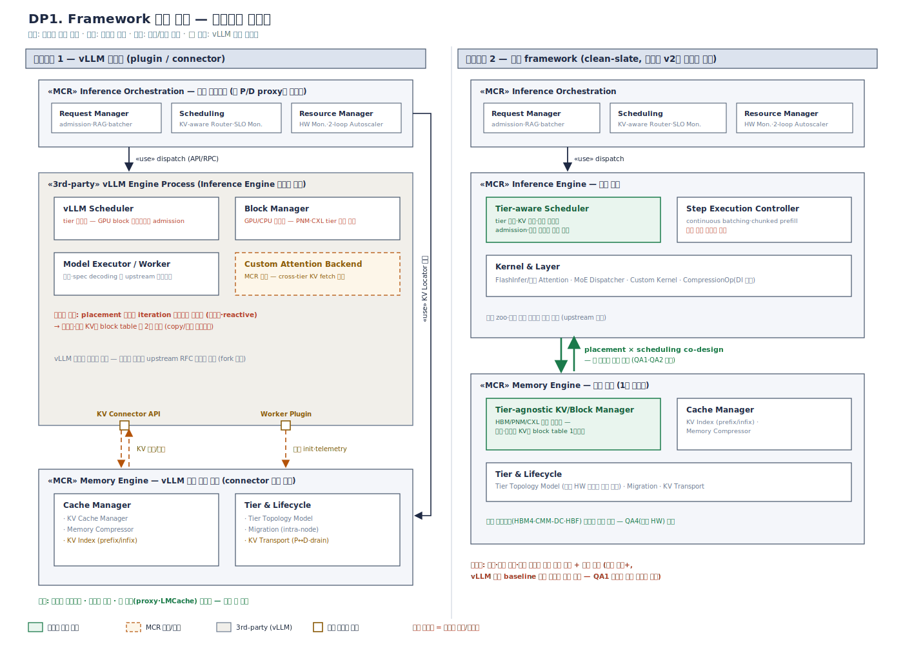
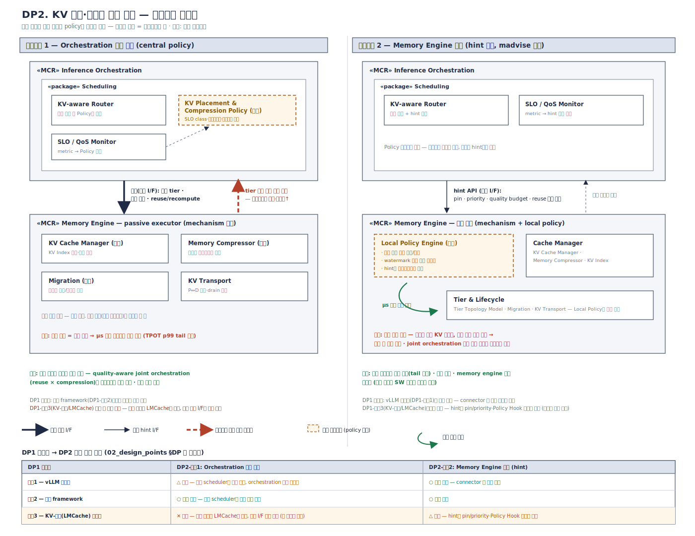

# MCR 설계포인트 전개 — DP1 · DP2 (v0.5)

변경 이력: v0.5 — DP1을 **후보구조 2개** 구도로 재편: 후보1 = 외부 스택
활용형(Inference Engine + KV 계층을 외부 생태계에서 채택 — 내부 변형 A: vLLM
확장/KV 골격 자체, 변형 B: LMCache 편승), 후보2 = 자체 구현형(독립 framework).
구 후보3은 후보1의 변형 B로 흡수(QA 델타 표로 유지), 변형 A/B 선택은 하위
결정으로 검토 노트·ADR에 이관. v0.4 — DP1을 **실행 스택 소싱**(Inference Engine + Memory Engine을
외부에서 채택하는가, 자체 구현하는가)의 단일 결정으로 재프레이밍: 제목·문제
정의·설계 쟁점·검토 노트 개정, 후보별 "자체 구현 경계선" 명시 (후보 구성·QA표는
유지 — 세 후보는 경계선 위치의 순수형 3점으로 재해석).
v0.3 — DP1에 후보구조 3(KV-계층(LMCache) 확장형) 추가: 문제 정의에
KV-계층 생태계 압력 보강, 설계 쟁점 4 신설(DP2·DP6 커플링), 검토 노트를 3후보
구도로 재작성, 의존성 표 갱신. v0.2 — QA 평가표를
[`00_qa_definitions.md`](00_qa_definitions.md) v0.3 bin 기준으로 재채점 (DP1
후보2 QA4 ★★☆→★☆☆, DP2 후보2 QA2 ★☆☆→★★☆, 나머지 별점 유지·근거를 bin
판정문으로 전면 재작성). v0.1 — 최초 작성.

작성 기준: 확정안 v2 패키지 다이어그램. QA 정의·별점 기준은 [`00_qa_definitions.md`](00_qa_definitions.md)를 따른다 (잠정 — 공식 확정 시 재평가 필요).

---

## 0. QA 정의 (분리됨)

QA1–QA6의 정의, 측정 방법, **별점별 정량 bin과 그 선정 근거(레퍼런스 SLO)** 는
[`00_qa_definitions.md`](00_qa_definitions.md)로 분리되었다. 본 문서의 모든
QA 평가표 별점은 해당 문서의 bin 기준으로 해석한다.

> 본 문서의 평가표는 **00 v0.3 bin 기준으로 재채점**되었다 (전부 설계 단계
> 예측 `(F)`, 근거 등급 A 실측 / B 문헌 / C 구조 논증). QA1의 baseline은
> 00 v0.7에서 "동일 실행 구성의 GPU HBM 단일 tier"로 개정(P/D 분리 전제
> 제거)되었으며, QA 번호는 v0.7 교환 후 기준(QA2 응답 품질·QA3 메모리
> 효율)으로 읽는다.
>
> **QA1 재평가 (00 v0.9 — 2지표 bin)**: QA1이 goodput@SLO(단일 배율)에서
> **TTFT(prefill 축 — 재사용·retrieval) · throughput(decode 축 — tier·압축)
> 각 ≥ 2×**로 개정됨에 따라 전 DP의 QA1 행을 재채점했다. 각 DP는 대개
> **한 축**에 작용하므로(예: DP3·DP7·DP8 = TTFT 축, DP2·DP4·DP5·DP6 =
> throughput 축, DP1 = 두 축 substrate), QA1 별점은 **그 DP가 담당하는
> 축의 배율**을 신 bin(★★★ 2× · ★★☆ 1.5–2× · ★☆☆ <1.5×)으로 판정하고,
> 상보 축은 sibling DP가 완성함을 병기한다. 별점 수치 자체는 대부분
> 유지되나 판정 기준이 "축별 2×"로 강화되었다.

---

## DP1. 실행 스택 소싱 — Inference·Memory Engine의 외부 채택 vs 자체 구현

### 문제 정의

본 DP는 실행 스택 — **Inference Engine**(실행·배칭·커널)과 **Memory Engine의
KV 데이터-이동 계층**(추출·이동·영속화 골격) — 을 **외부 생태계에서
채택하는가, 자체 구현하는가**를 하나의 결정으로 다룬다. 후보는 그 양극의
순수형 2개다:

| 후보 | Inference Engine | KV 계층(Memory Engine) 골격 |
|---|---|---|
| 1. 외부 스택 활용형 | 외부 (vLLM) | 변형 A: **자체 (MCR)** / 변형 B: 외부 (LMCache) |
| 2. 자체 구현형 (독립 framework) | **자체 (MCR)** | **자체 (MCR)** |

외부 활용의 깊이(KV 골격까지 편승하는가)는 후보1 **내부의 변형 A/B**로
다룬다 — 이 하위 선택은 "외부 vs 자체"라는 본 DP의 결정을 바꾸지 않고, 두
변형 모두 vLLM connector 생태계 위에서 상호 전환·공존이 가능하기 때문이다
(변형 간 QA 차이는 후보1의 QA 델타 표로 명시).

MCR은 PIM/PNM/CXL 이종 메모리를 1급 자원으로 다루는 런타임이다. 그러나 현존 오픈소스 추론 프레임워크(vLLM)는 "KV cache는 GPU HBM에 있다"는 가정이 코드 전반에 배어 있다. 구체적으로:

- **Block 관리의 GPU 중심성**: PagedAttention block table과 allocator가 GPU/CPU 이분법 위에 설계되어 있고, swap 경로는 CPU 전용이다. PNM DRAM·CXL을 제3, 제4의 tier로 넣을 자리가 구조적으로 없다.
- **Scheduler의 tier 비인지**: iteration scheduler는 gpu block 잔량만 보고 admission을 결정한다. "이 요청의 KV 절반이 CXL에 압축 상태로 있다"는 정보가 스케줄 결정에 들어갈 통로가 없다.
- **KV Connector의 용도 제한**: v1 connector API는 P→D prefill 결과 전송용으로 설계되어, decode 진행 중의 tier 간 이동(승격/강등)이나 non-contiguous 재사용 경로로는 반쪽짜리다.

반대 방향의 압력도 강하다. vLLM 생태계는 continuous batching, chunked prefill, speculative decoding, 신규 모델 지원이 주 단위로 갱신된다. 독립 framework는 이 축적을 전부 재구현하고 영구히 추종해야 하며, "vLLM 동등 baseline 성능 도달" 자체가 하나의 대형 프로젝트다.

세 번째 압력은 **KV-계층 생태계의 선점**이다. LMCache가 vLLM 공식 KV offloading
connector로 프로덕션에 안착하며(GKE Inference·CoreWeave·Cohere 채택),
chunking·영속화·백엔드 추상화·압축(CacheGen)·비접두 재사용(CacheBlend)을 이미
갖춘 KV 데이터-이동 계층이 표준 지위를 굳히고 있다. MCR이 이 계층과 **경쟁**할지
(후보1 변형 A·후보2), 그 **위에 올라탈지**(후보1 변형 B)가 소싱 결정의 일부가 되었다. 단 이
계층은 백엔드를 수동적 put/get 저장소로 추상화하므로 — tier topology 인지 배치,
요청별 SLO 정책, 근접 연산이 들어갈 자리가 구조적으로 제한된다(배경 문서 ④).

### 설계 쟁점

1. **경계선의 위치**: MCR의 차별 가치(tier-aware 배치, non-contiguous KV 1급 관리, 근접 연산)는 실행 스택의 어느 층에 사는가 — 자체 구현 경계선은 최소한 그 층을 안쪽에 두어야 한다. 그 가치가 외부 계층의 확장 통로 — **vLLM의 공식 확장점**(platform plugin, KV connector, custom attention backend, worker extension)·LMCache 정책 훅 — 안에서 표현 가능한가? 표현 불가능한 잔여분은 무엇인가?
2. 확장점 밖 수정이 필요한 지점(scheduler의 tier 인지, block table 일반화)이 연구·제품 가치의 **핵심인가 주변부인가**?
3. 조직 리소스로 감당 가능한 유지보수 모델은 무엇인가 — plugin 추종, fork rebase, 독립 코어 유지, KV-계층 백엔드 추종 중.
4. (DP2·DP6 커플링) 차별 가치 중 어디까지가 KV 데이터-이동 계층(LMCache)의 백엔드·정책 훅으로 표현 가능한가 — 근접 연산 오프로드(DP6)와 tier-aware decode 경로는 이 계층 밖이며, 이 경로 채택 시 중앙 정책(DP2 후보1)의 자리도 LMCache 골격에 제약된다.

### 후보구조 설계도

*draw.io 소스: [`dp1_candidates.drawio`](../diagrams/dp1_candidates.drawio)*

### 후보구조 1 — 외부 스택 활용형 (vLLM 생태계 기반)

**소싱 경계선**: Inference Engine을 외부(vLLM)에서 채택한다. KV 계층의 소싱 깊이는 후보 내부의 두 변형으로 갈린다 — **변형 A (기준형)**: KV 골격은 MCR 자체(vLLM 확장점에 주입), **변형 B**: KV 골격까지 LMCache에 편승(백엔드+정책 훅만 자체). A/B 선택은 하위 결정으로 검토 노트·별도 ADR에서 다룬다.

**구조 (변형 A — vLLM 확장형, 기준형)**: Inference Orchestration은 vLLM 프로세스 밖의 독립 계층(현 disagg proxy 구조의 정식화). Inference Engine 자리는 vLLM이 그대로 담당. Memory Engine은 KV connector API + custom attention backend + worker plugin으로 vLLM에 주입하되, 코어는 vLLM 프로세스 밖 독립 모듈로 유지한다.

**주의 — fork와의 구분**: "vLLM 위에" 만드는 방식은 공식 확장점만 쓰는 plugin형과 코어를 직접 수정하는 fork형으로 갈린다. fork는 초기 개발 속도가 빠르지만 upstream이 주 단위로 움직이므로 6~12개월 후 rebase 비용이 급증한다. 본 후보구조는 plugin형을 기준으로 하고, 확장점이 막히는 지점은 upstream RFC 기여로 뚫는 것을 원칙으로 한다.

**구조 (변형 B — KV-계층(LMCache) 편승형)**: Inference Engine 자리는 변형 A와
동일하게 vLLM(무수정). KV의 추출·이동·영속화 골격은 **LMCache**(vLLM 공식 KV
offloading connector — GKE Inference·CoreWeave·Cohere 채택)가 담당하고, MCR은
(a) 자사 tier(CXL·PNM DRAM·HBF)를 LMCache **storage backend connector 모듈**로
노출, (b) 배치·압축·재사용 정책을 LMCache의 정책 훅에 구현한다. 변형 A와의
구분: A는 KV 계층의 골격을 MCR이 소유(자체 Memory Engine 주입), B는 기존
오픈소스 KV 계층에 올라탐(골격·정책 훅·백엔드 추상화를 LMCache가 소유) — 상속
자산 최대(chunking·영속화·CacheGen 압축·CacheBlend 비접두 재사용·멀티엔진 통합),
아키텍처 골격 지배력 최소. 대가는 셋: 백엔드가 수동적 put/get 대상이라
tier topology 인지 배치·요청별 SLO 정책의 자리가 제한되고, 근접 연산(DP6)은 이
계층 밖이며, vLLM+LMCache **이중 upstream**을 동시 추종한다.

**장점 (변형 A 기준)**
- 생태계 무임승차: 배칭·커널·모델 지원의 지속 개선을 비용 없이 흡수
- 검증된 코어: 수치 정확성·edge case가 대규모 배포로 이미 검증됨
- 현 자산 재사용: 기 구축한 P/D proxy, LMCache 연동, 벤치마크 인프라가 그대로 유효
- 초기 구축 비용 최소 — 연구 가설 검증까지의 리드타임 단축

**단점 (변형 A 기준)**
- scheduler가 tier를 모름: placement 결정이 스케줄링과 통합되지 못해 사후적(reactive). tier-aware co-scheduling으로 얻을 이득을 구조적으로 미회수
- cross-tier non-contiguous KV가 2급 시민: block table 밖에서 관리 → 재사용 시 copy/포맷 변환 오버헤드
- upstream API 변경 리스크: connector/plugin API 자체가 아직 개정 중
- 아키텍처 주도권 부재 — MCR이 "vLLM 애드온"으로 인식될 전략적 리스크 (변형 B는 "LMCache 백엔드 하나"로 인식될 더 강한 희석 리스크)

**QA 평가 (변형 A — 기준형)**

| QA | 평점 | 정량 근거 (00 v0.3 bin 판정) |
|----|------|-----------|
| QA1 | ★★☆ (F) | 두 축 모두 2× 미달. **throughput 축**: connector 경유 압축·오프로딩으로 batch 이득 일부 회수(KIVI 2.35–3.47×의 부분 실현, B)나 scheduler tier 비인지로 co-scheduling 미회수 — decode wait 70–85%(A) 개선 상한이 확장점에 걸려 1.5–2×(C). **TTFT 축**: 확장점이 비연속 재사용(DP3 후보2)을 구조적으로 제약 — prefix 재사용만 회수해 2× 미달(C). 각 축 1.5× 경로라 종합 ★★☆ |
| QA2 | ★★★ (F) | acc ≤1%p·ΔPPL ≤0.1은 KVQuant 3-bit급 기법 채택으로 달성 가능(B); 검증된 vLLM 코어라 회귀 리스크가 MCR 추가분에 국한(C). 요청별 bound는 connector 메타데이터로 집행 가능(C — DP2 채택안에 종속) |
| QA3 | ★★☆ (F) | 1.5–3× bin 예측: 압축 2–4×(A)·CXL 오프로딩은 connector로 가능하나, block table 밖 관리라 재사용·압축 KV의 copy/포맷 변환 오버헤드가 유효 배율을 깎아 ≥3× 미달(C) |
| QA4 | ★★☆ (F) | (a) tier 추가는 자사 Memory Engine 어댑터 모듈에 갇히나, 확장점 밖 기능은 upstream RFC 경유 — 리드타임 1분기급(C). (b) KV 구조 변화는 upstream이 모델을 지원하므로 어댑터 갱신만 — +2주 가능(B: 2주 릴리스 주기). API 개정 시 재작업 리스크로 ★★★ 미달 |
| QA5 | ★★★ (F) | 초기 "수 인월"(A) ≤ 6인월 bin; plugin 경계 유지 시 추종 ≤0.5 FTE(C — 릴리스 주기당 수일) |

**변형 B의 QA 델타** (기준형 대비 — 별점·근거 상세는 v0.3 이력의 구 후보3 평가표 기준):

| QA | 변형 A (기준형) | 변형 B | 델타 근거 |
|----|------|------|-----------|
| QA1 | ★★☆ | ★★☆ (상한↓) | 두 축 모두 2× 미달은 동일. tier-aware decode 경로·co-scheduling 부재로 throughput 상한이 더 낮고, 재사용 낮은 워크로드에선 TTFT < 1.5×로 ★☆☆ 하향 리스크(C) |
| QA2 | ★★★ | **★★☆** | 정책 골격이 LMCache 소유 — 요청별 품질 예산 차등 집행 통로 없음, "전역 bound만 보장" bin(C) |
| QA3 | ★★☆ | **★★★** | 다단 백엔드(CPU DRAM·SSD·원격)+CacheGen 압축 상속 — 원본 환산 수용량 확장이 주특기(B), 자사 CXL tier는 백엔드 모듈로 즉시 기여(C) |
| QA4 | ★★☆ | ★★☆ (리스크↑) | tier 추가는 백엔드 모듈 1개로 ★★★급이나, KV 구조 변화 시 vLLM+LMCache 이중 upstream 대응을 모두 대기(C) |
| QA5 | ★★★ | ★★★ (초기↓) | KV 계층 전체를 상속하고 백엔드 connector+정책 훅만 구현 — 초기 비용 전 변형 중 최소(기 구축 LMCache 연동 자산(A)), 단 이중 upstream 변동성(C) |

### 후보구조 2 — 자체 구현형 (독립 framework)

**소싱 경계선**: 없음 — 실행 스택 전 층(Inference Engine + Memory Engine)을 자체 구현한다.

**구조**: Memory Engine을 설계 중심에 놓고, scheduler·block table·executor가 tier topology를 1급으로 인지하는 클린 설계. 커널 계층은 FlashInfer/자체 커널 조합으로 구성. 확정안 v2 다이어그램을 제약 없이 그대로 구현하는 안.

**장점**
- memory-centric 설계 자유: block table이 tier-agnostic, placement·압축·스케줄링의 진짜 co-design 가능 (이론 성능 상한 최고)
- 자사 HW 로드맵(HBM4·CMM-DC·HBF)을 확장점 제약 없이 직접 수용
- 아키텍처 주도권·IP 확보 — MCR을 독립 플랫폼으로 포지셔닝 가능

**단점**
- 재구현 비용: continuous batching, chunked prefill, prefix caching, 모델 zoo 지원 등 vLLM이 수년·수백 contributor로 축적한 것을 자체 구현 — vLLM 동등 baseline 도달 자체가 리스크
- 검증 부담: 미검증 실행 코어의 수치 정확성·안정성 검증 비용
- 영구 추종 부담: 신규 모델·기법이 나올 때마다 자체 포팅 필요 (리드타임 만성 열세)

**QA 평가**

| QA | 평점 | 정량 근거 (00 v0.3 bin 판정) |
|----|------|-----------|
| QA1 | ★★★ (상한) / ★☆ (도달 리스크) (F) | 상한: 전 층 co-design으로 **throughput 축 2×**(압축·co-scheduling batch, 압축 단독 2.35–3.47×(B))와 **TTFT 축 2×**(비연속 재사용·오프로드 1급 수용, CacheBlend 2.2–3.3×(B))를 **동시에 여는 유일 구조** — 두 축 모두 2× 경로(C). 도달 리스크: vLLM 동등 배칭 효율 재현 실패 시 baseline 자체 미달 — 두 축 동시 무효화(C) |
| QA2 | ★☆☆ (F) | bound 보장 자체가 리스크: 압축 기법의 acc/PPL은 문헌상 달성 가능(B)하나, 미검증 실행 코어의 수치 정확성 리스크가 저하의 총량을 키워 ≤2%p bound 보장을 장담 못 함(C) |
| QA3 | ★★★ (F) | ≥3× bin 예측: tier-agnostic block table로 압축 2–4×(A)와 tier 오프로딩을 1급 결합 — 관리 오버헤드 없는 원본 환산 배율 극대화(C) |
| QA4 | ★☆☆ (F) | (a) 디바이스 축은 ★★★급 — tier 추가가 어댑터 모듈에 갇히는 클린 설계(C). 단 (b) 독립 framework는 00 각주 규칙에 따라 **일반 모델 enablement 전체가 MCR 책임** — 신규 모델·기법 자체 포팅으로 리드타임 만성 열세 >1분기(C). a·b 동시 충족 요건이므로 종합 ★☆☆ |
| QA5 | ★☆☆ (F) | 초기 "수십 인월+"(A) > 24인월 bin 초과; 유지보수 인력 상시 소요 — vLLM 2주 릴리스(B) 추종을 자체 부담 시 > 2 FTE(C) |

### 검토 노트

- 본 DP의 실질 결정 변수는 "**MCR의 차별 가치(tier-aware co-scheduling,
  non-contiguous KV 1급 관리, 근접 연산)가 외부 스택의 확장 통로(vLLM 확장점·
  LMCache 훅) 안에서 표현 가능한가**"다. 표현 가능하다면 후보1이 생태계의
  축적(배칭·커널·모델 지원·KV 계층)을 무료로 얻고, 표현 불가능한 잔여분이
  연구·제품 가치의 핵심이라면 후보2만이 그 가치를 온전히 담는다 — QA5(초기
  ≤6인월 vs >24인월)와 QA1 상한·도달 리스크의 정면 교환.
- **하위 결정 (후보1 채택 시) — 변형 A vs B**: KV 골격의 소유권. "MCR의
  정체성이 KV 데이터-이동 계층인가(변형 B — 계층화/용량 축의 최단 경로),
  배치×연산을 함께 결정하는 메모리 시스템 런타임인가(변형 A — 근접 연산·decode
  경로의 자리 보존)". 이 선택은 본 DP의 "외부 vs 자체" 결정을 바꾸지 않으므로
  별도 ADR로 이관한다 (QA 델타 표 참조).
- QA 프로파일 요약: 후보1은 QA5 최강·QA1 상한 제한(변형 B는 QA3 최강·QA2
  집행 단위 열위), 후보2는 QA1·QA3 상한 최고·QA5 최악 — 두 후보의 trade-off가
  전 QA에 걸쳐 살아 있어 DP 자격을 유지한다.
- 현실적 절충은 **진화 경로형 결정** — 외부 의존을 단계적으로 줄이는 경로:
  변형 B로 시작(자사 tier를 백엔드로 노출 — 시장 진입·E2E 완주 최속)하되,
  정책 훅·decode 경로가 막히는 지점을 ADR에 목록화하고, 임계 초과 시 변형
  A(vLLM 확장점에 자체 Memory Engine)로, 그다음 후보2로 전환한다. 변형 B와
  A는 상호 배타가 아니라 **공존 가능**(LMCache 백엔드는 유지한 채 Memory
  Engine 코어를 자체화)하므로 전환 비용이 낮다 — 이 경로의 실질 장점.

---

## DP2. KV 배치·압축의 관리 주체

### 문제 정의

이종 메모리 tier(GPU HBM / PNM DRAM / CXL) 위에서 KV cache의 배치(placement), 압축(compression level), 이동(promotion/demotion)을 **누가 결정하는가**. 이 결정에는 상반된 두 종류의 정보가 필요하다:

- **요청 문맥** (orchestration만 앎): SLO class, multiturn 재사용 확률, retrieval chunk의 공유도, 허용 품질 예산. 실측상 decode wait가 e2e의 70–85%이므로, "이 요청의 KV가 어느 tier에 어떤 압축 상태로 있는가"가 goodput을 직접 결정한다.
- **자원 상태** (memory engine만 신선하게 앎): tier별 잔량, 대역폭 포화도, 압박 스파이크. 이 정보는 μs~ms 단위로 변하며, request-granularity 제어 루프로는 따라잡을 수 없다.

압축에는 품질 비용이 있고(K가 V보다 민감하다는 K>V sensitivity 계열 결과 — 압축 대상·비율 선택이 품질을 좌우), 재사용에는 위치 비용이 있다(non-contiguous chunk의 selective recompute 여부). 즉 이 DP는 성능 문제이면서 동시에 **품질 예산의 집행 주체** 문제다. 구조적으로는 OS paging policy의 고전적 위치 논쟁(커널 자율 vs madvise 힌트 vs 응용 전권)과 동형이다.

### 설계 쟁점

1. 품질 예산(quality budget)을 요청별로 차등 집행하려면 결정 주체가 요청 문맥을 알아야 한다 — 어느 레벨까지 문맥을 내릴 것인가?
2. 메모리 압박 스파이크 대응은 μs 반응이 필요하다 — 어느 레벨까지 자율성을 줄 것인가?
3. Memory Engine의 독립 재사용성(타 엔진 이식, 자사 메모리 생태계 전략)을 policy 결합이 훼손하지 않는가?
4. (DP1 커플링) DP1 후보1(외부 스택 활용형)에서는 중앙 policy를 엔진 scheduler에 심을 수 없고, 그 변형 B(LMCache 편승)에서는 정책 골격 자체를 LMCache가 소유해 제약이 더 강하다(중앙 정책 실현 가능성 최소) — DP1 채택안(과 변형)이 본 DP의 실현 가능 집합을 제약한다.

### 후보구조 설계도

*draw.io 소스: [`dp2_candidates.drawio`](../diagrams/dp2_candidates.drawio)*

### 후보구조 1 — Orchestration 중앙 정책 (central policy, memory engine은 mechanism 전담)

**구조**: Scheduling 패키지에 KV Placement & Compression Policy 컴포넌트를 신설. KV-aware Router가 요청 배치 시 KV의 목표 tier·압축 수준·재사용/재계산 여부까지 함께 결정해 Memory Engine에 지시. Memory Engine은 지시 집행(mechanism)만 담당.

**장점**
- 전역 최적화: SLO class·재사용 확률·품질 예산을 반영한 배치 — quality-aware joint orchestration 연구의 자연스러운 구현 위치
- 품질 SLO 보장: 요청별 품질 예산을 중앙에서 집행 → 요청 간 품질 편차 통제 가능
- 결정 로직 단일화로 설명가능성·디버깅 용이

**단점**
- 반응 지연: 제어 루프가 request granularity → μs 단위 메모리 압박 스파이크에 늦어 stall/OOM성 지연 위험
- 인터페이스 비대화: tier 상태를 상시 상향 보고해야 정책이 성립 — orchestration↔memory 결합도 증가
- Memory Engine이 수동적 executor로 격하 → 독립 제품화·이식성 저하

**QA 평가**

| QA | 평점 | 정량 근거 (00 v0.3 bin 판정) |
|----|------|-----------|
| QA1 | ★★☆ (F) | **throughput 축(decode)**: 정상 상태 배치 품질은 2× 경로이나, μs 압박 스파이크에 request-granularity 정책 루프가 늦어 TPOT p99 tail 증가 — iso-latency 판정에서 2× 미달(1.5–2×)(C). TTFT는 재사용 판정 중앙 집행으로 간접 기여(DP3 종속). 본 DP는 decode 축 책임 — 종합 ★★☆ |
| QA2 | ★★★ (F) | ★★★ bin의 "요청별 bound 집행" 조건을 구조적으로 정면 충족 — 품질 예산의 요청별 중앙 집행(C); acc ≤1%p·ΔPPL ≤0.1은 기법 문헌로 달성 가능(B) |
| QA3 | ★★★ (F) | ≥3× bin 예측: SLO class·재사용 확률 기반 배치로 오강등 miss 없이 tier·압축 이득을 온전히 회수(C) — 압축 2–4×(A) × tier 결합의 상한 실현 경로 |
| QA4 | ★★☆ (F) | 정책이 tier 문맥·KV 의미론에 결합 — tier 추가/KV 구조 변화 시 중앙 정책(코어) 수정 발생, 단 ≤40% 범위·≤1분기 예측(C). 정책-메커니즘 결합으로 Memory Engine 단독 진화 제약 |
| QA5 | ★★☆ (F) | tier 상태 상시 상향 보고 인터페이스·상태 동기화 구현 — 초기 6–24인월 구간, 유지 ≤2 FTE 예측(C) |

### 후보구조 2 — Memory Engine 자율 (autonomous local policy)

**구조**: Cache Manager가 자체 정책(접근 온도 기반 승격/강등, watermark 기반 압축 트리거)을 내장. Orchestration은 얇은 힌트 API(pin, priority, 총 품질 예산)만 제공 — madvise 모델.

**장점**
- μs 반응: 자원 상태 변화에 즉시 대응, 압박 스파이크 흡수
- 얇은 인터페이스: 결합도 최소 — DP1 후보1(외부 스택 활용형)과 가장 궁합이 좋음 (변형 B에서는 사실상 유일 후보)
- Memory Engine 독립성: 타 추론 엔진에도 이식 가능한 컴포넌트로 성립 — 자사 메모리 소프트웨어 생태계 전략과 부합

**단점**
- 문맥 부재: 재사용될 KV를 온도만 보고 강등하거나, SLO 여유 요청과 급한 요청을 동일 취급 → goodput 전역 최적 미달
- 품질 예산의 로컬 집행 → 요청 간 품질 불균형, "quality-aware joint orchestration"이라는 연구 기여 지점이 구조에서 사라짐

**QA 평가**

| QA | 평점 | 정량 근거 (00 v0.3 bin 판정) |
|----|------|-----------|
| QA1 | ★★★ (F) | **throughput 축(decode)**: watermark 기반 μs 반응으로 압박 스파이크의 TPOT p99 tail 방어 → iso-latency throughput **2× 경로에 최강**(C); 압축·tiering 기본 이득(KIVI 2.35–3.47×(B)). TTFT 2×는 재사용 담당 DP(DP3·DP7·DP8)가 완성 — 본 DP는 decode 축 책임. 오강등 miss가 배율 깎으면 1.5–2× 하향 경계 리스크(C) |
| QA2 | ★★☆ (F) | **v0.2 ★☆☆에서 승격**: "전역 bound만 보장"이 v0.3 ★★☆ bin의 정의와 정확히 일치 — 전역 watermark 압축 수준 제한으로 acc ≤2%p(KIVI 2-bit 실측 상한(B)) 보수 운용 가능(C). 요청별 차등 불가로 ★★★ 미달 |
| QA3 | ★★☆ (F) | 1.5–3× bin 예측: watermark 압축 트리거로 기본 배율은 확보하나, 문맥 없는 온도 정책이 재사용 예정 KV를 오강등 → miss·재계산 비용이 ≥3× 도달을 막음(C) |
| QA4 | ★★★ (F) | (a) tier 추가 = Cache Manager 내 어댑터 모듈, 얇은 hint API라 코어(인터페이스) 무수정(C); (b) KV 구조 변화도 Memory Engine 모듈 내 수용 — +2주 추종 가능(C, 2주 주기(B)). 독립 이식성 최고 |
| QA5 | ★★★ (F) | 얇은 인터페이스·단계적 구현 — 초기 ≤6인월·유지 ≤0.5 FTE 예측(C) |

### 검토 노트

- 실질 채택 방향은 **계층 절충(hybrid)** 이 유력하다: mechanism과 기본 정책(온도·watermark)은 Memory Engine 자율로 두되, 품질·SLO가 걸린 결정만 orchestration이 예산·힌트로 하향(quality budget per request, pin/priority, 재사용 후보 명단). OS가 커널 페이징 + madvise로 수렴한 것과 같은 구조. 이렇게 하면 연구 기여(joint orchestration은 힌트 생성 로직에 위치)와 제품 전략(memory engine 독립성) 이 동시에 성립한다.
- 단, DP 문서에서는 순수형 두 후보의 긴장을 먼저 보인 뒤 hybrid를 채택안으로 제시하는 순서가 리뷰 설득력이 높다 — hybrid를 처음부터 후보로 세우면 trade-off 분석이 무뎌진다.

---

## DP 간 의존성

| 의존 | 내용 |
|------|------|
| DP1 → DP2 | 외부 스택 활용형(후보1) 채택 시 중앙 정책을 엔진 scheduler에 통합 불가 → DP2는 자율+힌트형으로 제약. 변형 B(LMCache 편승)면 정책 위치가 LMCache cache manager 골격에 추가 제약 — DP2 중앙 정책(후보1)의 실현 가능성 최소. 자체 구현형(후보2) 채택 시 DP2 전 후보 실현 가능 |
| DP1 → DP6 | 후보1 변형 B(LMCache 편승)는 데이터 이동 전용 계층 — 근접 연산 오프로드(DP6)는 KV-계층 경로 밖의 별도 통로(custom attention backend 등)를 전제해야 하며, DP6의 실현 가능 집합을 제약 |
| DP2 → 구조도 | 채택안에 따라 확정안 v2의 "policy 위치 미확정" 주석이 해소됨 (Scheduling 내 Policy 컴포넌트 신설 여부) |
| 공통 | 양 DP 모두 KV Index·KV Transport(신규 제안 컴포넌트)의 존재를 전제 |
