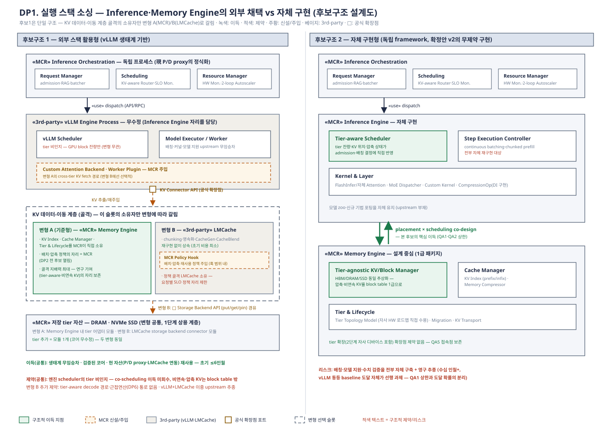
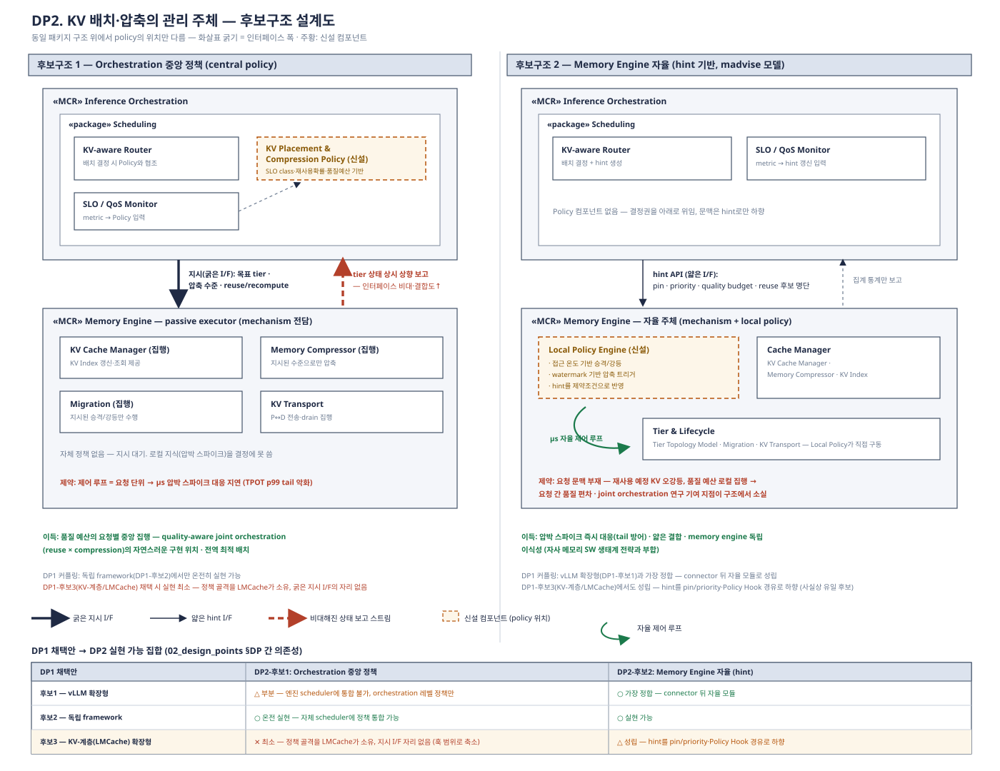
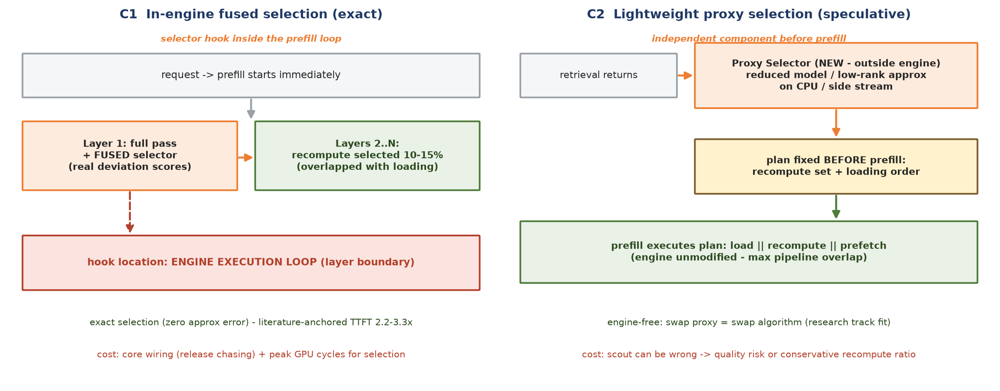
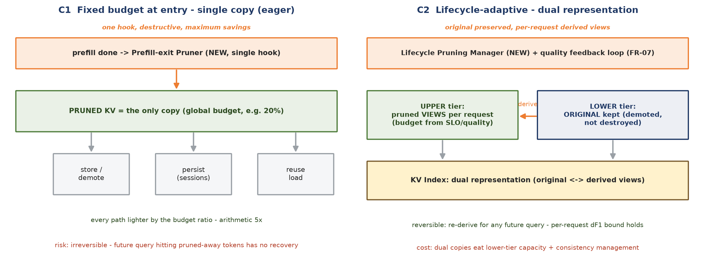
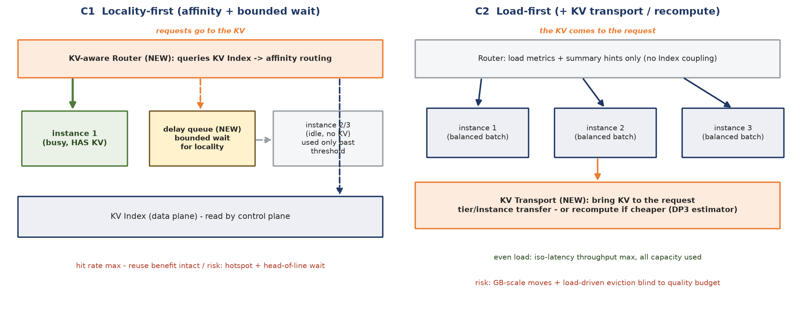

# KV 캐시 최적 운용 (MCR 1단계) 설계포인트 전개 — DP1–DP5 (v1.0)

변경 이력: v1.0 — 최초 작성. 5-DP 체계 확정(검수 합의)에 따라 구
`02_design_points_dp1_dp2.md`(v0.5)의 **DP1(실행 스택 소싱)·DP2(KV 배치·압축
관리 주체)를 승계·개정**하고(골격 유지 — 후보구조·핵심 긴장·진화 경로 /
논거를 1단계 범위로 교체 — 이종 tier·근접연산 근거 제거, 목표 3축 본체
메커니즘으로 결정 변수 갱신, QA 신번호[v1.4] 재채점), **DP3(KV 재사용
범위·복원 전략)·DP4(정확도를 유지한 KV 캐시 압축)·DP5(KV 캐시 인지형 동적
스케줄링)를 신설**했다(각각 필요성 2층 운용 공백 ①②③ 대응, DP3는 검토 대기
노트 [`dp_note_kv_reuse_selector.md`](dp_note_kv_reuse_selector.md) 승격).
구 `03`–`05` 문서(구 DP3–DP8)는 구 체계(MCR 전체 범위·2단계 포함) 기록으로
동결한다.

작성 기준: 배경·범위 문서 v5 (**MCR 1단계 = KV 캐시 최적 운용 AI 런타임**),
요구사항 분석 v1.5, QA 정의 [`00_qa_definitions.md`](00_qa_definitions.md)
v1.5 (**QA1 throughput · QA2 응답 품질 · QA3 TTFT · QA4 유효 KV 용량 ·
QA5 확장성·진화성** — 신번호). 평가는 전부 설계 단계 예측 `(F)`,
근거 등급 A 자체 실측 / B 문헌 / C 구조 논증.

---

## 0. QA 정의 (분리됨)

QA1–QA5의 정의·측정 방법·**별점별 정량 bin과 선정 근거**는
[`00_qa_definitions.md`](00_qa_definitions.md)가 단일 출처다. 본 문서의 모든
평가표 별점은 그 bin 기준으로 해석한다. 구 QA6(Maintainability)의 비용
bin(초기 ≤6/≤24인월 · 유지 ≤0.5/≤2 FTE)은 미선정 전환(v1.5)과 함께 **DP1의
비용 모델 판단 기준으로 보존**되어 본 문서 DP1에서만 사용한다.

## DP 체계 요약 — 2계층 구조

| 층 | DP | 결정 | 대응 |
|---|---|---|---|
| 기반 결정 | **DP1. 실행 스택 소싱** | 실행 스택을 외부 생태계에서 채택하는가, 자체 구현하는가 — "집을 어디에 짓나" | 전 목표의 substrate |
| 기반 결정 | **DP2. KV 배치·압축의 관리 주체** | KV 운용 정책들이 어디에 사는가(중앙 vs 자율) — "누가 다스리나" | 필요성 관통 문제(조율 계층 부재) |
| 내용 결정 | **DP3. KV 재사용 범위·복원 전략** | 재계산 토큰 선택 연산을 어디서·언제 실행하나 | 운용 공백 ① → 목표 1 (QA3) |
| 내용 결정 | **DP4. 정확도를 유지한 KV 캐시 압축** | pruning을 언제·어떤 자산 표현으로 집행하나 | 운용 공백 ② → 목표 2 (QA1·QA4, gate QA2) |
| 내용 결정 | **DP5. KV 캐시 인지형 동적 스케줄링** | 라우팅·배칭의 1차 기준 — KV locality인가 부하인가 | 운용 공백 ③ → 목표 3 (QA1) |

**DP2와 DP3–5의 경계**: DP2는 각 정책이 **어디에 사는가**(결정의 소재 —
중앙/자율, 문맥을 어느 레벨까지 내리나)를 정하고, DP3–5는 각 정책의
**구조가 무엇인가**(선택 연산의 실행 구조, pruning의 집행 구조, 라우팅
기준)를 정한다. 직교하되 커플링된다 — 의존성 표 참조.

---

## DP1. 실행 스택 소싱 — Inference·Memory Engine의 외부 채택 vs 자체 구현

(구 02 v0.5 DP1 승계 — 후보구조·긴장·진화 경로 유지, 결정 변수의 내용물을
1단계 목표 3축 메커니즘으로 교체, QA 신번호 재채점.)

### 문제 정의

본 DP는 실행 스택 — **Inference Engine**(실행·배칭·커널)과 **Memory Engine의
KV 데이터-이동 계층**(추출·이동·영속화 골격) — 을 **외부 생태계에서
채택하는가, 자체 구현하는가**를 하나의 결정으로 다룬다. 후보는 양극의
순수형 2개다:

| 후보 | Inference Engine | KV 계층(Memory Engine) 골격 |
|---|---|---|
| 1. 외부 스택 활용형 | 외부 (vLLM) | 변형 A: **자체 (MCR)** / 변형 B: 외부 (LMCache) |
| 2. 자체 구현형 (독립 framework) | **자체 (MCR)** | **자체 (MCR)** |

1단계 런타임은 KV 캐시를 상용 메모리 계층(GPU HBM / host DRAM / NVMe SSD)
위에서 재사용·압축·스케줄링으로 최적 운용한다. 그러나 현존 오픈소스 추론
프레임워크(vLLM)는 "KV cache는 GPU HBM에 있다"는 가정이 코드 전반에 배어
있어, **목표 3축의 본체 메커니즘이 들어갈 자리**가 구조적으로 제한된다:

- **Block 관리의 GPU 중심성**: PagedAttention block table과 allocator가
  GPU/CPU 이분법 위에 설계되어 있고 swap 경로는 CPU 전용 — DRAM·SSD를
  다단 tier로 쓰는 배치·강등·영속(목표 2·재사용 영속)의 1급 표현이 없다.
  cross-tier **non-contiguous chunk KV는 2급 시민** — block table 밖에서
  관리하면 재사용 시 copy/포맷 변환 오버헤드를 문다.
- **Scheduler의 KV 비인지**: iteration scheduler는 gpu block 잔량만 보고
  admission을 결정한다. "이 요청의 재사용 KV가 SSD에 압축 상태로 있다"는
  정보가 스케줄 결정에 들어갈 통로가 없다(목표 3의 훅 부재). KV 공간 확보도
  preemption(전량 폐기/swap)뿐이다.
- **확장점의 용도 제한**: v1 KV connector API는 P→D prefill 결과 전송용으로
  설계되어 비접두 재사용·decode 중 tier 이동에는 반쪽이고, **비접두
  재사용의 query-aware 재계산 토큰 선택(DP3)은 prefill 실행 루프 내부
  (layer 경계) 훅**을 요구한다 — connector 수준이 아니라 엔진 코어 진입에
  가까운 지점이라, 1단계에서는 구 문서보다 더 첨예한 제약이다.

반대 방향의 압력도 강하다. vLLM 생태계는 continuous batching, chunked
prefill, speculative decoding, 신규 모델 지원이 주 단위로 갱신된다. 독립
framework는 이 축적을 전부 재구현하고 영구히 추종해야 하며, "vLLM 동등
baseline 성능 도달" 자체가 하나의 대형 프로젝트다.

세 번째 압력은 **KV-계층 생태계의 선점**이다. LMCache가 vLLM 공식 KV
offloading connector로 프로덕션에 안착하며(GKE Inference·CoreWeave·Cohere
채택) chunking·영속화·백엔드 추상화·압축(CacheGen)·비접두 재사용(CacheBlend)
을 이미 갖춘 KV 데이터-이동 계층의 표준 지위를 굳히고 있다. 1단계에서 이
압력은 **양방향**이다 — 비접두 재사용이 목표 1의 본체가 되면서 CacheBlend
계열을 통합한 LMCache는 더 유관해졌지만(상속 이득↑), 팀 연구가 바로 그 선택
알고리즘의 자체 개선이므로 **그 훅을 LMCache가 소유하는 구조는 더 아픈
제약**이 된다(연구 자유도↓).

### 설계 쟁점

1. **경계선의 위치**: 1단계의 차별 가치 — **목표 3축의 본체 메커니즘**
   ① query-aware 재계산 선택기의 layer-경계 훅(DP3) ② 요청별 차등 pruning
   집행점(DP4) ③ KV 상태를 읽는 스케줄러 훅(DP5) — 이 외부 계층의 확장
   통로(vLLM platform plugin·KV connector·custom attention backend·worker
   extension, LMCache 정책 훅) 안에서 표현 가능한가? 표현 불가능한 잔여분은
   무엇인가?
2. 확장점 밖 수정이 필요한 지점(layer-경계 selector 훅, scheduler의 KV
   인지)이 연구·제품 가치의 **핵심인가 주변부인가**?
3. 조직 리소스로 감당 가능한 유지보수 모델은 무엇인가 — plugin 추종, fork
   rebase, 독립 코어 유지, KV-계층 백엔드 추종 중. (비용 모델: 구 QA6 bin —
   초기 ≤6 / 6–24 / >24인월, 유지 ≤0.5 / ≤2 / >2 FTE.)
4. (DP2·DP3·DP5 커플링) 채택안이 정책 위치(DP2)·selector 훅(DP3)·스케줄러
   훅(DP5)의 실현 가능 집합을 제약한다 — 변형 B(LMCache 편승)에서 제약 최강.

### 후보구조 설계도

*draw.io 소스: [`dp1_candidates.drawio`](../diagrams/dp1_candidates.drawio)*

### 후보구조 1 — 외부 스택 활용형 (vLLM 생태계 기반)

**소싱 경계선**: Inference Engine을 외부(vLLM)에서 채택한다. KV 계층의 소싱
깊이는 후보 내부의 두 변형으로 갈린다 — **변형 A (기준형)**: KV 골격은 MCR
자체(vLLM 확장점에 주입), **변형 B**: KV 골격까지 LMCache에 편승(백엔드+정책
훅만 자체). A/B 선택은 하위 결정으로 검토 노트·별도 ADR에서 다룬다.

**구조 (변형 A — vLLM 확장형, 기준형)**: Inference Orchestration은 vLLM
프로세스 밖의 독립 계층(현 disagg proxy 구조의 정식화). Inference Engine
자리는 vLLM이 그대로 담당. Memory Engine은 KV connector API + custom
attention backend + worker plugin으로 vLLM에 주입하되, 코어는 vLLM 프로세스
밖 독립 모듈로 유지한다.

**주의 — fork와의 구분**: "vLLM 위에" 만드는 방식은 공식 확장점만 쓰는
plugin형과 코어를 직접 수정하는 fork형으로 갈린다. fork는 초기 개발 속도가
빠르지만 upstream이 주 단위로 움직이므로 6~12개월 후 rebase 비용이 급증한다.
본 후보구조는 plugin형을 기준으로 하고, 확장점이 막히는 지점(layer-경계
selector 훅 등)은 upstream RFC 기여로 뚫는 것을 원칙으로 한다.

**구조 (변형 B — KV-계층(LMCache) 편승형)**: Inference Engine 자리는 변형
A와 동일하게 vLLM(무수정). KV의 추출·이동·영속화 골격은 **LMCache**가
담당하고, MCR은 (a) 저장 백엔드(DRAM·SSD 조합)를 LMCache storage backend
connector 모듈로 구성, (b) 배치·압축·재사용 정책을 LMCache의 정책 훅에
구현한다. 상속 자산 최대(chunking·영속화·CacheGen 압축·**CacheBlend 비접두
재사용**·멀티엔진 통합), 아키텍처 골격 지배력 최소. 대가는 셋: 백엔드가
수동적 put/get 대상이라 KV-인지 스케줄링(DP5)·요청별 정책(DP2·DP4)의 자리가
제한되고, **재계산 선택기(DP3)의 훅을 LMCache가 소유**해 자체 개선 알고리즘
탑재의 자유도가 낮으며, vLLM+LMCache **이중 upstream**을 동시 추종한다.

**장점 (변형 A 기준)**
- 생태계 무임승차: 배칭·커널·모델 지원의 지속 개선을 비용 없이 흡수
- 검증된 코어: 수치 정확성·edge case가 대규모 배포로 이미 검증됨
- 현 자산 재사용: 기 구축한 P/D proxy, LMCache 연동, 벤치마크 인프라 유효
- 초기 구축 비용 최소 — 연구 가설 검증까지의 리드타임 단축

**단점 (변형 A 기준)**
- scheduler가 KV를 모름: admission·배칭이 KV 상태와 통합되지 못해
  사후적(reactive) — KV 인지 스케줄링(목표 3)의 이득을 구조적으로 미회수
- cross-tier non-contiguous KV가 2급 시민: block table 밖 관리 → 재사용 시
  copy/포맷 변환 오버헤드, layer-경계 selector 훅은 확장점 밖(RFC 종속)
- upstream API 변경 리스크: connector/plugin API 자체가 아직 개정 중
- 아키텍처 주도권 부재 — "vLLM 애드온" 인식 리스크 (변형 B는 "LMCache
  백엔드 하나"로 인식될 더 강한 희석 리스크)

**QA 평가 (변형 A — 기준형)**

| QA | 평점 | 정량 근거 (00 v1.5 bin 판정) |
|----|------|-----------|
| QA1 (throughput) | ★★☆ (F) | connector 경유 pruning·오프로딩으로 batch 이득 일부 회수(SnapKV 3.6×·H2O의 부분 실현(B))하나 scheduler KV 비인지로 이득의 처리량 전환(목표 3)이 미회수 — decode wait 70–85%(A) 개선 상한이 확장점에 걸려 1.5–2× bin(C) |
| QA2 (품질) | ★★★ (F) | ΔF1 ≤1%p는 pruning·양자화 문헌로 달성 가능(H2O·SnapKV·KIVI(B)); 검증된 vLLM 코어라 수치 회귀 리스크가 MCR 추가분에 국한(C). 요청별 bound는 connector 메타데이터로 집행 가능(C — DP2 채택안 종속) |
| QA3 (TTFT) | ★★☆ (F) | prefix 재사용은 즉시 회수(SGLang(B))하나 비접두 재사용의 layer-경계 selector 훅이 확장점 밖 — 근사 우회(DP3 후보2)로 부분 회수 시 1.5–2× bin(C), CacheBlend 2.2–3.3×(B) 상한은 RFC 성사에 종속 |
| QA4 (유효 용량) | ★★☆ (F) | pruning·오프로딩은 connector로 가능하나 block table 밖 관리의 copy/포맷 변환과 재사용 KV 보수 pruning 제약이 유효 배율을 깎아 1.5–3× bin — ≥3× 미달(C) |
| QA5 (확장성) | ★★☆ (F) | (a) tier 조합 변경은 자체 Memory Engine 어댑터에 갇히나 확장점 밖 기능은 upstream RFC 경유 — 리드타임 1분기급(C). (b) KV 구조 변화는 upstream이 모델을 지원하므로 어댑터 갱신만 — +2주 가능(B: 2주 릴리스 주기). API 개정 시 재작업 리스크로 ★★★ 미달 |

**변형 B의 QA 델타** (기준형 대비):

| QA | 변형 A (기준형) | 변형 B | 델타 근거 |
|----|------|------|-----------|
| QA1 | ★★☆ | ★★☆ (상한↓) | KV-인지 스케줄링 자리가 put/get 추상화 밖 — 이득 전환 통로가 더 좁음(C) |
| QA2 | ★★★ | **★★☆** | 정책 골격이 LMCache 소유 — 요청별 품질 예산 차등 집행 통로 없음, "전역 bound만 보장" bin(C) |
| QA3 | ★★☆ | **★★★ (상한) / 연구 제약** | CacheBlend 비접두 재사용을 즉시 상속 — 문헌 배율 2.2–3.3×(B) 직도달. 단 selector 훅을 LMCache가 소유해 자체 개선 알고리즘(팀 연구) 탑재 자유도 최소(C) |
| QA4 | ★★☆ | **★★★** | 다단 백엔드(DRAM·SSD·원격)+CacheGen 압축 상속 — 원본 환산 수용량 확장이 주특기(B) |
| QA5 | ★★☆ | ★★☆ (리스크↑) | 백엔드 모듈 1개 추가는 ★★★급이나 KV 구조 변화 시 vLLM+LMCache 이중 upstream 대응 대기(C) |

### 후보구조 2 — 자체 구현형 (독립 framework)

**소싱 경계선**: 없음 — 실행 스택 전 층(Inference Engine + Memory Engine)을
자체 구현한다.

**구조**: Memory Engine을 설계 중심에 놓고 scheduler·block table·executor가
KV 상태(위치·압축·재사용 가능성)를 1급으로 인지하는 클린 설계. 커널 계층은
FlashInfer/자체 커널 조합. layer-경계 selector 훅·요청별 pruning 집행점·KV
인지 admission을 제약 없이 배선하는 안.

**장점**
- KV-centric 설계 자유: block table이 tier-agnostic·비접두 chunk 1급,
  재사용×압축×스케줄링의 진짜 co-design 가능 (이론 성능 상한 최고)
- 목표 3축 메커니즘(selector 훅·차등 pruning·KV 인지 스케줄러)을 확장점
  제약 없이 직접 배선 — 2단계(자사 디바이스·근접연산) 수용의 접속점 보존
- 아키텍처 주도권·IP 확보 — 독립 플랫폼 포지셔닝 가능

**단점**
- 재구현 비용: continuous batching, chunked prefill, prefix caching, 모델
  zoo 지원 등 vLLM이 수년·수백 contributor로 축적한 것을 자체 구현 —
  vLLM 동등 baseline 도달 자체가 리스크
- 검증 부담: 미검증 실행 코어의 수치 정확성·안정성 검증 비용
- 영구 추종 부담: 신규 모델·기법이 나올 때마다 자체 포팅 (리드타임 만성 열세)

**QA 평가**

| QA | 평점 | 정량 근거 (00 v1.5 bin 판정) |
|----|------|-----------|
| QA1 (throughput) | ★★★ (상한) / ★☆ (도달 리스크) (F) | 상한: pruning·오프로딩 이득을 KV 인지 스케줄링으로 온전 전환하는 유일 구조 — ≥2× 경로(SnapKV 3.6×(B)·vLLM paging 2–4×(B)의 결합, C). 도달 리스크: vLLM 동등 배칭 효율 재현 실패 시 baseline 자체 미달(C) |
| QA2 (품질) | ★☆☆ (F) | 기법의 ΔF1은 문헌상 달성 가능(B)하나 **미검증 실행 코어의 수치 정확성 리스크**가 저하 총량을 키워 bound 보장을 장담 못 함(C) — "bound 자체를 보장 못 함" 리스크 bin |
| QA3 (TTFT) | ★★★ (F) | 비접두 재사용·layer-경계 selector 훅·복원 경로를 1급 배선 — CacheBlend 2.2–3.3×(B) 상한을 구조 제약 없이 회수, ≥2× bin(C) |
| QA4 (유효 용량) | ★★★ (F) | tier-agnostic block table로 pruning(H2O 예산 20% = 산술 5×(B))·다단 오프로딩을 1급 결합 — 관리 오버헤드 없는 원본 환산 배율 극대화, ≥3× bin(C) |
| QA5 (확장성) | ★☆☆ (F) | tier 축은 클린 설계로 ★★★급이나, 독립 framework는 00 각주 규칙상 **일반 모델 enablement 전체가 MCR 책임** — 신규 모델·기법 자체 포팅으로 수용 리드타임 만성 >1분기(C). (a)·(b) 동시 충족 요건이므로 종합 ★☆☆ |

**비용 모델** (구 QA6 bin — 본 DP 전용 판단 기준): 후보1 초기 ≤6인월·추종
≤0.5 FTE(변형 B는 초기 최소 — 기 구축 LMCache 연동 자산(A)) vs 후보2 초기
>24인월·유지 >2 FTE(vLLM 2주 릴리스(B) 추종 자체 부담) — 구조 선택이 비용을
한 자릿수 이상 가른다.

### 검토 노트

- 본 DP의 실질 결정 변수는 "**목표 3축의 본체 메커니즘 — query-aware
  선택기의 layer-경계 훅(DP3), 요청별 차등 pruning 집행점(DP4), KV 상태를
  읽는 스케줄러 훅(DP5) — 이 외부 스택의 확장 통로 안에서 표현 가능한가**"
  다. 표현 가능하면 후보1이 생태계의 축적을 무료로 얻고, 표현 불가능한
  잔여분이 연구 가치의 핵심이면 후보2만이 그 가치를 온전히 담는다 —
  비용(≤6인월 vs >24인월)과 QA1·QA3 상한·도달 리스크의 정면 교환.
- **하위 결정 (후보1 채택 시) — 변형 A vs B**: KV 골격의 소유권. 변형 B는
  CacheBlend 상속으로 목표 1의 최단 경로이지만 selector 훅 소유권이 없어
  **팀 알고리즘 연구의 탑재 통로**가 좁다 — "MCR의 정체성이 KV 데이터-이동
  계층인가(B), KV 운용을 함께 결정하는 런타임인가(A)". 별도 ADR로 이관.
- 현실적 절충은 **진화 경로형 결정**: 변형 B로 시작(E2E 완주·문헌 배율
  직도달 최속)하되 정책 훅·selector 훅이 막히는 지점을 ADR에 목록화하고,
  임계 초과 시 변형 A(vLLM 확장점에 자체 Memory Engine)로, 그다음 후보2로
  전환한다. B와 A는 상호 배타가 아니라 **공존 가능**(LMCache 백엔드 유지 +
  Memory Engine 코어 자체화)하므로 전환 비용이 낮다.

---

## DP2. KV 배치·압축의 관리 주체 — 중앙 정책 vs Memory Engine 자율

(구 02 v0.5 DP2 승계 — 핵심 긴장(정보 비대칭·시간 스케일)·후보구조·OS paging
동형성 유지. 개정: tier 전제를 1단계 상용 계층으로 교체, **관리 대상을
배치·압축에서 재사용 영속·축출, 복원 vs 재계산 판단, pruning×재사용 충돌
중재까지 확장**, QA 신번호 재채점.)

### 문제 정의

상용 메모리 계층(GPU HBM / host DRAM / NVMe SSD) 위에서 KV cache의
배치(placement)·압축 수준(pruning 예산)·이동(승격/강등), 그리고 1단계에서
추가된 **재사용 KV의 영속·축출, 복원 vs 재계산 판단, pruning×재사용 충돌의
중재**를 — **누가 결정하는가**. 이 결정에는 상반된 두 종류의 정보가 필요하다:

- **요청 문맥** (orchestration만 앎): SLO class, multiturn·agent 재사용
  확률, retrieval chunk의 공유도, 허용 품질 예산. decode wait가 e2e의
  70–85%(A)이므로 "이 요청의 KV가 어느 tier에 어떤 압축 상태로 있는가"가
  goodput을 직접 결정한다.
- **자원 상태** (memory engine만 신선하게 앎): tier별 잔량, 대역폭 포화도,
  압박 스파이크. 이 정보는 μs~ms 단위로 변하며 request-granularity 제어
  루프로는 따라잡을 수 없다.

압축에는 품질 비용이 있고(토큰 중요도는 쿼리 의존 — H2O·SnapKV 계열(B) —
무엇을 지우는가가 품질을 좌우), 재사용에는 충돌 비용이 있다(재사용 KV는
미래 쿼리용 영속인데 pruning은 현재 쿼리 기준 — 요구사항 v1.2 등재 쟁점).
이 충돌은 DP3(재사용)·DP4(압축) 어느 한쪽 내부에서 풀 수 없고 **중재자의
위치**를 정해야 한다 — 본 DP가 그 집이다. 즉 이 DP는 성능 문제이면서
동시에 **품질 예산의 집행 주체** 문제다. 구조적으로는 OS paging policy의
고전적 위치 논쟁(커널 자율 vs madvise 힌트 vs 응용 전권)과 동형이다.

**경계**: 본 DP는 각 정책의 **소재**만 결정한다 — 판단·선택의 구조 자체는
DP3(복원 전략)·DP4(pruning 집행)·DP5(확보 선택)가 결정한다.

### 설계 쟁점

1. 품질 예산(quality budget)을 요청별로 차등 집행하려면 결정 주체가 요청
   문맥을 알아야 한다 — 어느 레벨까지 문맥을 내릴 것인가?
2. 메모리 압박 스파이크 대응은 μs 반응이 필요하다 — 어느 레벨까지 자율성을
   줄 것인가?
3. **pruning×재사용 충돌의 중재 주체**: 재사용 예정 KV의 pruning 보수화·원본
   보존 요건(DP4)과 영속 예산(DP3)을 누가 조정하는가 — 로컬 규칙인가, 전역
   중재인가?
4. (DP1 커플링) DP1 후보1에서는 중앙 policy를 엔진 scheduler에 심을 수
   없고, 변형 B(LMCache 편승)에서는 정책 골격 자체를 LMCache가 소유해
   제약이 더 강하다(중앙 정책 실현 가능성 최소) — DP1 채택안이 본 DP의
   실현 가능 집합을 제약한다.

### 후보구조 설계도

*draw.io 소스: [`dp2_candidates.drawio`](../diagrams/dp2_candidates.drawio)*

### 후보구조 1 — Orchestration 중앙 정책 (central policy)

**구조**: Scheduling 패키지에 KV Placement & Compression Policy 컴포넌트를
신설. KV-aware Router가 요청 배치 시 KV의 목표 tier·pruning 예산·영속/축출
여부까지 함께 결정해 Memory Engine에 지시. Memory Engine은 지시
집행(mechanism)만 담당. (복원 vs 재계산·재계산율의 판단 **구조**는 DP3
소관 — 본 후보는 그 판단이 중앙에서 내려진다는 소재 결정.)

**장점**
- 전역 최적화: SLO class·재사용 확률·품질 예산을 반영한 배치 —
  quality-aware joint orchestration 연구의 자연스러운 구현 위치
- 품질 SLO 보장: 요청별 품질 예산의 중앙 집행 → 요청 간 품질 편차 통제,
  pruning×재사용 충돌의 전역 중재 일원화
- 결정 로직 단일화로 설명가능성·디버깅 용이

**단점**
- 반응 지연: 제어 루프가 request granularity → μs 메모리 압박 스파이크에
  늦어 stall/OOM성 지연 위험
- 인터페이스 비대화: tier 상태를 상시 상향 보고해야 정책이 성립 —
  orchestration↔memory 결합도 증가
- Memory Engine이 수동적 executor로 격하 → 독립 제품화·이식성 저하

**QA 평가**

| QA | 평점 | 정량 근거 (00 v1.5 bin 판정) |
|----|------|-----------|
| QA1 (throughput) | ★★☆ (F) | 정상 상태 배치 품질은 2× 경로이나 μs 압박 스파이크에 request-granularity 루프가 늦어 TPOT p99 tail 증가 — iso-latency 판정에서 1.5–2× bin(C) |
| QA2 (품질) | ★★★ (F) | "요청별 bound 집행" 조건을 구조적으로 정면 충족 — 품질 예산의 요청별 중앙 집행 + pruning×재사용 충돌의 전역 중재(C); ΔF1 ≤1%p 자체는 기법 문헌로 달성 가능(B) |
| QA3 (TTFT) | ★★☆ (F) | 본 DP의 비주도 축(주 담당 DP3) — 재사용 확률 기반 영속·배치의 중앙 판정이 hit rate에 간접 기여하나 단독으로 2× 미도달(C) |
| QA4 (유효 용량) | ★★★ (F) | SLO class·재사용 확률 기반 배치로 오강등 miss 없이 pruning·tier 이득을 온전히 회수 — ≥3× bin 경로(H2O 산술 5×(B) × tier 결합, C) |
| QA5 (확장성) | ★★☆ (F) | 정책이 tier 문맥·KV 의미론에 결합 — tier 조합·KV 구조 변화 시 중앙 정책(코어) 수정 발생, ≤40% 범위·≤1분기 예측(C). 정책-메커니즘 결합으로 Memory Engine 단독 진화 제약 |

### 후보구조 2 — Memory Engine 자율 (autonomous local policy)

**구조**: Cache Manager가 자체 정책(접근 온도 기반 승격/강등, watermark 기반
pruning 트리거, 로컬 축출 규칙)을 내장. Orchestration은 얇은 힌트 API(pin,
priority, 총 품질 예산)만 제공 — madvise 모델. pruning×재사용 충돌은 로컬
규칙(재사용 태그 KV 보수 pruning)으로 처리.

**장점**
- μs 반응: 자원 상태 변화에 즉시 대응, 압박 스파이크 흡수
- 얇은 인터페이스: 결합도 최소 — DP1 후보1과 궁합 최선 (변형 B에서는
  사실상 유일 후보)
- Memory Engine 독립성: 타 추론 엔진에도 이식 가능한 컴포넌트 — 자사
  메모리 소프트웨어 생태계 전략과 부합

**단점**
- 문맥 부재: 재사용될 KV를 온도만 보고 강등하거나 SLO 여유/급한 요청을
  동일 취급 → goodput 전역 최적 미달
- 품질 예산의 로컬 집행 → 요청 간 품질 불균형, 충돌 중재가 태그 규칙
  수준으로 보수화 — "quality-aware joint orchestration" 기여 지점이
  구조에서 사라짐

**QA 평가**

| QA | 평점 | 정량 근거 (00 v1.5 bin 판정) |
|----|------|-----------|
| QA1 (throughput) | ★★★ (F) | watermark 기반 μs 반응으로 압박 스파이크의 TPOT p99 tail 방어 → iso-latency 2× 경로에 최강(C); pruning·paging 기본 이득(SnapKV 3.6×·vLLM 2–4×(B)). 오강등 miss가 배율을 깎으면 1.5–2× 하향 경계 리스크(C) |
| QA2 (품질) | ★★☆ (F) | 전역 watermark·보수 태그 규칙으로 ΔF1 ≤2%p 보수 운용 가능(KIVI 상한 실측(B) 유추) — "전역 bound만 보장" bin, 요청별 차등 불가로 ★★★ 미달(C) |
| QA3 (TTFT) | ★★☆ (F) | 비주도 축은 후보1과 동일하나 감점 사유가 다름 — 문맥 없는 온도 정책이 재사용 예정 KV를 오강등 → hit 시 복원 비용·miss 증가로 재사용 이득 일부 반납(C) |
| QA4 (유효 용량) | ★★☆ (F) | watermark pruning으로 기본 배율은 확보하나 오강등·보수 pruning이 ≥3× 도달을 막음 — 1.5–3× bin(C) |
| QA5 (확장성) | ★★★ (F) | tier 조합 변경 = Cache Manager 내 어댑터 모듈, 얇은 hint API라 코어(인터페이스) 무수정(C); KV 구조 변화도 Memory Engine 모듈 내 수용 — +2주 추종 가능(C, 2주 주기(B)). 독립 이식성 최고 |

### 검토 노트

- 실질 채택 방향은 **계층 절충(hybrid)** 이 유력하다: mechanism과 기본
  정책(온도·watermark)은 Memory Engine 자율로 두되, 품질·SLO가 걸린
  결정(요청별 품질 예산, pin/priority, 재사용 후보 명단, 충돌 중재 규칙)만
  orchestration이 힌트로 하향한다 — OS가 커널 페이징 + madvise로 수렴한
  것과 같은 구조. 연구 기여(joint orchestration = 힌트 생성 로직)와 제품
  전략(memory engine 독립성)이 동시에 성립한다.
- 단, DP 문서에서는 순수형 두 후보의 긴장을 먼저 보인 뒤 hybrid를
  채택안으로 제시한다 — hybrid를 처음부터 후보로 세우면 trade-off 분석이
  무뎌진다.

---

## DP3. KV 재사용 범위·복원 전략 — 재계산 토큰 선택의 실행 구조

(신설 — 검토 대기 노트 [`dp_note_kv_reuse_selector.md`](dp_note_kv_reuse_selector.md)
v0.1 승격. 운용 공백 ① "다시 만들지 않기의 부재" → 목표 1.)

### 전제 (확정 방향)와 본 DP가 아닌 것

- **재사용 범위**: prefix 정확 일치 전용은 RAG에서 hit 0 — QA3(TTFT ≥2×)
  커버리지 미달이 자명하므로 **비접두(non-contiguous) 재사용 + 세션·사용자
  영속**(FR-02)을 채택한다(방향 확정 — 후보 대결 아님).
- **본 DP가 아닌 것**: 재계산 토큰 선택 **알고리즘**(CacheBlend의 K/V
  deviation, Prophet류의 attention 기반 선정 등 — 대부분 query-aware)은
  교체 가능한 mechanism이며 팀 알고리즘 연구 트랙의 대상이다. DP가 되는
  것은 그 알고리즘 패밀리를 수용하는 **구조** — "선택기가 엔진의 무엇을
  보고, 어디서·언제 실행되는가". (폐기된 후보 프레이밍 3건의 사유는 노트
  §1 참조 — 문헌 비교형·사전 가공형·query-독립 시그니처형.)

### 문제 정의

비접두 재사용은 저장된 chunk KV를 그대로 잇지 못한다 — cross-attention이
끊긴 경계 토큰들을 **선택적으로 재계산**해야 품질이 보장된다(CacheBlend:
HKVD 10–15% 재계산으로 TTFT 2.2–3.3×, 품질 저하 0.01–0.03(B)). 선택
알고리즘이 **query-aware**인 이상 선택 연산은 요청 시점 온라인 연산이
불가피하다. 갈리는 것은 그 연산의 **실행 위치·시점**이다:

- 엔진 **본체 안**에서 실제 1층 연산을 근거로 정확하게 선택하면 품질·검증된
  배율을 얻지만, 엔진 코어 배선(릴리스 추종·DP1 확장점 제약)과 피크 GPU
  자원 소비를 문다.
- 엔진 **밖에서 경량 근사로 선행**하면 격리·파이프라인 이득을 얻지만 근사
  오차가 품질 리스크로 돌아온다 — 방어하려면 재계산율을 보수 상향해 TTFT를
  반납한다.

그 위에 **복원 vs 재계산 판단**이 얹힌다: 하위 tier 복원 비용이 재계산
비용을 역전하는 구간(tier 계단 ~10×/tier(A))에서는 hit라도 재계산이 이득 —
판단 입력(대역폭 실측·telemetry)을 구조가 공급해야 한다.

### 설계 쟁점

1. 선택 근거의 정확도와 실행 위치의 교환 — 실제 모델 연산(정확, 코어 내부)
   인가, 경량 proxy(근사, 코어 외부)인가?
2. 재계산율의 결정 — 전역 고정 비율인가, SLO/품질 예산 기반 동적
   재계산율인가? (**직교 축** — 두 후보 모두에 결합 가능, QA2 요청별 bound
   집행의 실현 수단. 정책의 소재는 DP2 소관.)
3. 복원 vs 재계산 판단의 입력 — 비용 추정기가 읽을 tier 대역폭·부하
   telemetry(FR-07)를 어느 경로로 공급하나?
4. (DP1 커플링) layer-경계 훅(후보 C1)의 실현 가능성은 DP1 채택안에 종속 —
   변형 B에서는 훅 소유권이 LMCache에 있어 C1이 사실상 봉쇄된다.

### 후보구조 설계도

*draw.io 소스: [`kv_dp3_candidates.drawio`](../diagrams/kv_dp3_candidates.drawio)*

### 후보구조 1 — 본체 융합형 (in-engine, exact)

**구조**: 선택 연산을 prefill **본체의 1층 연산과 융합** — 실제 K/V
deviation·attention 스코어를 그대로 선택 근거로 사용, 2층부터 선택 토큰만
재계산(로딩과 중첩). selector 훅은 엔진 실행 루프(layer 경계) 내부.
CacheBlend 구현 계열 — TTFT 2.2–3.3×(B)가 이 구조의 실측 앵커.

**시나리오**: 요청 도착 → prefill 시작 → 1층 결과로 "이 query가 주목하는
토큰 12%" 확정 → 이후 층은 그 토큰만 재계산.

**장점**
- 선택 근거 = 실제 모델 연산 — 근사 오차 0 (QA2 최선)
- 검증된 방식 — 문헌 실측 앵커가 이 구조 (QA3 배율 직도달)

**단점**
- 엔진 코어 배선 — 릴리스 추종·교체 리스크 (QA5), DP1 확장점 제약에 정면 노출
- 선택 연산이 피크 GPU 임계 자원 소비 (QA1)

**QA 평가**

| QA | 평점 | 정량 근거 (00 v1.5 bin 판정) |
|----|------|-----------|
| QA1 (throughput) | ★★☆ (F) | 선택 연산(부분 QKV)이 피크 시간 GPU 임계 경로에서 수행 — prefill 자원 소비가 batch 여력을 잠식해 iso-latency 1.5–2× bin(C) |
| QA2 (품질) | ★★★ (F) | 선택 근거가 실제 1층 연산 — 근사 오차 0, 품질 저하가 문헌 실측 0.01–0.03(B) 그대로 — ΔF1 ≤1%p bin 여유 충족(C) |
| QA3 (TTFT) | ★★★ (F) | 실측 앵커 구조 — TTFT 2.2–3.3×(B) ≥2× bin 직도달 |
| QA4 (유효 용량) | ★★☆ (F) | 비주도 축(주 담당 DP4) — 원본 chunk 저장 전제는 양 후보 공유, 선택 구조 자체는 용량에 중립(C) |
| QA5 (확장성) | ★★☆ (F) | selector가 엔진 실행 루프(layer 경계)에 배선 — 코어 훅이라 vLLM 릴리스 추종·알고리즘 교체 시 코어 재검증 부담, 하위호환 수정 범위 ≤40% bin(C) |

### 후보구조 2 — 경량 선행형 (proxy, speculative)

**구조**: retrieval 직후(= prefill 시작 전, query는 이미 존재) **경량
proxy**(축소 모델/저차원 근사, CPU·보조 스트림)로 선택을 선행 계산 — 엔진
밖 독립 컴포넌트. prefill 시작 시점에 재계산·로딩 계획이 이미 확정되어
로딩∥재계산∥prefetch 파이프라인 최대화.

**시나리오**: retrieval 반환 즉시 정찰(근사 attention) → 계획 확정 → 본
게임(prefill)은 계획대로만 실행.

**장점**
- 엔진 무수정 — proxy만 교체, 팀 알고리즘 릴리스 트랙과 정합 (QA5)
- 선택 연산이 GPU 임계 경로 밖 (QA1) + 선행 확정의 파이프라인 이득

**단점**
- **근사 오차** — 정찰이 틀리면 엉뚱한 토큰 재계산(ΔF1 리스크), 방어하려면
  재계산율 보수 상향 → TTFT 반납 (QA2↔QA3 연쇄)
- proxy 재교정 관리 (모델 변경 시)

**QA 평가**

| QA | 평점 | 정량 근거 (00 v1.5 bin 판정) |
|----|------|-----------|
| QA1 (throughput) | ★★★ (F) | 선택 연산이 CPU·보조 스트림 — GPU 임계 자원 무소비, 선행 확정으로 로딩∥재계산 중첩 극대(C) — 피크 batch 여력 보존 |
| QA2 (품질) | ★★☆ (F) | 근사 선택 오차가 ΔF1 리스크 — 보수 재계산율로 ≤2%p 운용은 가능하나 요청별 정밀 bound는 일치율 실측에 종속(C) — 조건부 ★★★ |
| QA3 (TTFT) | ★★☆ (F) | 파이프라인 상한은 C1보다 높으나(선행 확정) 근사 방어용 재계산율 상향이 배율을 반납 — 도달 리스크로 1.5–2× 경계(C) |
| QA4 (유효 용량) | ★★☆ (F) | 비주도 축 — C1과 동일 근거, proxy 메타데이터의 추가 점유는 무시 가능 수준(C) |
| QA5 (확장성) | ★★★ (F) | 엔진 무수정·proxy 모듈 교체만 — 코어 변경 LOC 0·시그니처 0건 경로(C), 알고리즘 연구 트랙과 정합 |

### 검토 노트

- **동형성**: CPU branch prediction / speculative execution — 예측이 맞으면
  파이프라인이 가득 차고, 틀리면 벌금(재계산·품질)을 낸다.
- **실질 결정 변수**: 경량 근사의 **선택 일치율**(실제 1층 선택과의 겹침)이
  ΔF1 bound를 지킬 만큼 높은가 — **팀 알고리즘 연구가 실측으로 답할 질문**
  (자체 개선안이 근사 가능한 형태인지 포함). 일치율이 높으면 C2가 QA1·QA5를
  공짜로 얻고, 낮으면 C1만이 품질·배율을 담보한다.
- **직교 축(유지 확정)**: SLO/품질 예산 기반 **동적 재계산율 컨트롤러** —
  두 후보 모두에 결합 가능, QA2 요청별 bound 집행의 실현 수단(정책 소재는
  DP2 채택안을 따름).
- hybrid(시그니처로 1차 후보 축소 + probe는 그 위에만)는 검토 노트감 —
  순수형 후보로 세우지 않는다.

---

## DP4. 정확도를 유지한 KV 캐시 압축 — pruning 집행 시점·자산 표현

(신설 — 운용 공백 ② "줄이기의 부재" → 목표 2. 갈리는 축: QA1·QA4 ↔ QA2·QA5.)

### 문제 정의

중요도 기반 토큰 pruning은 KV의 **토큰 수 자체**를 줄여 용량(batch)과 매
토큰 읽기량(대역폭)에 동시 작용하는 주 기법이다(H2O KV 예산 20%로 full-cache
동등(B), SnapKV 92% 축소로 생성 3.6×·메모리 8.2×(B)). 그러나 두 압력이
정면 충돌한다:

- **최대 절감 압력**: 예산을 일찍, 공격적으로 확정할수록 저장·이동·읽기
  전 경로가 가벼워진다 — QA1(≥2×)·QA4(≥3×)의 최단 경로.
- **품질·재사용 압력**: 토큰 중요도는 **쿼리 의존**(SnapKV도 현재 쿼리
  기준(B))인데, 1단계 런타임은 KV를 **미래 쿼리를 위해 영속·재사용**한다
  (FR-02) — 지금 기준으로 지운 토큰이 다음 요청의 정답 근거일 수 있다.
  pruning이 불가역이면 요청별 ΔF1 bound(QA2 ★★★ 조건)를 구조적으로 보장할
  수 없다 (**pruning×재사용 충돌** — 요구사항 v1.2 등재 쟁점).

즉 "얼마나 줄이나"(알고리즘·예산 수치)가 아니라 **"언제 집행하고, 지운
결과를 무엇으로 남기나"(집행 시점 × 자산 표현)** 가 구조 결정이다. 동형성:
스토리지의 **파괴적 compaction vs 원본 보존 계층화(tiering + 파생 뷰)** —
공간을 벌기 위해 원본을 지우는 시스템과, 원본을 싼 곳에 내리고 쓰는 곳엔
파생본을 두는 시스템의 고전 대결.

### 설계 쟁점

1. **집행 시점**: prefill 직후 1점(입장 시 예산 확정)인가, KV 수명주기
   전반(생성→영속→재사용→재평가)에 분산인가?
2. **예산 결정**: 전역 고정 예산인가, 요청별 품질 예산 연동인가 — 품질
   피드백 루프(FR-07 telemetry)의 유무.
3. **자산 표현**: pruned KV가 유일 사본인가, 원본(하위 tier)–파생(pruned
   상주본) 이중 표현인가 — 가역성과 총 풋프린트의 교환.
4. (DP2 커플링) 예산 배분·충돌 중재의 소재는 DP2 채택안을 따른다.
   (DP3 커플링) 재사용 대상 KV의 pruning 보수화 요건 — 원본이 없으면 DP3의
   선택 재계산 품질이 pruned 잔여물에 갇힌다.

### 후보구조 설계도

*draw.io 소스: [`kv_dp4_candidates.drawio`](../diagrams/kv_dp4_candidates.drawio)*

### 후보구조 1 — 입장 시 고정 예산·단일 사본형 (eager, 파괴적)

**구조**: prefill 종료 훅 **1점**에서 전역 예산(예: 토큰 20%)으로 pruning을
확정 집행 — pruned KV가 **유일 사본**으로 저장·영속·재사용 전 경로를 탄다.
신설 컴포넌트는 Prefill-exit Pruner 하나. 저장 이후 재평가 없음.

**장점**
- 전 경로가 가볍다: 저장·tier 이동·재사용 로드·decode 읽기가 모두 1/5
  (예산 20% 시) — QA1·QA4 산술 최대
- 구조 최소: 훅 1점·사본 1개 — 관리 복잡도·정합성 문제 없음

**단점**
- **불가역**: 미래 쿼리가 지운 토큰을 원하면 회복 수단 없음(C-03
  training-free — 재학습 회복도 배제) → 재사용 요청의 bound 보장 실패 리스크
- 요청별 차등 불가: 예산이 저장 시점에 구워짐 — 품질 예산이 다른 요청에
  같은 잔여물 제공
- 알고리즘 교체 시 기존 자산 전체 재생성 필요 (예산·알고리즘이 자산에 각인)

**QA 평가**

| QA | 평점 | 정량 근거 (00 v1.5 bin 판정) |
|----|------|-----------|
| QA1 (throughput) | ★★★ (F) | 저장분 자체가 pruned — decode 매 토큰 읽기량·attention 연산량이 예산 비율로 즉감(SnapKV 3.6×(B)), batch 확대 포함 ≥2× bin 경로(C) |
| QA2 (품질) | ★☆☆ (F) | 전역 고정 예산 + 불가역 — 재사용(미래 쿼리) 요청의 ΔF1 bound를 구조적으로 보장 못 함(pruning×재사용 충돌 정면 노출, C) — "bound 자체를 보장 못 함" 리스크 bin |
| QA3 (TTFT) | ★★☆ (F) | 비주도 축(주 담당 DP3) — hit 시 로드량이 작아 복원은 빠르나 품질 미달 감지 시 전체 재계산 fallback이 이득을 반납(C) |
| QA4 (유효 용량) | ★★★ (F) | 단일 사본 × 예산 20% = 산술 5×(H2O(B)) — tier 결합 시 ≥3× bin 최단 경로(C) |
| QA5 (확장성) | ★★☆ (F) | 훅 1점은 모듈 격리에 유리하나 **예산·알고리즘이 저장 자산에 각인** — 정책 변경·신 알고리즘 도입 시 기존 영속 KV 전량 재생성(사실상 마이그레이션), 수용 리드타임 1분기급(C) |

### 후보구조 2 — 수명주기 적응·이중 표현형 (adaptive, 가역)

**구조**: 원본 KV는 **하위 tier에 보존**(pruning 대신 강등), 상위 tier에는
요청별 품질 예산으로 만든 **파생 pruned view**를 상주. KV Index가
원본–파생을 함께 가리키고(이중 표현), 품질 피드백(FR-07 telemetry)으로
예산·view를 수명주기 전반에서 재조정. 신설: Lifecycle Pruning Manager +
파생 view 캐시 + 품질 피드백 루프.

**장점**
- **가역**: 미래 쿼리·재사용 요청은 원본에서 재파생 — 요청별 ΔF1 bound
  집행 가능, pruning×재사용 충돌을 구조로 해소
- 요청별 차등: 같은 원본에서 예산 다른 view — 품질 예산 연동(QA2 ★★★ 조건)
- 알고리즘 교체 자유: 원본 무손실이라 파생만 재생성 — DP3 알고리즘 연구
  트랙과 정합

**단점**
- 이중 사본이 하위 tier 용량 잠식 + 원본–파생 정합성 관리 비용
- view 생성·재평가 연산이 운영 오버헤드 — 피크 자원 일부 소비
- 구조 복잡: 수명주기 훅 분산 + 피드백 루프 — 초기 구축·검증 부담

**QA 평가**

| QA | 평점 | 정량 근거 (00 v1.5 bin 판정) |
|----|------|-----------|
| QA1 (throughput) | ★★☆ (F) | decode 읽기는 pruned view라 C1과 동등하나 view 생성·재평가 연산이 피크 자원을 일부 잠식 — 1.5–2× bin 경계(C) |
| QA2 (품질) | ★★★ (F) | 요청별 예산 × 가역 복원 × 품질 피드백(FR-07) — "요청별 bound 집행" 조건 정면 충족(C), ΔF1 ≤1%p는 기법 문헌 범위(H2O·SnapKV(B)) |
| QA3 (TTFT) | ★★☆ (F) | 비주도 축 — C1과 별점 동일하나 사유 다름: hit 시 파생 view 적중이면 즉시, miss면 원본 재파생 비용이 hit 경로에 얹힘(C) |
| QA4 (유효 용량) | ★★☆ (F) | 상위 tier 실효는 C1급이나 원본 사본이 하위 tier 용량을 점유해 시스템 합산 유효 배율을 잠식 — 1.5–3× bin(C) |
| QA5 (확장성) | ★★★ (F) | 원본 보존이라 알고리즘·예산 정책 교체가 파생 재생성만 — 코어·자산 무손실, upstream+2주 추종 경로(C) |

### 검토 노트

- **실질 결정 변수**: 재사용률과 하위 tier 여유의 곱 — 재사용이 활발하고
  SSD 용량이 싸게 남으면 C2의 이중 사본 비용은 미미하고 가역성 이득이
  압도한다. 재사용이 드물면(일회성 위주) C1의 단순·최대 절감이 옳다.
  워크로드 실측(cache hit rate·재사용 간격)이 답할 질문.
- QA 프로파일 요약: C1 = QA1·QA4 최강(산술 배율) vs C2 = QA2(gate)·QA5
  최강 — **우선순위 1·4를 얻고 2를 걸 것인가, 2를 지키고 1·4의 상한을
  낮출 것인가**의 정면 교환. QA2가 gate(미달 시 전 수치 무효)임을 감안하면
  C1 채택은 "재사용 대상 제외" 같은 보수 규칙을 반드시 동반해야 한다.
- hybrid(재사용 태그 KV만 이중 표현, 일회성은 단일 사본 즉시 pruning)가
  유력한 절충 — 채택 시 태그 판정의 오분류율이 새 리스크로 등재된다.

---

## DP5. KV 캐시 인지형 동적 스케줄링 — 라우팅·배칭의 1차 기준

(신설 — 운용 공백 ③ "잘 두고 고르기의 부재" → 목표 3. 갈리는 축:
QA3 ↔ QA1 정면 충돌.)

### 문제 정의

현행 스케줄러는 **KV-blind**다: 라우터는 부하 지표만 보고 요청을 배치해
재사용 KV가 있는 인스턴스·tier와 무관하게 흩뿌리고(locality 비인지), 메모리
포화 시 수단은 preemption(전량 폐기/swap)뿐이다 — 재사용(DP3)·압축(DP4)이
만든 이득이 시스템 처리량으로 전환되지 못한다(목표 3). KV를 인지하는 순간
두 최적화 목표가 정면 충돌한다:

- **locality 압력**: 재사용 hit는 KV가 있는 곳에서만 난다 — hit rate가
  TTFT(QA3)를 직접 결정. 그런데 **인기 컨텍스트가 있는 곳은 이미 붐빈다**
  (인기 KV = 인기 인스턴스) — locality를 따르면 부하가 쏠린다.
- **균형 압력**: iso-latency throughput(QA1)은 배치 균형이 결정 — 균형을
  따르면 KV 없는 곳으로 요청이 가서 이동(전송·복원)이나 재계산을 문다.

구조적으로 cluster 스케줄링의 **data locality vs load balancing** 고전
문제와 동형이다(Hadoop delay scheduling(EuroSys'10)·NUMA affinity(B)) —
단, KV는 GB급이라 "데이터를 요청에게 가져오는" 비용이 훨씬 크고, 재계산이
이동의 대체재라는 점이 다르다.

### 설계 쟁점

1. **라우팅 1차 기준**: KV 위치(affinity)인가 부하인가 — 충돌 시
   **대기**(locality 유지, 지연 지불)를 택하나 **이동/재계산**(균형 유지,
   전송·연산 지불)을 택하나?
2. **KV 공간 확보의 선택 구조**: admission이 막힐 때 pruning 상향 / 강등 /
   축출 / preemption 중 무엇을 고르나 — QA1 rubric이 지적한 문헌 공백
   지점. (확보 수단의 실현 형태는 DP4 자산 표현에 종속.)
3. **스케줄러의 KV 가시성**: KV Index(data plane 상태)를 직조회하는
   구조인가, 요약 힌트(hit 예상·복원 비용 추정)만 받는가 — 결합도와 결정
   품질의 교환.
4. (DP1 커플링) scheduler 훅의 실현 가능성은 DP1 채택안에 종속. (DP2
   커플링) 확보 선택·배치 정책의 소재는 DP2 채택안을 따른다.

### 후보구조 설계도

*draw.io 소스: [`kv_dp5_candidates.drawio`](../diagrams/kv_dp5_candidates.drawio)*

### 후보구조 1 — locality 우선형 (KV-affinity 라우팅 + 지연 대기)

**구조**: Router가 KV Index를 조회해 요청을 **재사용 KV가 있는
인스턴스·tier로** 보낸다(affinity). 대상이 포화면 짧은 **지연 대기**(delay
scheduling)로 locality를 지키고, 임계 초과 시에만 차선지로 넘긴다. 신설:
KV-aware Router(Index 조회 경로) + delay 큐.

**장점**
- hit rate 극대 — 재사용 이득(TTFT)을 온전히 회수, KV 이동·중복 없음
- 축출·전송 최소 — 품질 영향원(축출 선택) 접촉 최소

**단점**
- hotspot: 인기 KV 인스턴스에 부하·용량 압박 집중 — 배치 불균형으로
  iso-latency tail 악화
- 대기 자체가 지연 — miss성 요청까지 줄 서는 head-of-line 리스크
- Router↔KV Index 결합 (control↔data plane)

**QA 평가**

| QA | 평점 | 정량 근거 (00 v1.5 bin 판정) |
|----|------|-----------|
| QA1 (throughput) | ★★☆ (F) | hotspot 편중으로 batch 불균형 + delay 대기 — TPOT p99 tail 리스크로 iso-latency 판정 1.5–2× bin(C, delay scheduling의 fairness 비용(B) 동형) |
| QA2 (품질) | ★★★ (F) | KV 원위치 유지 — 부하 사유 축출·강등(품질 영향원 ③) 발생 최소, 품질 예산 집행이 스케줄링에 교란되지 않음(C) |
| QA3 (TTFT) | ★★★ (F) | hit rate 극대 — 재사용 배율(CacheBlend 2.2–3.3×·prefix(B))을 라우팅이 깎지 않는 유일 구조, ≥2× bin 경로(C) |
| QA4 (유효 용량) | ★★☆ (F) | 인기 인스턴스에 용량 압박 집중 — 전역 유효 용량이 남아도 국소 포화로 admit 실패, 실사용률 불균형이 1.5–3× bin으로 제한(C) |
| QA5 (확장성) | ★★☆ (F) | Router가 KV Index 스키마에 결합 — Index·KV 구조 변화가 control plane까지 파급, 하위호환 수정 ≤40% bin(C) |

### 후보구조 2 — 부하 우선형 (+ KV 이동/재계산)

**구조**: Router는 부하 지표(대기열·TPOT·잔량)로 균형 배치를 유지하고, KV가
없는 곳에 배치된 요청은 **KV를 가져온다** — tier 간/인스턴스 간
전송·복원(DP3 경로 재사용) 또는 비용 우위면 재계산. 신설: KV Transport
경로 + 복원/재계산 비용 힌트(요약 지표만 수신 — Index 직조회 없음).

**장점**
- 배치 균형 — iso-latency throughput 최대, tail 방어
- 전 노드·전 tier 용량 균등 활용, control↔data plane 결합 최소(힌트만)

**단점**
- KV 이동(GB급)·재계산이 TTFT를 잠식 — 재사용 이득 일부 반납
- 부하 사유의 강등·축출이 품질 예산과 무관하게 발생 — 품질 blind 리스크

**QA 평가**

| QA | 평점 | 정량 근거 (00 v1.5 bin 판정) |
|----|------|-----------|
| QA1 (throughput) | ★★★ (F) | 배치 균형으로 TPOT p99 방어 — iso-latency ≥2× bin에 최강(C), 재사용·압축 이득의 처리량 전환이 교란 없이 성립 |
| QA2 (품질) | ★★☆ (F) | 부하 사유 강등·축출이 품질 예산과 무관 발생 가능 — 전역 bound 운용은 가능하나 요청별 보장은 이동 경로의 품질 추적에 종속(C) |
| QA3 (TTFT) | ★★☆ (F) | GB급 KV 전송·복원(tier 계단 ~10×/tier(A))이 hit 이득을 부분 반납 — 재계산 대체 판단(DP3)이 좋아도 1.5–2× bin 경계(C) |
| QA4 (유효 용량) | ★★★ (F) | 전 노드·전 tier 용량 균등 활용 — 유효 KV 용량의 실사용률 최대, ≥3× 인정 경로(C) |
| QA5 (확장성) | ★★★ (F) | Router는 부하 지표·요약 힌트만 — KV Index 스키마 무결합, 코어 변경 0 경로(C); KV 이동은 DP3 복원 경로 재사용 |

### 검토 노트

- **실질 결정 변수**: 워크로드의 **재사용 집중도**(인기 편중)와 **KV 이동
  비용/재계산 비용 비율**. 편중이 강하면(소수 인기 문서) locality의 hit
  이득이 hotspot 비용을 압도하고, 고르게 퍼지면 균형이 옳다. 이동 비용은
  tier 대역폭 실측(A)이 답한다.
- **hybrid(유력 채택 방향)**: **bounded-wait delay scheduling** — 1차
  affinity + 상한부 대기, 초과 시 이동/재계산으로 전환(전환 판단은 DP3
  비용 추정기 재사용). 고전 해(Hadoop delay scheduling(B))와 동형이므로
  방어력이 높다. 순수형 두 후보의 긴장을 먼저 보인 뒤 채택안으로 제시한다.
- KV 공간 확보 선택(쟁점 2)은 채택 후보와 직교로 살아남는 설계 항목 —
  ADR로 이관하되, 확보 수단의 우선순위(pruning 상향 → 강등 → 축출 →
  preempt)는 DP4 자산 표현(가역성)에 종속됨을 기록한다.

---

## DP 간 의존성

| 의존 | 내용 |
|------|------|
| DP1 → DP2 | 후보1(외부 스택) 채택 시 중앙 정책을 엔진 scheduler에 통합 불가 → DP2는 자율+힌트형으로 제약. 변형 B(LMCache 편승)면 정책 골격을 LMCache가 소유 — DP2 중앙 정책(후보1) 실현 가능성 최소. 후보2(자체 구현) 채택 시 전 후보 실현 가능 |
| DP1 → DP3 | layer-경계 selector 훅(DP3 C1)은 vLLM 확장점 밖 — 후보1에서는 RFC 종속, 변형 B에서는 훅 소유권이 LMCache라 사실상 봉쇄(DP3 C2로 제약). 후보2는 무제약 |
| DP1 → DP5 | scheduler의 KV 인지 훅은 후보1 확장점 밖(admission은 vLLM 내부) — 후보1에서는 Orchestration 계층(라우터) 수준의 KV 인지만 가능, 엔진 내부 배칭까지 KV 인지는 후보2 전용 |
| DP2 → DP3·DP4·DP5 | 내용 정책들의 소재 결정: 동적 재계산율(DP3 직교 축)·pruning 예산 배분(DP4)·KV 공간 확보 선택(DP5)이 중앙 정책이면 Orchestration에, 자율이면 Memory Engine 로컬 규칙에 산다. pruning×재사용 충돌의 중재 주체도 DP2 채택안이 정함 |
| DP3 ↔ DP4 | pruning×재사용 충돌 — 재사용 대상 KV의 pruning 보수화(DP4 C1 채택 시 필수 보완) 또는 원본 보존(DP4 C2)이 DP3의 선택 재계산 품질 상한을 결정. 중재는 DP2 |
| DP4 → DP5 | KV 공간 확보 수단(pruning 상향·강등·축출)의 실현 형태·가역성이 DP4 자산 표현에 종속 — 단일 사본(C1)이면 축출=소실이라 확보 선택이 보수화됨 |
| DP1·DP2 → 구조도 | 채택안에 따라 확정안 v2의 "policy 위치 미확정" 주석 해소(Scheduling 내 Policy 컴포넌트 신설 여부), Memory Engine 주입 방식 확정 |
| 공통 | 전 DP가 **KV Index**(비접두 chunk·content-addressed·세션/사용자 영속)와 **tiered KV store**(HBM/DRAM/SSD)의 존재를 전제 |
