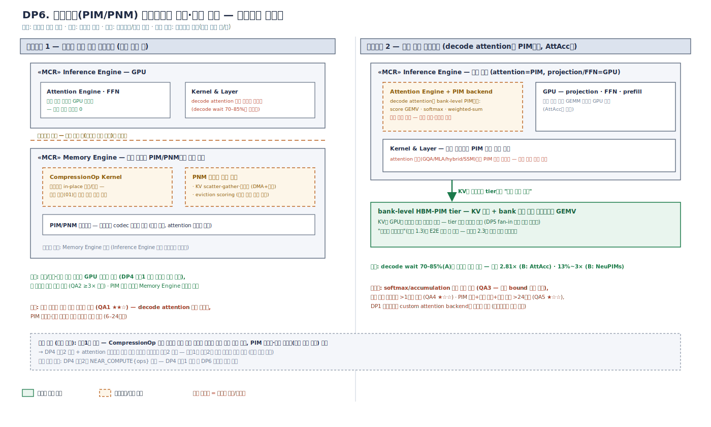

# MCR 설계포인트 전개 — DP6 (v0.1)

작성 기준: 확정안 v2 패키지 다이어그램([`01_architecture_overview.md`](01_architecture_overview.md)).
QA 정의·별점 기준은 [`00_qa_definitions.md`](00_qa_definitions.md) v0.3을 따른다.
DP1·DP2는 [`02_design_points_dp1_dp2.md`](02_design_points_dp1_dp2.md),
DP3–DP5는 [`03_design_points_dp3_dp5.md`](03_design_points_dp3_dp5.md) 참조.

배경: DP1–DP5는 "KV를 어디에 두고 어떻게 옮기는가"(tiered memory 축)만
결정하며, 배경 1.3이 선언한 문제 재정의의 나머지 절반 — **"연산을 데이터가
있는 곳으로"(근접연산 축)** — 를 결정하는 DP가 없었다. DP6이 그 공백을 채운다.

---

## 0. QA 정의 (참조)

QA1–QA5의 정의·측정 방법·별점별 정량 bin·근거는
[`00_qa_definitions.md`](00_qa_definitions.md) 참조. 전 평가는 설계 단계 예측
`(F)`, 근거 등급 A 실측 / B 문헌 / C 구조 논증.

---

## DP6. 근접연산(PIM/PNM) 오프로드의 대상·실행 구조

### 문제 정의

decode는 memory-bandwidth-bound 연산이고(자체 실측 decode wait 70–85%(A)),
그 중심인 decode attention은 산술 강도가 낮은 GEMV 계열 — **PIM의 bank 내부
병렬 대역폭이 정확히 겨냥하는 지점**이다. 문헌이 이득을 입증했다:

- **AttAcc(ASPLOS'24)**: attention을 bank-level HBM-PIM에, FC는 GPU에 두는
  이종 실행으로 175B 모델 성능 최대 **2.81×**·에너지 **2.67×**(B)
- **NeuPIMs(ASPLOS'24)**: NPU(GEMM)+PIM(GEMV) 분담과 sub-batch interleaving으로
  처리율 **13%~3×** 개선(B)
- 압축·해제(CompressionOp)도 현재 GPU 사이클을 잠식 — DP4 후보1 평가(03)에서
  QA1 감점 근거였던 바로 그 비용이며, 확정안 v2는 CompressionOp Kernel을
  이미 **의존 역전**으로 분리해 실행 위치를 바꿀 자리를 마련해 두었다(01 §검수 4)

억제 방향의 압력도 실재한다. PIM 커널은 **수치 경로**를 침범한다 — 누적
순서·정밀도가 GPU와 달라 softmax/accumulation 검증 부담이 생기고(QA3),
attention 변형(GQA/MLA/hybrid)마다 PIM 커널 재작성이 필요하며(QA4), PIM
툴체인·실기 확보 자체가 초기 비용이다(QA5). 구조적으로는 computational
storage/스마트 NIC의 고전적 **오프로드 경계 논쟁**과 동형이다 — "데이터 경로
부속 연산부터 내리는가, 핵심 연산을 정면으로 내리는가."

### 설계 쟁점

1. **오프로드 경계**: 모델 수치 경로 **밖**(압축/해제·scatter-gather·eviction
   scoring)까지인가, 수치 경로 **안**(decode attention)까지인가 — 품질 검증
   부담이 불연속적으로 뛰는 단절점이 어디인가.
2. **실행 모델**: PIM 연산의 스케줄 주체 — Memory Engine이 자율 실행하는
   내부 연산인가, Inference Engine의 커널 그래프에 편입되는 실행 단계인가.
3. **모델 종속성 관리**: attention 변형마다 PIM 커널을 재작성하는 비용을
   어느 컴포넌트가 격리하는가.
4. **(DP4·DP1·DP2 커플링)** DP4 후보2의 `NEAR_COMPUTE{ops}` 표현이 하드 전제.
   DP1 확장형에서는 custom attention backend 확장점이 후보2의 유일한 통로.
   후보1 채택 시 DP2의 압축 mechanism이 in-place(디바이스 내) 실행으로 바뀐다.

### 후보구조 설계도

*draw.io 소스: [`dp6_candidates.drawio`](../diagrams/dp6_candidates.drawio)*

### 후보구조 1 — 데이터 관리 연산 오프로드 (수치 경로 밖)

**구조**: Memory Engine 내부 연산만 PIM/PNM으로 내린다 — CompressionOp
(압축/해제)를 디바이스 in-place 실행으로, KV scatter-gather·재배치를 PNM
DMA+연산으로, eviction scoring(접근 온도 집계)을 근접 집계로. 모델의 수치
경로(attention·FFN)는 GPU에 그대로. CompressionOp Kernel의 의존 역전(01)이
그대로 실행 위치 교체 지점이 된다.

**장점**
- 모델 수치 경로 불침범 — 압축 codec은 결정론적 변환이라 품질 영향 구조적 0
- GPU 사이클 회수: 압축/해제·이동 부속 연산이 decode 경로에서 제거 —
  DP4 후보1 평가에서 감점됐던 비용의 직접 회수
- 모델 독립 — attention 변형과 무풍, PIM 명령셋 변화도 Memory Engine 모듈에 갇힘

**단점**
- decode attention 병목 자체는 그대로 — 이득 상한이 부속 연산 비용에 갇힘
- PIM 툴체인·검증 인프라 구축이라는 고정 비용은 동일하게 지불
- "memory-centric 증명"으로서의 임팩트가 간접적 (E2E 개선 폭 제한)

**QA 평가**

| QA | 평점 | 정량 근거 (00 v0.3 bin 판정) |
|----|------|-----------|
| QA1 | ★★☆ (F) | 1.1–1.5× bin: 압축/해제의 GPU 사이클 회수 + 더 공격적 압축 운용 가능으로 간접 개선(C). decode attention(wait 70–85%(A)의 지배분)은 그대로 — ≥1.5× 불확실 |
| QA2 | ★★★ (F) | ≥3× bin 경로: in-place 압축으로 압축 비용이 하락 → 더 높은 압축률·더 넓은 압축 적용을 감당 — 압축 2–4×(A)의 적용 범위 확대(C) |
| QA3 | ★★★ (F) | 수치 경로 불침범 — codec은 결정론적 변환, acc 저하 0%p·ΔPPL 0 (압축 기법 자체의 품질 비용은 DP2·QA3에서 이미 계상)(C) |
| QA4 | ★★★ (F) | 모델 독립 — KV 구조 변화 무풍(+2주 자동 충족), PIM 세대 교체는 Memory Engine 내 어댑터 모듈, 코어 0(C) |
| QA5 | ★★☆ (F) | codec·gather 커널 포팅은 제한 규모나 PIM SDK 통합·검증 인프라가 초기 고정 비용 — 6–24인월 구간(C) |

### 후보구조 2 — 모델 연산 오프로드 (decode attention을 PIM으로)

**구조**: decode attention(score GEMV·softmax·weighted-sum)을 bank-level
PIM에서 실행 — AttAcc형 이종 실행(attention=PIM, projection/FFN=GPU).
Inference Engine의 Attention Engine이 PIM backend를 갖고, KV가 상주하는
tier에서 **읽지 않고 계산**한다. Kernel & Layer의 커널 그래프에 PIM 실행
단계가 편입된다.

**장점**
- decode wait 70–85%(A)의 지배분을 정면 공략 — 문헌 상한 2.81×(B: AttAcc),
  13%~3×(B: NeuPIMs)
- KV를 GPU로 읽어올 필요 자체가 감소 — tier 승격 트래픽 절감(DP5와 시너지)
- "연산을 데이터로"의 E2E 증명 그 자체 — 필요성 2.3의 가장 강한 시나리오

**단점**
- 수치 경로 침범 — PIM의 누적 순서·정밀도 차이로 softmax/accumulation 검증
  부담, 품질 bound 관리 필요
- attention 변형(GQA/MLA/hybrid/SSM)마다 PIM 커널 재작성 — 모델 추종 만성 부담
- PIM attention 커널 개발+수치 검증+실기 확보의 대규모 초기 투자

**QA 평가**

| QA | 평점 | 정량 근거 (00 v0.3 bin 판정) |
|----|------|-----------|
| QA1 | ★★★ (상한) / ★★☆ (도달 리스크) (F) | 상한: attention 오프로드로 decode 지배분 직격 — 최대 2.81×(B: AttAcc), ≥1.5× bin 초과 경로. 도달 리스크: GQA로 산술 강도가 오르면 PIM 이점 축소, batch 구성·파이프라인 효율에 종속(C) |
| QA2 | ★★☆ (F) | 1.5–3× bin: 용량 축 직접 기여 없음 — 압축은 여전히 GPU 실행이라 적용 범위 제한(C). tier 승격 트래픽 절감은 있으나 원본 환산 배율엔 간접적 |
| QA3 | ★★☆ (F) | 결정론적 HW 연산이나 누적 순서·정밀도가 GPU와 상이 — acc ≤2%p 전역 bound 운용은 가능(C)하되 요청별 집행 문제 이전에 **커널 수치 검증**이 선행 부담. ★★★ 미달 |
| QA4 | ★☆☆ (F) | attention 변형마다 PIM 커널 재작성 — GQA/MLA/SSM 수용 리드타임 >1분기 만성 리스크(C). `NEAR_COMPUTE` 스키마(코어) 개정도 동반 |
| QA5 | ★☆☆ (F) | PIM attention 커널 + 수치 검증 인프라 + 실기 확보 — 초기 >24인월 리스크, 모델 추종 상시 인력(C) |

### 검토 노트

- 실질 결정 변수는 "**수치 경로 침범이라는 검증 비용의 단절점을 넘어야만
  잡히는 이득이 과제 목표(goodput@SLO)에 필수인가**"다. 후보1의 간접 이득
  (압축 비용 회수)이 QA1 ★★☆에 그친다는 예측이 맞다면, ≥1.5× 달성에는
  후보2가 필요하다는 결론이 실측으로 나올 수 있다 — AttAcc 시뮬레이터(공개)
  + 자사 PIM 실기/에뮬레이션으로 attention 오프로드 이득의 자사 워크로드
  재현이 1차 검증 항목.
- **진화 경로형 결정**이 자연스럽다: 후보1로 시작 — **CompressionOp의 의존
  역전(확정안 v2)이 이미 실행 위치 교체 지점을 마련**해 두어 구조 변경 없이
  착수 가능 — 하고, PIM 툴체인·검증 인프라(양 후보 공통 고정 비용)를 그
  과정에서 구축한 뒤, DP4 후보2 채택 + attention 오프로드 이득 실측 통과를
  트리거로 후보2를 확장한다. 후보1이 후보2의 **기반 공사**가 되는 구조라
  단계 전환 비용이 낮다.
- hybrid(일부 attention 층만 오프로드 등)는 후보로 세우지 않았다 — 층 선택
  정책은 DP2의 배치 정책과 같은 축이며, 순수형의 긴장(경계 안/밖)이 먼저다.

---

## DP 간 의존성 (DP6 추가분)

| 의존 | 내용 |
|------|------|
| DP4 → DP6 | DP6 양 후보 모두 DP4 후보2의 `NEAR_COMPUTE{ops}` 표현을 전제 — DP4 후보1(순수 파라미터형) 채택 시 DP6 자체가 성립 불가 (가장 강한 커플링) |
| DP1 → DP6 | vLLM 확장형에서 후보2의 통로는 custom attention backend 확장점뿐 — scheduler가 PIM 실행을 인지 못해 파이프라인 효율(AttAcc의 이득 조건) 제약 |
| DP6 → DP2 | 후보1 채택 시 압축 mechanism이 디바이스 in-place 실행으로 — DP2의 policy/mechanism 분리에서 mechanism의 물리 위치가 바뀜 (인터페이스는 CompressionOp 그대로) |
| DP6 → DP5 | 후보2 채택 시 KV의 GPU 승격 트래픽 감소 — DP5 공유 tier fan-in 병목(후보2 도달 리스크)을 완화하는 방향의 상호작용 |
| DP6 → 구조도 | 채택 시 CompressionOp Kernel의 실행 위치 주석 확정, Attention Engine의 PIM backend 유무 확정 |
