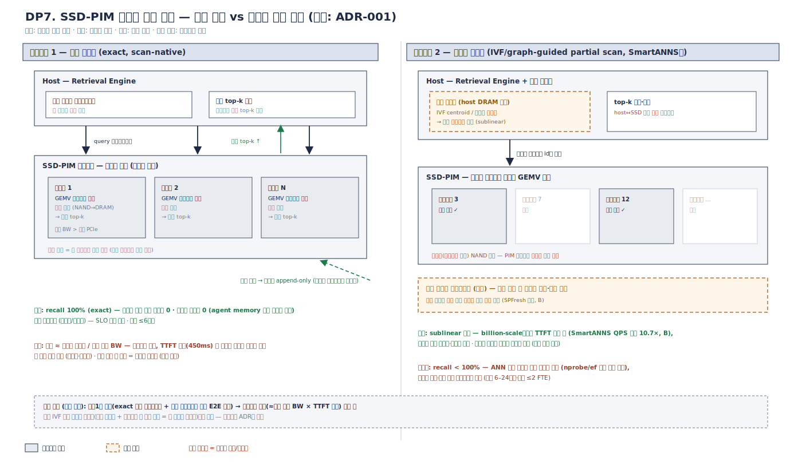
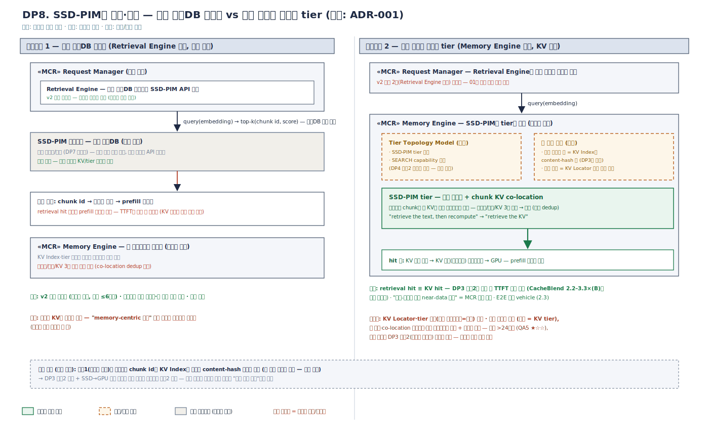

# MCR 설계포인트 전개 — DP7 · DP8 (v0.1)

작성 기준: 확정안 v2 패키지 다이어그램([`01_architecture_overview.md`](01_architecture_overview.md))
+ **[ADR-001](adr/ADR-001-ssd-pim-rag-retrieval.md) (SSD-PIM GEMV 검색 가속 — 결정 완료, 본 문서의 전제)**.
QA 정의·별점 기준은 [`00_qa_definitions.md`](00_qa_definitions.md) v0.3을 따른다.
DP1–DP6: [`02`](02_design_points_dp1_dp2.md) · [`03`](03_design_points_dp3_dp5.md) · [`04`](04_design_points_dp6.md).

두 DP는 ADR-001이 결정한 것("SSD-PIM이 유사도 검색을 한다") **아래 층위**의
미결 결정이다: DP7은 검색의 **실행 구조**, DP8은 디바이스의 **계약·소유**.
두 축은 독립이다(어느 조합도 가능).

---

## 0. QA 정의 (참조)

QA1–QA5의 정의·측정·별점 bin·근거는 [`00_qa_definitions.md`](00_qa_definitions.md)
참조. 전 평가는 설계 단계 예측 `(F)`, 근거 등급 A 실측 / B 문헌 / C 구조 논증.

---

## DP7. SSD-PIM 검색의 실행 구조 — 전수 스캔 vs 인덱스 유도 스캔

### 문제 정의

SSD-PIM의 GEMV 엔진은 본질적으로 **스트리밍 스캔 연산기**다 — NAND에서 내부
DRAM으로 벡터를 흘리며 내적을 쏟아내는 데 최적이고, 이는 SSD 내부 대역폭이
외부 PCIe보다 크다는 구조적 사실과 정합한다(ADR-001). 전수 스캔으로 쓰면
recall 100%(exact)·인덱스 유지비 0·append-only 갱신이라는 단순성이 따라온다 —
agent memory처럼 **문서가 세션 중 계속 추가되는** 워크로드(배경 1.1)에 특히
유리하다.

반대 압력은 스케일이다. 전수 스캔 지연은 코퍼스 크기에 **선형** —
`지연 ≈ 코퍼스 바이트 / SSD 내부 유효 대역폭`이라는 물리 하한이 있고,
retrieval은 TTFT 임계 경로이므로 코퍼스가 커지면 TTFT 예산(표준 SLO 450ms)을
구조적으로 초과한다. billion-scale ANN 계열은 그래서 **인덱스로 스캔 범위를
sublinear로 줄이는** 방향으로 수렴했다 — SmartANNS(ATC'24)는 host CPU +
SmartSSD 협력의 **계층 인덱스**로 QPS 최대 10.7×를 보고(B). 단 인덱스에는
대가가 있다: recall < 100%(ANN 근사), 인덱스 빌드·갱신 파이프라인(증분 갱신이
독립 연구 주제일 만큼 비용 실재 — SPFresh 계열(B)), 불규칙 NAND 접근과 PIM
스트리밍 모델의 상성 문제, host↔SSD 조정 왕복.

구조적으로는 DB의 고전 논쟁 — **full table scan vs index scan** — 과
동형이다: 스캔은 예측 가능하고 갱신에 강하며, 인덱스는 빠르지만 유지비와
근사를 산다.

### 설계 쟁점

1. **TTFT 예산 내 코퍼스 상한**: 목표 코퍼스 규모(GB~TB)에서 전수 스캔 지연이
   450ms 예산의 몇 %를 소모하는가 — 물리 계산과 실측으로 답 가능한 1차 질문.
2. **recall의 품질 환산**: ANN recall@k 손실(놓친 chunk)이 응답 품질(QA3)에
   주는 영향의 정량화 — retrieval 품질과 생성 품질의 연결 함수.
3. **갱신 경로**: agent memory의 상시 문서 추가를 어느 후보가 감당하는가 —
   전수 스캔은 append-only, 인덱스형은 증분 재빌드 파이프라인 필요.
4. **(DP8·ADR-001 커플링)** 인덱스 유도형의 인덱스를 host가 들면 DP8 후보1
   (서비스 모델)과, 디바이스 내에 두면 DP8 후보2(tier 모델)와 자연 정합 —
   실행 구조가 계약·소유의 비용을 바꾼다.

### 후보구조 설계도

*draw.io 소스: [`dp7_candidates.drawio`](../diagrams/dp7_candidates.drawio)*

### 후보구조 1 — 전수 스캔형 (exact, scan-native)

**구조**: 코퍼스를 SSD-PIM 파티션들에 샤딩. 질의 임베딩을 브로드캐스트하면 각
파티션이 자기 벡터 전량을 GEMV 스트리밍 스캔 → 로컬 top-k → host(또는 지정
집계자)가 전역 top-k 병합. 인덱스 없음. 추가 문서는 파티션에 append.

**장점**
- recall 100% (exact) — 검색발 품질 저하 구조적 0
- 인덱스 유지비 0, append-only 갱신 — agent memory 상시 추가에 최강
- 지연이 결정론적(코퍼스/대역폭) — SLO 예측 가능성, 운영 단순

**단점**
- 지연이 코퍼스 크기에 선형 — TTFT 예산 내 코퍼스 상한이 구조에 박힘
- 대규모 코퍼스에서 스캔 에너지·대역폭 낭비 (매 질의가 전량 접근)
- 상한 도달 시 대응 수단이 증설(파티션 추가)뿐 — 비용 선형 증가

**QA 평가**

| QA | 평점 | 정량 근거 (00 v0.3 bin 판정) |
|----|------|-----------|
| QA1 | ★★☆ (F) | 소·중규모 코퍼스에선 내부 대역폭 스캔으로 retrieval이 TTFT 예산 내 — RAG goodput 기여 1.1–1.5× bin(C). 코퍼스가 임계(≈내부 유효 BW × 예산) 초과 시 TTFT 초과로 attainment 하락 — 규모 조건부라 ≥1.5× 불확실 |
| QA2 | ★★★ (F) | 벡터는 SSD 상주 — HBM 점유 0. *본 QA는 두 후보를 가르지 않음* (KV 용량과 직교)(C) |
| QA3 | ★★★ (F) | recall 100% — 검색발 응답 품질 저하 0%p, bound 문제 자체가 없음(C) |
| QA4 | ★★★ (F) | 코퍼스 성장 대응 = SSD-PIM 파티션 증설(어댑터/샤드 추가), 코어 0(C); KV 구조 변화와 무풍 |
| QA5 | ★★★ (F) | 인덱스 파이프라인 부재 — 초기 ≤6인월·운영 단순 ≤0.5 FTE(C) |

### 후보구조 2 — 인덱스 유도형 (IVF/graph-guided partial scan)

**구조**: 상위 인덱스(IVF centroid/그래프 상위층)가 후보 클러스터를 선별하고,
SSD-PIM은 **선택된 클러스터 내부만** GEMV 스캔. 인덱스는 host DRAM(SmartANNS형
협력 구조) 또는 SSD 내부에 상주. 문서 추가는 증분 인덱싱 파이프라인 경유.

**장점**
- sublinear 지연 — billion-scale 코퍼스에서도 TTFT 예산 내 (SmartANNS QPS
  최대 10.7×(B))
- 질의당 스캔 바이트·에너지 절감 — 대규모에서 비용 효율
- 코퍼스 상한이 인덱스 품질의 함수 — 증설 없이도 규모 확장

**단점**
- recall < 100% — ANN 근사 손실이 응답 품질로 전이 (nprobe/ef 튜닝 상시 부담)
- 인덱스 빌드·증분 갱신 파이프라인 비용 (SPFresh 계열이 독립 연구일 만큼(B))
- 불규칙(클러스터 점프) NAND 접근 — PIM 스트리밍 모델과 상성 저하, host↔SSD 왕복

**QA 평가**

| QA | 평점 | 정량 근거 (00 v0.3 bin 판정) |
|----|------|-----------|
| QA1 | ★★★ (상한) / ★★☆ (도달 리스크) (F) | 상한: sublinear 스캔으로 billion-scale에서도 TTFT 예산 내 — 10.7× QPS(B: SmartANNS) 계열 이득, ≥1.5× 경로. 도달 리스크: recall-지연 트레이드 튜닝과 host 왕복 오버헤드에 종속(C) |
| QA2 | ★★★ (F) | *비차별* — 동일(C). (host 상주 인덱스의 DRAM 점유는 실재하나 QA2 정의(HBM 분모) 밖 — 검토 노트 참조) |
| QA3 | ★★☆ (F) | recall@k < 1.0의 chunk 누락이 응답 품질 저하로 전이 — ANN 관례 recall 0.9~0.99(B)에서 전역 bound 운용은 가능하나 요청별 보장 불가(C) |
| QA4 | ★★☆ (F) | 인덱스 구조가 host-디바이스 협력 계약 — SSD-PIM 세대 교체 시 인덱스-펌웨어 경계 개정 ≤40%(C) |
| QA5 | ★★☆ (F) | 인덱스 빌드·증분 갱신 파이프라인 + recall 튜닝 운영 — 초기 6–24인월·유지 ≤2 FTE(C) |

### 검토 노트

- 실질 결정 변수는 "**목표 코퍼스 규모에서 전수 스캔 지연이 TTFT 예산 안에
  드는가**"다. `코퍼스 바이트 / SSD 내부 유효 대역폭`은 종이 계산이 먼저 되고
  실기로 검증 가능한, 이 DP 세트에서 가장 싸게 답이 나오는 결정 변수다 —
  대표 워크로드(범위 3.2-3)의 코퍼스 규모 산정이 선행 과제.
- 두 후보의 **수렴점이 계층형(상위 IVF 인덱스 + 클러스터 내 전수 스캔)** 임을
  주목 — SmartANNS의 hierarchical indexing이 정확히 이 형태다. 이는 hybrid를
  후보로 세우지 않은 이유이기도 하다: 계층형의 설계 변수(층 경계, 인덱스 위치)
  는 순수형의 긴장이 정리된 뒤에야 의미가 생긴다.
- **진화 경로형 결정**: 후보1(파티션 전수 스캔)로 시작 — exact recall로 품질
  베이스라인 확보 + 갱신 파이프라인 없이 E2E 완주 — 하고, 코퍼스가 임계를
  넘는 시점(위 결정 변수의 실측 트리거)에 상위 IVF 층만 추가해 계층형으로
  전환. 전환 트리거를 ADR에 명시.

---

## DP8. SSD-PIM의 계약·소유 — 가속 벡터DB 서비스 vs 검색 가능한 메모리 tier

### 문제 정의

ADR-001은 SSD-PIM이 검색한다고 정했지만, 그 디바이스가 **런타임에 무엇으로
보이는지**는 정하지 않았다. 이 결정은 v2 검수 2번 — "RAG 검색은
device-resident 연산이 아니므로 Retrieval Engine을 Request Manager로
이동"(01) — 의 **정당한 재개봉**이다: 당시엔 SSD-PIM 검색 capability가 논의
대상이 아니었다.

분리(서비스) 방향의 압력:

- **v2 구조 보존**: Retrieval Engine이 외부 벡터DB를 부르던 자리에 SSD-PIM
  API를 꽂으면 구조 변경 0 — 검증된 경계 유지
- **생태계 계약**: `query → top-k chunk id`는 벡터DB 표준 계약 — 디바이스를
  독립 제품(가속 벡터DB)으로 포지셔닝 가능(레퍼런스 전략)

동거(tier) 방향의 압력:

- **retrieval hit ≡ KV hit**: 검색되는 chunk와 그 chunk의 KV가 같은 디바이스에
  살면, 검색 결과를 텍스트가 아니라 **KV 참조**로 반환 가능 — "retrieve the
  text, then recompute"가 "**retrieve the KV**"로 바뀐다. DP3 후보2(비연속
  재사용, CacheBlend TTFT 2.2–3.3×(B))와 융합 시 retrieval→재사용이 단일
  near-data 경로가 되는, MCR 고유의 연구 기여 지점
- **3중 저장 해소**: 텍스트/벡터/KV가 분리 저장되는 중복을 co-location으로 통합
- **01 검수 2의 완성**: "retrieval chunk 목록 → Router의 KV 재사용 판정 입력"
  이라는 연결이 소프트웨어 배선에서 **물리 배치**로 내려감

구조적으로는 스토리지 업계의 고전 — **파일서버(NAS) vs 공유 블록/오브젝트의
계약 수준 논쟁**, 혹은 DB의 "외부 검색엔진 vs 내장 인덱스" — 와 동형이다:
경계가 깨끗한 서비스냐, 융합이 여는 이득이냐.

### 설계 쟁점

1. **산출물 계약**: 검색 결과가 chunk id(텍스트)인가 KV 참조인가 — 후속
   파이프라인(prefill 재계산 vs KV 승격)이 통째로 갈린다.
2. **키 공간**: 벡터 인덱스의 키와 KV Index(DP3)의 키를 통합하는가 — 통합해야
   retrieval hit이 KV hit으로 직결된다.
3. **소유 패키지**: Request Manager(제어 평면 서비스)인가 Memory Engine의
   Tier & Lifecycle(데이터 평면 tier)인가 — 장애·확장·버전 관리의 책임 소재.
4. **(DP4·DP3 커플링)** tier 모델 채택은 DP4 후보2의 `SEARCH` capability 표현이
   하드 전제. KV 융합의 이득 크기는 DP3 후보2(비연속 재사용) 채택 여부에 종속.

### 후보구조 설계도

*draw.io 소스: [`dp8_candidates.drawio`](../diagrams/dp8_candidates.drawio)*

### 후보구조 1 — 가속 벡터DB 서비스 (Retrieval Engine 소유)

**구조**: SSD-PIM이 `query(embedding) → top-k(chunk id, score)` API를 노출.
Request Manager의 Retrieval Engine이 외부 벡터DB 자리에서 호출(제어 평면).
결과 chunk는 기존 경로 그대로 — 텍스트 로드 → prefill(또는 DP3의 KV Index
조회는 별도 키로 후속 수행). Memory Engine은 이 디바이스를 모른다.

**장점**
- v2 구조 무변경 — Retrieval Engine 내부의 백엔드 교체로 완결, 리스크 최소
- 벡터DB 표준 계약 유지 — 디바이스의 독립 제품화·타 스택 이식 용이
- 장애 격리 — 검색 실패가 KV/tier 경로와 무관

**단점**
- 검색과 KV가 분리된 세계 — retrieval hit 후에도 prefill 재계산(또는 별도 KV
  조회) 경로 잔존, TTFT의 prefill 몫 미회수
- 텍스트/벡터/KV 3중 저장 중복 잔존
- "memory-centric 융합" 기여 지점이 구조에서 사라짐 — 가속기 납품 이상이 안 됨

**QA 평가**

| QA | 평점 | 정량 근거 (00 v0.3 bin 판정) |
|----|------|-----------|
| QA1 | ★★☆ (F) | 검색 지연 단축분만 회수 — retrieval 후 prefill 재계산 경로가 그대로라 TTFT의 지배 몫(재계산) 미회수, 1.1–1.5× bin(C) |
| QA2 | ★★☆ (F) | 1.5–3× bin: 벡터·텍스트·KV 3중 저장 중복 잔존 — co-location dedup 없이 압축·tier 이득만(C) |
| QA3 | ★★★ (F) | 재사용 경로에 새 근사 없음 — 검색발 품질 영향 0 (DP7 채택안의 recall 특성만 상속)(C) |
| QA4 | ★★★ (F) | 백엔드 교체가 Retrieval Engine 모듈에 갇힘, 코어 0(C); 벡터DB 계약 호환으로 디바이스 세대 교체도 API 뒤에 은닉 |
| QA5 | ★★★ (F) | 통합 규모 최소 — 초기 ≤6인월(C) |

### 후보구조 2 — 검색 가능한 메모리 tier (Memory Engine 소유, KV 융합)

**구조**: SSD-PIM을 Tier Topology Model의 tier로 등록하고 `SEARCH`
capability(DP4 후보2 스키마 확장)로 표현. 벡터 인덱스의 키를 KV Index의
content-hash 키와 **통합** — 검색 결과가 "KV Locator가 해석 가능한 KV 참조"로
반환된다. chunk KV를 같은 SSD tier에 co-locate하고, hit 시 KV 승격(프리페치)
파이프라인으로 직결. Retrieval Engine은 질의 발행자 역할만 유지.

**장점**
- retrieval hit ≡ KV hit — chunk prefill 재계산 소멸, DP3 후보2와 융합 시
  TTFT 이득 극대(CacheBlend 2.2–3.3×(B)의 검색 융합판)
- 3중 저장 → co-location 통합, 전역 dedup — 유효 용량 동반 개선
- "검색-재사용 단일 near-data 경로"라는 MCR 고유 기여 — E2E 증명 vehicle(2.3)

**단점**
- KV Locator·tier 모델(공개 인터페이스=코어) 개정 — `SEARCH` capability,
  KV 참조 반환 계약
- 키 공간 통합·co-location 레이아웃·승격 파이프라인 신규 — 초기 투자 대규모
- 장애 도메인 결합 — 검색과 KV tier가 같은 디바이스, v2 검수 2번 재개봉의
  설득 비용

**QA 평가**

| QA | 평점 | 정량 근거 (00 v0.3 bin 판정) |
|----|------|-----------|
| QA1 | ★★★ (상한) / ★★☆ (도달 리스크) (F) | 상한: hit 시 prefill 재계산 소멸 — 비연속 재사용 TTFT 2.2–3.3×(B: CacheBlend)와 융합, ≥1.5× 경로. 도달 리스크: SSD→GPU KV 승격 대역폭과 DP3 후보2 채택에 종속(C) |
| QA2 | ★★★ (F) | ≥3× bin 경로: 텍스트/벡터/KV co-location dedup + chunk 전역 재사용 — 원본 환산 수용량 극대(C) |
| QA3 | ★★☆ (F) | KV 재사용 경로 확대 = 위치 근사·selective recompute 개입(DP3 종속) — 전역 bound 운용(C), 요청별 집행은 DP2 채택안에 종속 |
| QA4 | ★★☆ (F) | `SEARCH` capability + KV 참조 계약이 공개 인터페이스(코어) 개정 — ≤40%·+1분기(C); DP4 후보2 하드 전제 |
| QA5 | ★☆☆ (F) | 키 공간 통합·co-location 레이아웃·승격 파이프라인·재개봉 설득 — 초기 >24인월 리스크(C) |

### 검토 노트

- 실질 결정 변수는 "**retrieval 가속의 가치를 '더 빠른 검색'으로 볼 것인가,
  'KV 재사용과의 융합'으로 볼 것인가**"다 — 이는 사실상 DP3(비연속 재사용)
  채택과 동시 결정이다: DP3 후보1(prefix 전용)이면 후보2의 융합 이득이 대부분
  사라져 후보1이 자동 우세, DP3 후보2면 융합이 본 과제의 대표 기여가 된다.
- **진화 경로형 결정**: 후보1(서비스 모델)로 시작하되, **chunk id를 KV Index와
  동일한 content-hash 체계로 발급**(키 공간 정렬만 선행 — 비용 미미) →
  DP3 후보2 채택 + SSD→GPU 승격 대역폭 실측 통과를 트리거로 후보2 전환.
  키 공간이 정렬돼 있으면 전환 시 계약 개정이 "반환 타입 확장"으로 축소된다.
- hybrid(일부 hot chunk만 KV co-locate)는 배치 정책의 문제(DP2 축)라 후보로
  세우지 않았다.

---

## DP 간 의존성 (DP7·DP8 추가분)

| 의존 | 내용 |
|------|------|
| ADR-001 → DP7·DP8 | SSD-PIM GEMV 검색 가속이 양 DP의 전제 — 디바이스 선택 자체는 재론하지 않음 |
| DP7 → DP8 | 전수 스캔형(DP7 후보1)은 co-location 레이아웃이 단순(append 샤드)해 DP8 후보2의 초기 비용을 낮춤; 인덱스 유도형은 인덱스 위치에 따라 DP8 양 후보와 결합 비용이 갈림 |
| DP4 → DP8 | DP8 후보2는 DP4 후보2의 `SEARCH` capability 표현이 하드 전제 (DP6과 동일 패턴의 커플링) |
| DP3 ↔ DP8 | DP8 후보2의 이득 크기가 DP3 후보2(비연속 재사용) 채택에 종속 — 사실상 동시 결정 묶음. 채택 시 벡터 인덱스·KV Index 키 공간 통합이 새 선행 과제 |
| DP8 → 구조도 | 후보2 채택 시 v2 검수 2번(Retrieval Engine 위치) 재개봉·개정 — 01에 개정 사유 기록 필요 |
| 공통 | DP7·DP8 모두 대표 워크로드의 코퍼스 규모 산정(범위 3.2-3의 벤치 정의 확장)을 선행 실측 과제로 공유 |
