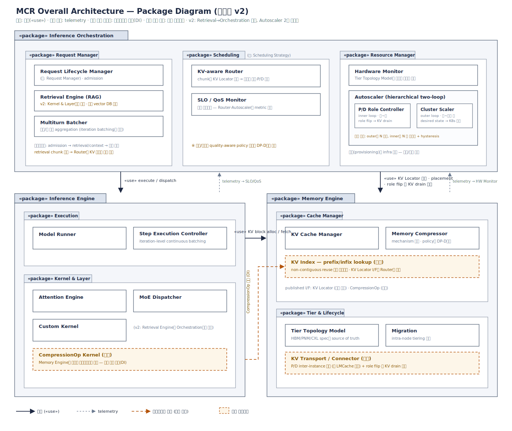

# MCR Overall Architecture — 패키지 구조 (확정안 v2)

MCR(Memory-Centric Runtime)은 PIM/PNM/CXL 등 이종 메모리를 1급 자원으로 다루는 LLM 추론 런타임이다. 본 문서는 패키지 다이어그램 확정안 v2의 구조와, 검수 과정에서 반영된 결정 사항을 기록한다.

다이어그램: [`diagrams/mcr_package_diagram_v2.svg`](../../diagrams/mcr_package_diagram_v2.svg)

*draw.io 소스: [`mcr_package_diagram_v2.drawio`](../../diagrams/mcr_package_diagram_v2.drawio)*

## 패키지 구조

### Inference Orchestration (control plane)

| 하위 패키지 | 컴포넌트 | 비고 |
|---|---|---|
| Request Manager | Request Lifecycle Manager · Retrieval Engine (RAG) · Multiturn Batcher | 파이프라인: admission → retrieval/context → 세션 배칭 |
| Scheduling | KV-aware Router · SLO/QoS Monitor | (구: Scheduling Strategy) — policy 위치는 DP2에서 결정 |
| Resource Manager | Hardware Monitor · Autoscaler (2-loop) | Autoscaler = P/D Role Controller(inner) + Cluster Scaler(outer) |

### Inference Engine (data plane)

| 하위 패키지 | 컴포넌트 |
|---|---|
| Execution | Model Runner · Step Execution Controller (iteration-level batching) |
| Kernel & Layer | Attention Engine · MoE Dispatcher · Custom Kernel · CompressionOp Kernel (신설) |

### Memory Engine (data plane, 1급 패키지)

| 하위 패키지 | 컴포넌트 |
|---|---|
| Cache Manager | KV Cache Manager · Memory Compressor · KV Index (신설, prefix/infix lookup) |
| Tier & Lifecycle | Tier Topology Model · Migration (intra-node) · KV Transport (신설, P/D inter-instance) |

Published interface: **KV Locator** (조회 전용, Router가 사용) · **CompressionOp** (Memory Engine이 정의, kernel이 구현 — 의존 역전).

## 검수 반영 사항 (v1 → v2)

1. **네이밍 충돌 해소**: Request Manager 패키지 내 동명 컴포넌트 → Request Lifecycle Manager로 개명. Scheduling Strategy → Scheduling.
2. **Retrieval Engine 이동**: RAG 검색은 device-resident 연산이 아니므로 Kernel & Layer → Request Manager로 이동. retrieval chunk 목록 → Router의 KV 재사용 판정 입력이라는 연결이 non-contiguous reuse 연구의 구조적 표현.
3. **배칭 경계 계약**: Multiturn Batcher = 세션/턴 단위 aggregation, Step Execution Controller = iteration-level continuous batching.
4. **신설 컴포넌트 3종**: KV Index (재사용 핵심 자료구조), KV Transport (P/D 전송 — intra-node Migration과 경로·실패모델 분리), CompressionOp Kernel (순환 의존 차단용 DI 구현체).
5. **Autoscaler 2중 루프화**: inner(P/D role flip, 초~분, KV drain → KV Transport 의존) + outer(cluster scaler, 분~수십 분, desired state를 infra에 위임). 결합 규칙: outer가 N 결정, inner는 N 내 분할만 + hysteresis. *범위 주석(요구사항 분석 v0.3): 연구 범위는 고정 N 테스트베드 전제 — outer 루프·desired state 인터페이스는 상용화 단계 진화 경로로만 유지하며, 구현·평가 대상은 inner 루프다 ([00_requirements_analysis.md](00_requirements_analysis.md) §3.1).*
6. **압축의 policy/mechanism 분리**: Memory Compressor는 mechanism 전담. quality-aware policy의 위치는 DP2의 결정 사항으로 이월.

## 의존 관계

- Orchestration → Inference Engine: «use» execute/dispatch
- Orchestration → Memory Engine: «use» KV Locator 조회 · placement · role flip 시 KV drain 지시
- Inference Engine → Memory Engine: «use» KV block alloc/fetch
- Kernel & Layer ⇢ Cache Manager: CompressionOp 인터페이스 구현 (의존 역전)
- Engines ⇢ Monitors: telemetry (점선)

## 미결 사항

- MCR 공식 QA 정의 확정 (현재 잠정 QA1–QA6 사용, [`00_qa_definitions.md`](00_qa_definitions.md) 참조)
- DP1–DP8 채택안 결정 및 ADR 작성 — DP1·DP2: [`02_design_points_dp1_dp2.md`](02_design_points_dp1_dp2.md), DP3–DP5: [`03_design_points_dp3_dp5.md`](03_design_points_dp3_dp5.md), DP6(근접연산 오프로드): [`04_design_points_dp6.md`](04_design_points_dp6.md), DP7·DP8(SSD-PIM 검색 실행 구조·계약, 전제: [ADR-001](adr/ADR-001-ssd-pim-rag-retrieval.md)): [`05_design_points_dp7_dp8.md`](05_design_points_dp7_dp8.md)
- DP 채택에 따른 Scheduling 내 Policy 컴포넌트 신설 여부 확정 (DP2), KV Index 키 스키마·KV Transport 구현 형태 확정 (DP3·DP5)
